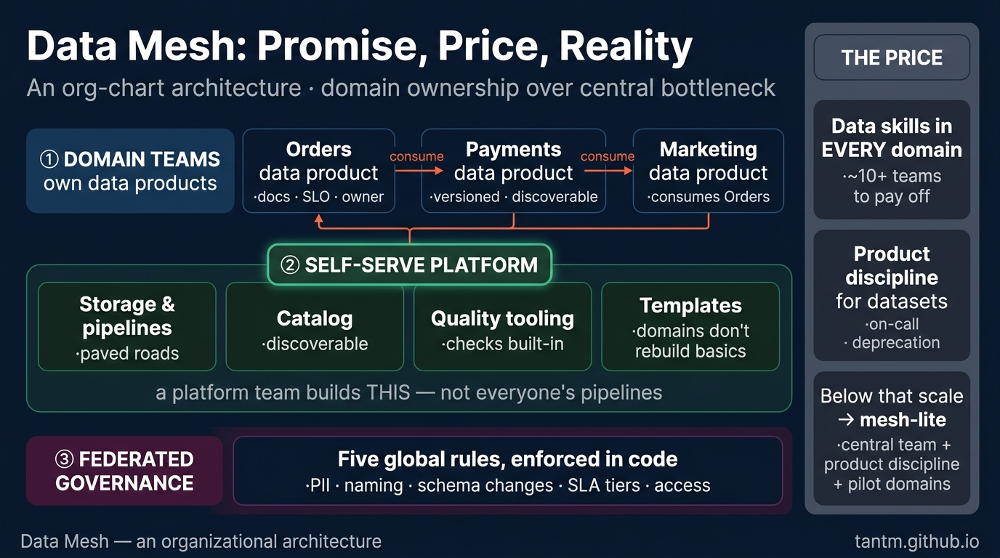
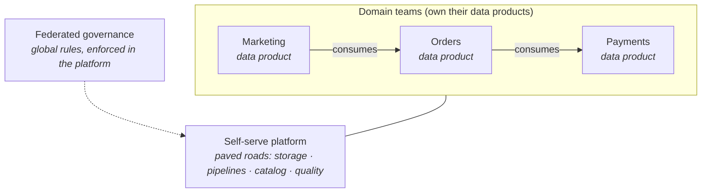

Every school so far had a diagram of *systems*. Data mesh is different: it is a diagram of *people*. It answers an organizational failure, not a technical one — and that is exactly why it is both genuinely important and the most over-adopted idea of the past decade.

## What you'll learn

- Name the organizational bottleneck data mesh is a response to.
- State the four principles, and which one teams always skip.
- Price the mesh honestly before proposing it.
- Run "mesh-lite" — the version most companies should actually stop at.

**Prerequisites:** Parts 2–3 (warehouse and lakehouse) — mesh is an organizing principle on top of those, not a replacement.

## 1. The birth pain

Picture a company where Parts 2–6 all went *well*: a central data team, a healthy lakehouse, streaming where it matters. Now the company has 40 product teams — and every one of them files tickets at the same central data team. The team knows the pipelines but not the domains ("is a cancelled-then-reinstated order a churn event?"). Backlog swells, domain teams build shadow pipelines out of frustration, trust erodes.

That's the birth pain: **the central team becomes the bottleneck, and domain knowledge lives everywhere except where the data work happens.** Conway's law, presenting its bill.

## 2. The four principles

Data mesh (Zhamak Dehghani's formulation) proposes flipping ownership:

1. **Domain ownership** — the orders team owns orders *data*, not just the orders *service*. Pipelines, quality, uptime: theirs.
2. **Data as a product** — each domain publishes its data like a product for other teams: documented, discoverable, versioned, with SLOs and an owner you can page.
3. **Self-serve data platform** — a central *platform* team (not a central *pipeline* team) provides paved roads: storage, orchestration, catalog, quality tooling — so every domain doesn't rebuild Parts 2–6 from scratch.
4. **Federated computational governance** — global rules (PII handling, naming, interoperability) defined together, enforced *automatically* by the platform, not by a committee reviewing every dataset.

Note what the mesh is *not*: it is not a technology. Every box above can be built from Parts 2–6 material. The mesh is a re-assignment of ownership over that material.

## 3. The price (read before buying)

- **Headcount with data skills in every domain.** Each owning team needs someone who can build and operate pipelines. Ten domains ≈ ten part-time data engineers *plus* the platform team. This is the constraint that disqualifies most companies.
- **A real platform team.** "Self-serve" is a product that must be built and maintained. If your paved road is a wiki page of instructions, domains will each pave their own — congratulations, you have decentralized chaos, the exact thing you had before but with more Kafka.
- **Product discipline for data.** SLOs, versioning, deprecation policies, on-call for *datasets*. Most organizations have never operated data this way; it is a culture bill, paid monthly.
- **Federation is hard politics.** Who defines "customer"? When two domains disagree, governance-by-committee returns through the back door unless the global rules are few, crisp, and automated.

## 4. Reality check: who is actually big enough?

An honest heuristic: mesh starts paying for itself around **many domain teams (roughly ten plus), each with genuine data producers and consumers, and a platform team you can actually staff**. Below that, the four principles cost more than the bottleneck they cure. A three-engineer data team adopting mesh is reorganizing a bottleneck into three smaller, lonelier bottlenecks.

## 5. Mesh-lite: the version most teams should run

You can harvest most of the value without the full reorganization:

- Keep the **central team**, but adopt **data-as-a-product discipline** for its outputs: every gold table has an owner, docs, an SLO, and a deprecation policy.
- Give the 2–3 **most data-mature domains** ownership of their silver layers first — a pilot, not a proclamation.
- Invest early in the **self-serve platform** (catalog, quality checks, templated pipelines) — this part pays off *at any scale*.
- Write down **five global rules** (PII, naming, schema change process, SLA tiers, access) and automate their enforcement.

Mesh-lite is not a compromise; for most mid-size companies it is the end state.

## 6. Scoring on the five axes

- **Team:** the deciding axis, inverted from every other school — mesh is *for* the many-teams case and *only* that case.
- **Scale:** organizational scale, not data scale — a mesh of gigabytes is perfectly sensible if forty teams touch it.
- **Latency/Budget:** inherited from the underlying schools each domain uses; the platform team is the new fixed cost.
- **Compliance:** federated governance done well is *stronger* than central review (rules enforced in code); done badly it's a compliance gap with a modern name.

## 7. Three customers

- **Startup:** skip. You are one domain. Do Part 8 and keep shipping.
- **Mid-size:** mesh-lite — product discipline + self-serve platform + one or two pilot domains. Revisit yearly.
- **Large enterprise with tens of teams:** the genuine mesh case — and the migration path (Part 13) matters as much as the target: pilot domains first, platform second, proclamation last.

## Practice (25 minutes — write one data product contract, then price the mesh)

This part has no code to run; its failure mode is organizational, so the exercise is too. Do both halves in writing — they take twenty-five minutes and they're the two artifacts that decide whether a mesh proposal survives contact with reality.

**Half 1 — the contract (15 minutes).** Pick one dataset your company actually produces and write its data product contract on one page:

| Field | Your answer |
|---|---|
| Name and one-sentence purpose | |
| Owning team (a real team, with a real on-call) | |
| Schema: columns, types, and which are guaranteed stable | |
| Grain: one row means exactly what? | |
| Freshness SLA: updated by when, measured how | |
| Quality guarantees: what is always true (uniqueness, non-null, ranges) | |
| How consumers discover it and get access | |
| Breaking-change policy: notice period, versioning, deprecation | |
| What happens at 3 a.m. when it's late or wrong — who is paged | |

**Half 2 — the price (10 minutes).** For the same dataset, answer honestly: how many hours per month does the owning team spend on it *after* this contract exists? Multiply by the number of datasets you'd expect them to own. Then ask whether that team's roadmap has room, and who told them.

Expected results: the contract's last two rows are where most drafts collapse — teams happily "own" a dataset until the words *paged* and *notice period* appear, because that's the moment ownership stops being a diagram and becomes a rota. If you can't name a real person for the 3 a.m. row, you don't have a data product; you have a table someone publishes. And half 2 usually reveals the honest answer to whether you're big enough for mesh: if the platform work isn't funded and the owning teams have no slack, a mesh proposal will produce the same central bottleneck plus more coordination.

## Check yourself

1. A leadership team wants to "adopt data mesh" to fix slow delivery from a 4-person central data team supporting 3 product teams. What do you advise?
2. Which of the four principles do organizations most often skip, and what happens when they do?
3. Your company genuinely has 15 product teams and a real bottleneck. What do you build first — and what would make you stop before full mesh?

See answers

1. Don't adopt mesh. With 3 consuming teams the coordination cost of federated ownership exceeds the bottleneck it removes — a central team of 4 is usually the *efficient* structure at that size. Fix delivery with better intake, clearer priorities, and self-serve tooling; revisit mesh when the number of teams, not the number of complaints, has grown.
2. Self-serve platform. Domain ownership, product thinking and federated governance are all things you can announce in a meeting; the platform is the one that requires funded engineering. Skipping it means each domain team hand-rolls its own pipelines, quality checks and access control — you get the coordination cost of mesh with none of the leverage, and quality varies wildly by team.
3. Build the self-serve platform first: paved-road ingestion, a catalog, standard quality checks, and access control that domain teams can use without filing tickets. What would make you stop before full mesh: if a few domains cover most of the demand, mesh-lite (a handful of certified data products owned by domains, everything else still central) captures most of the value at a fraction of the coordination cost.

## Key takeaways

- Data mesh solves an organizational bottleneck, not a technical one: domain ownership, data-as-product, self-serve platform, federated governance.
- The price is headcount in every domain, a real platform team, and product discipline for data — the constraint that disqualifies most companies.
- Mesh-lite (product discipline + paved roads + pilot domains) captures most of the value at mid-size, and is often the end state, not a stepping stone.
- Adopt mesh because of your org chart, never because of a conference talk.

*Next up — Part 8: The Small Data Architecture (Most Companies Are Small Data).*
