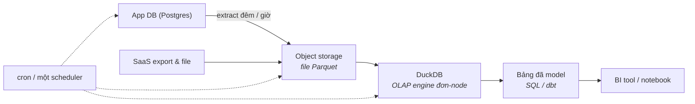

Đây là con số mà kỷ nguyên big-data không thích nhắc tới: *toàn bộ lịch sử phân tích* của một công ty trung vị nằm thoải mái trên SSD của một chiếc laptop. Các khảo sát trên cloud warehouse cứ tìm ra cùng một hình dạng — đa số workload quét megabyte tới vài gigabyte. Trong khi đó, cả một thế hệ team ba engineer đang vận hành cluster Spark size cho công ty lớn gấp nghìn lần mình.

Phần này là trường phái phản đề: **small data như một kiến trúc có chủ đích**, không phải điểm xuất phát đáng xấu hổ.


## Bạn sẽ học được gì

- Nhận ra khi nào bộ đồ nghề "big data" chỉ là phí tổn thuần tuý với cỡ dữ liệu thật của bạn.
- Lắp bộ stack small-data bốn quyết định, và biết mỗi mảnh thay thế cái gì.
- Nói thật thà bạn đánh đổi những gì, để lựa chọn là có chủ đích chứ không ngây thơ.
- Gọi tên bốn tín hiệu báo đã đến lúc tốt nghiệp — và tốt nghiệp sang trường phái nào.

**Cần biết trước:** Phần 2–3 (warehouse và lakehouse) để phép so sánh có chỗ tựa.

## 1. Nỗi đau khai sinh

Trường phái này sinh ra từ một loại *chi phí*, nhưng không phải hoá đơn cloud — mà là **hoá đơn độ phức tạp**. Mỗi thành phần phân tán bạn thêm vào (cluster, streaming, orchestration cho cả orchestration) mang theo kiểu hỏng riêng, chu kỳ upgrade riêng, và các cú page 2 giờ sáng riêng. Khi dữ liệu là 80 GB, độ phức tạp đó mua về đúng số không: một cỗ máy hiện đại có nhiều RAM hơn thế.

Trong lúc đó phần cứng đã lặng lẽ thắng cuộc đua với tăng trưởng dữ liệu của đa số công ty: hàng trăm GB RAM, NVMe SSD hàng triệu IOPS, và các query engine đơn-node quét cả tỷ dòng mỗi giây. Các hệ phân tán của Phần 3–7 được thiết kế cho những ràng buộc mà phần lớn công ty đơn giản là không có.

## 2. Kiến trúc



Cả platform là bốn quyết định:

1. **Postgres cứ là Postgres.** App database là system-of-record; một read replica gánh vài lookup vận hành. Đừng biến nó thành warehouse — hãy extract từ nó.
2. **Object storage + Parquet là cái "lake"** — cùng bản năng open-format của Phần 3, trừ bộ máy table format cho tới khi bạn cần update và time travel.
3. **DuckDB (OLAP đơn-node) là engine** — engine in-process query thẳng Parquet, chạy trong container, laptop, hay một job CI, và phủ hết loại analytics quét-nặng mà warehouse sẽ làm. Không một cluster nào. Slot này cũng có thể là một managed warehouse nhỏ nếu bạn thích trả tiền thay vì vận hành — cái quan trọng là *hình dạng*: **một node, không thứ gì phân tán**.
4. **Một scheduler, nhàm chán có chủ đích** — cron hoặc một orchestrator gọn nhẹ chạy các model SQL/dbt. Job idempotent (câu thần chú của S02) ở đây còn quan trọng *hơn*, vì sự đơn giản chính là toàn bộ giá trị.

Tổng bề mặt vận hành: một database vốn đã có, một bucket, một binary, một scheduler. Một engineer chạy nó trong một phần nhỏ tuần làm việc — chính xác là ràng buộc (trục *team* của Phần 1) mà trường phái này tối ưu.

## 3. Bạn đánh đổi gì — nói thật

- **Concurrency:** engine kiểu DuckDB phục vụ *ít* người cùng lúc. Mười analyst xem dashboard thì ổn (BI cache đỡ thêm); một nghìn khách hàng trên embedded analytics là việc của Phần 5.
- **Real-time:** micro-batch mỗi 5–15 phút là sàn thực dụng — mà theo câu hỏi gác cổng của Phần 4, thế đã thoả mãn gần hết những ai *tự nhận* cần real-time.
- **Join rất lớn:** khi working set thật sự vượt RAM+SSD của một máy, đơn-node thua. Đó mới là ranh giới thật — không phải đếm số dòng.
- **Độ hào nhoáng cho CV:** stack này không bao giờ trend trên sân khấu hội thảo. Nó chỉ ship đều.

## 4. Tín hiệu tốt nghiệp

Vấn đề không phải "không bao giờ scale" — mà là **scale dựa trên bằng chứng**. Canh các tín hiệu:

1. Working set của query tiệm cận giới hạn một máy *sau khi* đã nén Parquet và partition — hàng trăm GB bị quét mỗi query, không phải tổng lưu trữ.
2. Nhu cầu Phần 5 thật: analytics hướng khách hàng với concurrency thật.
3. Nhu cầu Phần 4 thật: cửa sổ hành động tính bằng giây.
4. Team lớn tới mức các domain giành nhau một repo pipeline (lãnh thổ Phần 7).

Mỗi tín hiệu chỉ đích danh một trường phái *cụ thể* để tốt nghiệp vào — và vì dữ liệu của bạn vốn nằm ở open format trên object storage, cuộc migration đó (Phần 13) là một con dốc thoải, không phải vách đá. Thiết kế lối ra từ ngày đầu; chỉ bước ra khi tín hiệu nổ.

## 5. Ba khách hàng

- **Startup:** đây *chính là* kiến trúc của bạn. Chấm hết. Mỗi vòng gọi vốn xem lại một lần.
- **SME có data team nhỏ:** vẫn là đây, thường trong nhiều năm — cộng kỷ luật dbt và các ý modeling của Phần 2 lên trên. Đa số cuộc họp "chúng ta cần lakehouse" ở cỡ này là lời cảnh báo resume-driven của Phần 1 đội lốt.
- **Một phòng ban trong enterprise:** phổ biến bất ngờ — một domain team chạy stack small-data *bên cạnh* platform tập đoàn để đi nhanh, trả kết quả về qua kênh có governance. Chính danh, miễn là tôn trọng lớp phủ Phần 10.

## Thực hành (20 phút — chạy một query analytics thật trên 50 triệu dòng ngay trên laptop)

Lập luận của bài này là lập luận thực nghiệm, nên hãy đo nó. DuckDB, một file, không cluster:

```bash
pip install duckdb
```

```sql
-- duckdb small.db
-- 50 triệu dòng: lớn hơn bảng fact thật của đa số công ty
CREATE TABLE events AS
SELECT (i % 50000)                                        AS customer_id,
       (i % 12) + 1                                       AS month,
       (i % 7)                                            AS channel,
       ((i * 37) % 10000) / 100.0                         AS amount
FROM range(50000000) t(i);

.timer on
-- 1. Một cú tổng hợp toàn bộ 50 triệu dòng
SELECT channel, count(*), round(sum(amount), 2) AS revenue
FROM events GROUP BY channel ORDER BY revenue DESC;

-- 2. Top-N theo nhóm — đúng hình dạng mà đa số dashboard chạy
SELECT customer_id, sum(amount) AS spend FROM events
GROUP BY customer_id ORDER BY spend DESC LIMIT 10;

-- 3. Một cú join, vì "cần Spark mới join nổi" là câu hay được nói
CREATE TABLE customers AS
SELECT i AS customer_id, 'seg-' || (i % 5) AS segment FROM range(50000) t(i);
SELECT c.segment, count(*) AS n, round(sum(e.amount), 2) AS revenue
FROM events e JOIN customers c USING (customer_id)
GROUP BY c.segment ORDER BY revenue DESC;

-- 4. Ghi ra Parquet — đúng định dạng mở mà một lakehouse sẽ dùng
COPY (SELECT * FROM events WHERE month <= 3) TO 'q1.parquet' (FORMAT PARQUET);
SELECT count(*) FROM 'q1.parquet';        -- query thẳng file, không cần bước import
```

Kết quả mong đợi: từng câu ở trên xong trong vài giây trên một laptop bình thường, kể cả cú join xuyên 50 triệu dòng. Hãy xem cả kích thước `q1.parquet` — nén dạng cột thường gây bất ngờ cho những ai vẫn ước lượng dung lượng theo số dòng. Điểm mấu chốt không phải DuckDB thắng Spark; mà là cỡ dữ liệu để bạn *cần* một cluster lớn hơn nhiều so với đa số team tưởng, và mỗi tháng bỏ ra vận hành một cluster không cần thiết là một tháng không dành cho chính dữ liệu.

## Tự kiểm tra

1. Bảng lớn nhất của công ty bạn là 80 GB và tăng 2 GB mỗi tháng. Một vendor đề xuất một cluster xử lý phân tán. Bạn đề xuất gì thay thế, và bằng chứng của bạn là gì?
2. Trong bốn tín hiệu tốt nghiệp, cái nào nói về *dữ liệu* và cái nào nói về *con người*? Vì sao phân biệt đó quan trọng?
3. Bạn thật sự đánh đổi gì khi chọn stack small-data, và giữ cánh cửa thoát mở bằng cách nào?

<details><summary>Xem đáp án</summary>

1. Một máy đơn cỡ lớn với engine dạng cột (DuckDB hoặc tương tự) đọc Parquet, điều phối bởi một scheduler. Bằng chứng là chính bài tập ở trên: 50 triệu dòng tổng hợp và join xong trong vài giây trên laptop, nên 80 GB trên một instance size đúng nằm thoải mái trong tầm — và với 2 GB mỗi tháng, bạn còn nhiều năm trước khi điều đó thay đổi.
2. Cỡ dữ liệu là tín hiệu duy nhất nói về dữ liệu; nhu cầu concurrency, team phình to, và yêu cầu governance đều nói về con người và tổ chức. Nó quan trọng vì các team thường tốt nghiệp vì lý do con người từ rất lâu trước lý do dữ liệu, và chẩn đoán nhầm chỗ này dẫn tới việc mua một engine phân tán trong khi vấn đề thật là quá nhiều người dùng đồng thời hoặc quá ít phân quyền.
3. Chủ yếu là concurrency đàn hồi, khoảng trống scale ngang, và các tính năng governance có sẵn của một nền tảng warehouse. Giữ cửa thoát mở bằng cách lưu ở định dạng mở (Parquet, hoặc một table format) thay vì định dạng riêng của engine, và giữ logic biến đổi ở SQL thuần — khi đó tốt nghiệp nghĩa là đổi engine, không phải viết lại cả nền tảng.

</details>

## Điều cần nhớ

- Đa số công ty là small data: toàn bộ lịch sử nằm trên một cỗ máy hiện đại, và phần cứng tăng nhanh hơn dữ liệu của họ.
- Stack là bốn mảnh nhàm chán: Postgres nguyên trạng, Parquet trên object storage, một OLAP engine đơn-node, một scheduler — bề mặt vận hành một engineer ôm trọn.
- Bạn đánh đổi concurrency, latency dưới phút, và độ hào nhoáng; bạn giữ open format, nên tốt nghiệp sau này là dốc thoải, không phải viết lại.
- Scale bằng bằng chứng, không phải bằng nỗi sợ: mỗi tín hiệu tốt nghiệp trỏ đúng một trường phái trong series.

*Tiếp theo — Phần 9: Analytics multi-tenant: một platform, nhiều khách hàng.*
