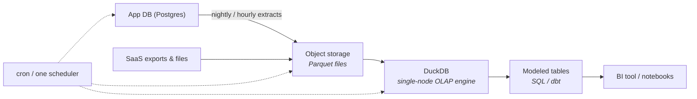

Here is the number the big-data era preferred not to mention: the median company's *entire analytical history* fits comfortably on a laptop's SSD. Surveys of cloud warehouses keep finding the same shape — most workloads scan megabytes to low gigabytes. Meanwhile, a generation of three-engineer teams operates Spark clusters sized for companies a thousand times their size.

This part is the counter-school: **small data as a deliberate architecture**, not an embarrassing starting point.

## The birth pain

This school was born from a *cost*, but not the cloud bill — the **complexity bill**. Every distributed component you add (cluster, streaming, orchestration for the orchestration) brings its own failure modes, upgrade cycles, and 2 a.m. pages. When the data is 80 GB, that complexity buys you literally nothing: a modern machine has more RAM than that.

Meanwhile hardware quietly won the race against most companies' data growth: hundreds of GB of RAM, NVMe SSDs at millions of IOPS, and single-node query engines that scan a billion rows per second. The distributed systems of Parts 3–7 were designed for constraints most companies simply do not have.

## The architecture

The whole platform is four decisions:

1. **Postgres stays Postgres.** Your app database is the system of record; a read replica handles the few operational lookups. Don't turn it into a warehouse — extract from it.
2. **Object storage + Parquet is the "lake"** — same open-format instinct as Part 3, minus the table-format machinery until you need updates and time travel.
3. **DuckDB (single-node OLAP) is the engine** — an in-process engine that queries Parquet directly, runs in a container, a laptop, or a CI job, and covers the scan-heavy analytics a warehouse would. Zero clusters. The same slot can be a small managed warehouse if you prefer paying over operating — the *shape* is what matters: **one node, no distributed anything**.
4. **One scheduler, boring by choice** — cron or a single lightweight orchestrator running SQL/dbt models. Idempotent jobs (S02's mantra) matter *more* here, because simplicity is the whole value proposition.

Total operational surface: one database you already had, one bucket, one binary, one scheduler. A single engineer runs this in a fraction of their week — which is precisely the constraint (Part 1's *team* axis) this school optimizes for.

## What you give up — honestly

- **Concurrency:** DuckDB-style engines serve *few* users at once. Ten analysts on dashboards is fine (BI caches help); a thousand customers on embedded analytics is Part 5's job.
- **Real-time:** micro-batch every 5–15 minutes is the practical floor — which, per Part 4's gate question, satisfies almost everyone who *claims* to need real-time.
- **Very large joins:** when working sets genuinely exceed one machine's RAM+SSD, single-node loses. That's the actual boundary — not a headcount of rows.
- **Résumé glamour:** the stack won't trend on any conference stage. It just ships.

## The graduation signals

The point is not "never scale" — it's **scale on evidence**. Watch for:

1. Query working sets approaching single-machine limits *after* Parquet compression and partitioning — hundreds of GB scanned per query, not stored in total.
2. A genuine Part 5 need: customer-facing analytics with real concurrency.
3. A genuine Part 4 need: an action window in seconds.
4. Team growth to the point where domains fight over one pipeline repo (Part 7's territory).

Each signal points at a *specific* school to graduate into — and because your data already lives in open formats on object storage, that migration (Part 13) is a ramp, not a cliff. Design the exit on day one; take it only when a signal fires.

## Three customers

- **Startup:** this *is* your architecture. Full stop. Revisit at each fundraise.
- **SME with a small data team:** still this, often for years — plus dbt discipline and the Part 2 modeling ideas on top. Most "we need a lakehouse" conversations at this size are Part 1's resume-driven warning in disguise.
- **A department inside an enterprise:** surprisingly common — a domain team running a small-data stack *beside* the corporate platform for speed, feeding results back through the governed channels. Legitimate, if the governance overlay (Part 10) is respected.

## Key takeaways

- Most companies are small data: their entire history fits on one modern machine, and hardware growth outpaced their data growth.
- The stack is four boring pieces: Postgres as-is, Parquet on object storage, a single-node OLAP engine, one scheduler — an operational surface one engineer can own.
- You trade concurrency, sub-minute latency, and glamour; you keep open formats, so graduating later is a ramp, not a rewrite.
- Scale on evidence, not on fear: each graduation signal points to a specific school in this series.

*Next up — Part 9: Multi-tenant Analytics: One Platform, Many Customers.*
