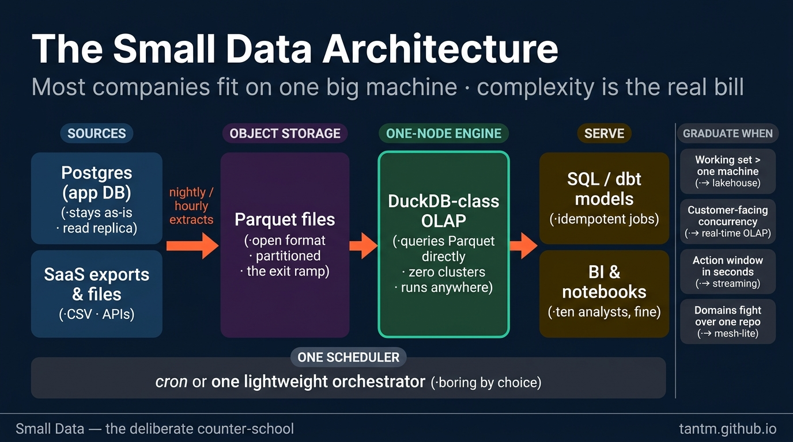
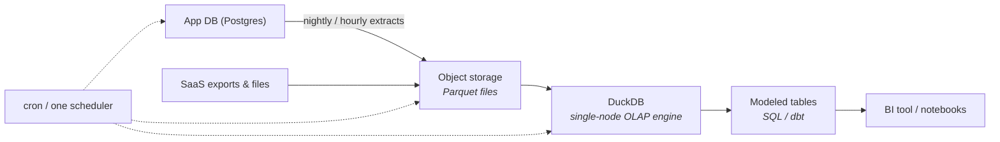

Here is the number the big-data era preferred not to mention: the median company's *entire analytical history* fits comfortably on a laptop's SSD. Surveys of cloud warehouses keep finding the same shape — most workloads scan megabytes to low gigabytes. Meanwhile, a generation of three-engineer teams operates Spark clusters sized for companies a thousand times their size.

This part is the counter-school: **small data as a deliberate architecture**, not an embarrassing starting point.



## What you'll learn

- Recognize when "big data" tooling is pure overhead for your actual data size.
- Assemble the four-decision small-data stack, and know what each piece replaces.
- State honestly what you give up, so the choice is deliberate rather than naive.
- Name the four signals that mean it's time to graduate — and which school to graduate to.

**Prerequisites:** Parts 2–3 (warehouse and lakehouse) so the comparison lands.

## 1. The birth pain

This school was born from a *cost*, but not the cloud bill — the **complexity bill**. Every distributed component you add (cluster, streaming, orchestration for the orchestration) brings its own failure modes, upgrade cycles, and 2 a.m. pages. When the data is 80 GB, that complexity buys you literally nothing: a modern machine has more RAM than that.

Meanwhile hardware quietly won the race against most companies' data growth: hundreds of GB of RAM, NVMe SSDs at millions of IOPS, and single-node query engines that scan a billion rows per second. The distributed systems of Parts 3–7 were designed for constraints most companies simply do not have.

## 2. The architecture



The whole platform is four decisions:

1. **Postgres stays Postgres.** Your app database is the system of record; a read replica handles the few operational lookups. Don't turn it into a warehouse — extract from it.
2. **Object storage + Parquet is the "lake"** — same open-format instinct as Part 3, minus the table-format machinery until you need updates and time travel.
3. **DuckDB (single-node OLAP) is the engine** — an in-process engine that queries Parquet directly, runs in a container, a laptop, or a CI job, and covers the scan-heavy analytics a warehouse would. Zero clusters. The same slot can be a small managed warehouse if you prefer paying over operating — the *shape* is what matters: **one node, no distributed anything**.
4. **One scheduler, boring by choice** — cron or a single lightweight orchestrator running SQL/dbt models. Idempotent jobs (S02's mantra) matter *more* here, because simplicity is the whole value proposition.

Total operational surface: one database you already had, one bucket, one binary, one scheduler. A single engineer runs this in a fraction of their week — which is precisely the constraint (Part 1's *team* axis) this school optimizes for.

## 3. What you give up — honestly

- **Concurrency:** DuckDB-style engines serve *few* users at once. Ten analysts on dashboards is fine (BI caches help); a thousand customers on embedded analytics is Part 5's job.
- **Real-time:** micro-batch every 5–15 minutes is the practical floor — which, per Part 4's gate question, satisfies almost everyone who *claims* to need real-time.
- **Very large joins:** when working sets genuinely exceed one machine's RAM+SSD, single-node loses. That's the actual boundary — not a headcount of rows.
- **Résumé glamour:** the stack won't trend on any conference stage. It just ships.

## 4. The graduation signals

The point is not "never scale" — it's **scale on evidence**. Watch for:

1. Query working sets approaching single-machine limits *after* Parquet compression and partitioning — hundreds of GB scanned per query, not stored in total.
2. A genuine Part 5 need: customer-facing analytics with real concurrency.
3. A genuine Part 4 need: an action window in seconds.
4. Team growth to the point where domains fight over one pipeline repo (Part 7's territory).

Each signal points at a *specific* school to graduate into — and because your data already lives in open formats on object storage, that migration (Part 13) is a ramp, not a cliff. Design the exit on day one; take it only when a signal fires.

## 5. Three customers

- **Startup:** this *is* your architecture. Full stop. Revisit at each fundraise.
- **SME with a small data team:** still this, often for years — plus dbt discipline and the Part 2 modeling ideas on top. Most "we need a lakehouse" conversations at this size are Part 1's resume-driven warning in disguise.
- **A department inside an enterprise:** surprisingly common — a domain team running a small-data stack *beside* the corporate platform for speed, feeding results back through the governed channels. Legitimate, if the governance overlay (Part 10) is respected.

## Practice (20 minutes — run a real analytics query over 50 million rows on your laptop)

The argument of this part is empirical, so measure it. DuckDB, one file, no cluster:

```bash
pip install duckdb
```

```sql
-- duckdb small.db
-- 50 million rows: larger than most companies' actual fact tables
CREATE TABLE events AS
SELECT (i % 50000)                                        AS customer_id,
       (i % 12) + 1                                       AS month,
       (i % 7)                                            AS channel,
       ((i * 37) % 10000) / 100.0                         AS amount
FROM range(50000000) t(i);

.timer on
-- 1. A full aggregation over all 50M rows
SELECT channel, count(*), round(sum(amount), 2) AS revenue
FROM events GROUP BY channel ORDER BY revenue DESC;

-- 2. A grouped top-N — the shape most dashboards actually run
SELECT customer_id, sum(amount) AS spend FROM events
GROUP BY customer_id ORDER BY spend DESC LIMIT 10;

-- 3. A join, because "you need Spark for joins" is the usual claim
CREATE TABLE customers AS
SELECT i AS customer_id, 'seg-' || (i % 5) AS segment FROM range(50000) t(i);
SELECT c.segment, count(*) AS n, round(sum(e.amount), 2) AS revenue
FROM events e JOIN customers c USING (customer_id)
GROUP BY c.segment ORDER BY revenue DESC;

-- 4. Write it out as Parquet — the same open format a lakehouse would use
COPY (SELECT * FROM events WHERE month <= 3) TO 'q1.parquet' (FORMAT PARQUET);
SELECT count(*) FROM 'q1.parquet';        -- query the file directly, no import step
```

Expected results: each of these completes in seconds on an ordinary laptop, including the join across 50 million rows. Check the size of `q1.parquet` too — columnar compression usually surprises people who have been sizing storage from row counts. The point isn't that DuckDB beats Spark; it's that the data size at which you *need* a cluster is far larger than most teams assume, and every month spent operating a cluster you didn't need is a month not spent on the data itself.

## Check yourself

1. Your company's largest table is 80 GB and grows 2 GB a month. A vendor proposes a distributed processing cluster. What do you propose instead, and what's your evidence?
2. Which of the four graduation signals is about *data*, and which are about *people*? Why does that distinction matter?
3. What do you genuinely give up by choosing the small-data stack, and how would you keep the exit door open?

<details><summary>See answers</summary>

1. A single large machine with a columnar engine (DuckDB or similar) reading Parquet, orchestrated by one scheduler. The evidence is the exercise above: 50 million rows aggregate and join in seconds on a laptop, so 80 GB on a properly sized instance is comfortably within reach — and at 2 GB a month you have years before that changes.
2. Data size is the only signal about data; concurrency needs, team growth, and governance requirements are all about people and organization. It matters because teams usually graduate for the people reasons long before the data reason, and misdiagnosing that leads to buying a distributed engine when the actual problem was too many concurrent users or too little access control.
3. Mainly elastic concurrency, horizontal headroom, and the managed governance features that come with a warehouse platform. Keep the exit open by storing in an open format (Parquet, or a table format) rather than an engine-specific one, and by keeping transformation logic in plain SQL — then graduating means changing the engine, not rewriting the platform.

</details>

## Key takeaways

- Most companies are small data: their entire history fits on one modern machine, and hardware growth outpaced their data growth.
- The stack is four boring pieces: Postgres as-is, Parquet on object storage, a single-node OLAP engine, one scheduler — an operational surface one engineer can own.
- You trade concurrency, sub-minute latency, and glamour; you keep open formats, so graduating later is a ramp, not a rewrite.
- Scale on evidence, not on fear: each graduation signal points to a specific school in this series.

*Next up — Part 9: Multi-tenant Analytics: One Platform, Many Customers.*
