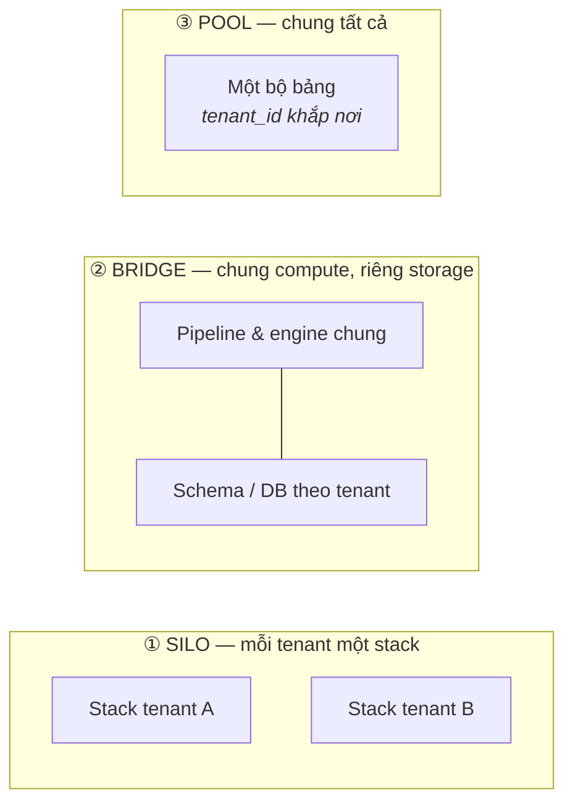

Các trường phái trước đều phục vụ câu hỏi của chính công ty mình. Phần này lật ngược hướng: **platform của bạn phục vụ dữ liệu của *các công ty khác*** — một sản phẩm SaaS có analytics bên trong, một agency chạy một stack cho nhiều khách, một data product bán theo subscription. Một platform, nhiều khách hàng, và một mệnh lệnh tối cao mới: **khách A không bao giờ được thấy dữ liệu của khách B — và không bao giờ phải cảm nhận workload của B.**


## Bạn sẽ học được gì

- Chọn giữa silo, bridge và pool từ các ràng buộc, không từ cái sơ đồ bạn thích.
- Cưỡng chế cách ly ở mọi lớp, và biết lớp nào là tuyến phòng thủ cuối cùng.
- Ngăn một tenant làm hỏng hiệu năng của tất cả những tenant còn lại.
- Đo chi phí theo từng tenant, để quyết định giá và công suất dựa trên con số.

**Cần biết trước:** Phần 2-3 (warehouse và lakehouse). Sự thật thà về small-data ở Phần 8 áp cho các tenant nhỏ nhất của bạn.

## 1. Nỗi đau khai sinh

Multi-tenancy ra đời vào ngày khách hàng thứ hai ký hợp đồng. Clone nguyên stack cho mỗi khách thì cách ly hoàn hảo — và team platform có chức danh mới là "người upgrade N bản sao của mọi thứ". Nhét tất cả vào một database với cột `tenant_id` thì một lần deploy — và một mệnh đề `WHERE` đứng giữa bạn và một tít báo rò rỉ dữ liệu. Cả trường phái này là khoảng không giữa hai vách đá đó.

## 2. Ba mô hình tenancy



- **Silo** — mỗi tenant một stack riêng (database riêng, đôi khi account riêng). Cách ly tối đa, câu chuyện compliance tối đa, chi phí tăng tuyến tính theo tenant, vận hành tăng tệ hơn tuyến tính. Mô hình mà khách bị kiểm soát hoặc khách rất lớn *đòi hỏi*.
- **Pool** — mọi tenant chung bảng; mỗi dòng mang `tenant_id`; mỗi query lọc theo nó. Rẻ nhất trên đầu tenant, onboard tenant thứ 1000 dễ như thứ 10, và dồn toàn bộ rủi ro vào việc access control phải đúng, ở mọi nơi, mãi mãi.
- **Bridge** — chung pipeline và compute, nhưng storage tách theo tenant (schema-per-tenant hoặc database-per-tenant). Điểm giữa thực dụng mà đa số platform B2B hội tụ về.

Đáp án thật của một platform trưởng thành thường là **phân bậc**: pool cho cái đuôi dài khách nhỏ, bridge cho tầm trung, silo cho hai khách enterprise có security team chuyên gửi questionnaire.

## 3. Cách ly, theo từng lớp

Tenancy không phải một quyết định — nó là cùng một câu hỏi ở bốn lớp:

| Lớp | Đáp án pool | Cái bẫy |
|---|---|---|
| **Storage** | Cột `tenant_id` + partition theo tenant | Thiếu một filter là trả về dòng của *tất cả* |
| **Query** | Row-level security (RLS) trong engine, không phải `WHERE` trong code app | Policy áp cho *vài* đường truy cập — BI tool đi vòng qua |
| **Compute** | Workload management: queue, resource group, quota per-tenant | Dashboard Black-Friday của một tenant bỏ đói tất cả (noisy neighbor) |
| **Pipelines** | Job tham số hoá theo tenant, lập lịch công bằng | File hỏng của một tenant chặn cả lượt chạy chung |

Hai thói quen gánh phần lớn sự an toàn. Một, **đẩy cách ly xuống platform, đừng để ở application**: RLS trong database thắng cái `WHERE tenant_id = ?` mà mọi developer phải nhớ, và credential scope theo tenant thắng cả hai. Hai, **test biên giới một cách thù địch** — một check tự động đăng nhập bằng tenant A và cố đọc dữ liệu B phải chạy trong CI mãi mãi.

## 4. Noisy neighbor và cuốn sổ chi phí

Chung compute nghĩa là chung số phận: một tenant nặng kéo p95 của tất cả xuống. Các biện pháp là cơ học — quota, query timeout, warehouse/pool riêng theo bậc, admission control — nhưng *công cụ tổ chức* lại là kinh tế: **đo đếm theo tenant**. Gắn thẻ mỗi query, mỗi lượt pipeline, mỗi GB lưu trữ với tenant gây ra nó. Bạn nhận cùng lúc ba siêu năng lực:

1. **Vận hành:** noisy neighbor hiện hình trong vài phút, không cần war room.
2. **Định giá:** bạn biết một tenant thật sự tốn bao nhiêu — trước khi kỳ gia hạn hợp đồng biết.
3. **Kiến trúc:** dữ liệu metering *chính là* bằng chứng để chuyển một tenant giữa các bậc (pool → bridge → silo).

Chi phí per-tenant không phải chuyện hậu kỳ của tài chính; trong trường phái này nó là yêu cầu thiết kế hạng nhất (Phần 12 tổng quát hoá ý này).

## 5. Chấm theo năm trục

- **Team:** platform chung = một codebase để vận hành, nhưng bug tenancy là bug bảo mật; thanh review và testing nâng lên vĩnh viễn.
- **Scale:** mô hình pool onboard hàng nghìn tenant; mô hình silo onboard các auditor.
- **Latency:** thừa kế từ trường phái nền (một tầng OLAP Phần 5 dạng pool rất phổ biến cho embedded analytics).
- **Budget:** toàn bộ cuộc chơi — chi phí biên per-tenant quyết định gross margin của sản phẩm.
- **Compliance:** data residency theo tenant ("dữ liệu khách EU ở lại EU") có thể ép silo theo region bất kể bạn muốn gì (lại Phần 10).

## 6. Ba khách hàng (lần này là của bạn)

- **SaaS startup:** bắt đầu pool với RLS từ ngày đầu — trang bị lại kỷ luật `tenant_id` về sau rất cay đắng. Dashboard nhúng chạy trên một engine Phần 5 dạng pool.
- **Agency / consultancy:** bridge — schema-per-client trên hạ tầng chung; offboard khách thành `DROP SCHEMA`, auditor rất thích.
- **Platform B2B có khách enterprise:** phân bậc — pool cho cái đuôi, silo (tới mức account riêng) cho cá voi; sales sẽ bán bậc silo dù bạn đã xây hay chưa, nên hãy thiết kế nó trước.

## Thực hành (25 phút — viết bài test đối kháng mà một bug tenancy thật sẽ trượt)

Cách ly là một trong số ít tính chất kiến trúc bạn thật sự unit-test được, và bài test thì ngắn. Đây là phép kiểm thuộc về CI mãi mãi:

```sql
-- duckdb tenancy.db  — mô hình POOL: một bảng, một cột tenant_id, dùng chung mọi thứ
CREATE TABLE orders(tenant_id VARCHAR, order_id VARCHAR, amount DECIMAL(10,2));
INSERT INTO orders VALUES
  ('acme','A-1',100),('acme','A-2',250),
  ('globex','G-1',999),('globex','G-2',50),
  ('initech','I-1',10);

-- 1. Đường truy cập dự kiến: mọi query đều bị khoanh theo tenant
CREATE VIEW v_orders_acme AS SELECT * FROM orders WHERE tenant_id = 'acme';
SELECT count(*) AS rows_visible, sum(amount) AS total FROM v_orders_acme;

-- 2. BÀI TEST ĐỐI KHÁNG — cái này phải trả về 0, mãi mãi, trong CI
SELECT count(*) AS leaked FROM v_orders_acme WHERE tenant_id <> 'acme';

-- 3. Kiểu rò rỉ qua số tổng không ai test: các con số lộ ra tenant khác
SELECT count(DISTINCT tenant_id) AS tenants_visible FROM v_orders_acme;   -- phải bằng 1
SELECT max(amount) AS max_seen FROM v_orders_acme;                        -- không được là 999

-- 4. Đo đếm: chi phí và mức dùng theo tenant, cũng chính là máy dò noisy neighbor
SELECT tenant_id, count(*) AS rows, sum(amount) AS value,
       round(100.0 * count(*) / (SELECT count(*) FROM orders), 1) AS pct_of_platform
FROM orders GROUP BY 1 ORDER BY rows DESC;
```

Rồi làm nửa trên giấy, nơi quyết định thật sự nằm. Với hệ thống của chính bạn, điền mỗi lớp tenant một dòng:

| Lớp tenant | Mô hình (silo/bridge/pool) | Vì sao | Cái gì vỡ trước ở quy mô 10 lần |
|---|---|---|---|
| … | … | … | … |

Kết quả mong đợi: query 2 mới là query đáng giá, và nó trông thừa thãi một cách nhàm chán — đó chính là điểm mấu chốt. Bug cách ly thì im lặng: không gì báo lỗi, một khách hàng đơn giản là nhìn thấy dữ liệu của khách hàng khác, và bạn biết chuyện từ chính họ. Một bài test khẳng định không dòng chéo-tenant nào trên mọi đường truy cập biến "chúng tôi có lọc theo tenant" từ một quy ước thành thứ CI cưỡng chế. Query 3 bắt phiên bản tinh vi hơn mà người ta hay quên: bộ lọc có thể đúng trong khi một con số tổng vẫn để lộ sự tồn tại, số lượng hay độ lớn của các tenant khác. Query 4 là thứ cho phép bạn trả lời "khách nào đang làm platform chậm?" bằng một con số thay vì một linh cảm.

## Tự kiểm tra

1. Ứng dụng của bạn lọc mọi query theo `tenant_id` ở tầng truy cập dữ liệu, và code review cưỡng chế điều đó. Vì sao vẫn chưa đủ?
2. Một tenant chạy báo cáo quét toàn bộ và dashboard của mọi tenant khác chậm hẳn. Bạn đang ở mô hình nào, và có những lựa chọn gì?
3. Khi nào mô hình silo — mỗi tenant một stack cách ly — lại là lựa chọn *rẻ hơn* bất chấp việc trùng lặp?

<details><summary>Xem đáp án</summary>

1. Vì nó phụ thuộc vào việc mọi lập trình viên đều nhớ, mãi mãi, trên mọi đường query mới — kể cả phân tích tuỳ hứng, export, công cụ admin và các cú join tương lai. Hãy đẩy ràng buộc xuống một tầng nơi không thể quên được: row-level security trong database, schema riêng, hoặc credential riêng theo tenant. Rồi giữ bài test đối kháng trong CI làm thứ chứng minh điều đó.
2. Pool: compute dùng chung không có giới hạn theo tenant. Các lựa chọn theo chi phí tăng dần: xếp hàng hoặc giới hạn tốc độ query nặng theo tenant, cho các tenant lớn compute riêng (mô hình bridge) trong khi tenant nhỏ vẫn dùng chung, hoặc đặt trần tài nguyên cứng cho từng tenant. Query đo đếm là cách bạn tìm ra nên dời tenant nào.
3. Khi cách ly là yêu cầu hợp đồng hoặc quy định, khi một tenant lớn tới mức đằng nào cũng được cấp công suất riêng, hoặc khi các tenant cần region, lịch chạy hay phiên bản khác nhau. Silo cũng rẻ hơn về giờ công kỹ thuật khi thiết kế dùng chung của bạn cần quá nhiều ngoại lệ riêng-từng-tenant tới mức đường dùng chung thôi còn dùng chung.

</details>

## Điều cần nhớ

- Ba mô hình — silo, bridge, pool — đánh đổi cách ly lấy chi phí biên; platform trưởng thành thường phân bậc cả ba.
- Cách ly là câu hỏi bốn lớp (storage, query, compute, pipelines); đẩy nó xuống platform và test biên giới thù địch trong CI.
- Noisy neighbor giải bằng cơ học (quota) nhưng *quản* bằng kinh tế (metering per-tenant) — thứ đồng thời định giá sản phẩm của bạn.
- Data residency có thể phủ quyết tất cả; biết rõ tenant nào mang theo địa lý riêng của họ.

*Tiếp theo — Phần 10: Data platform trong ngành có kiểm soát.*
