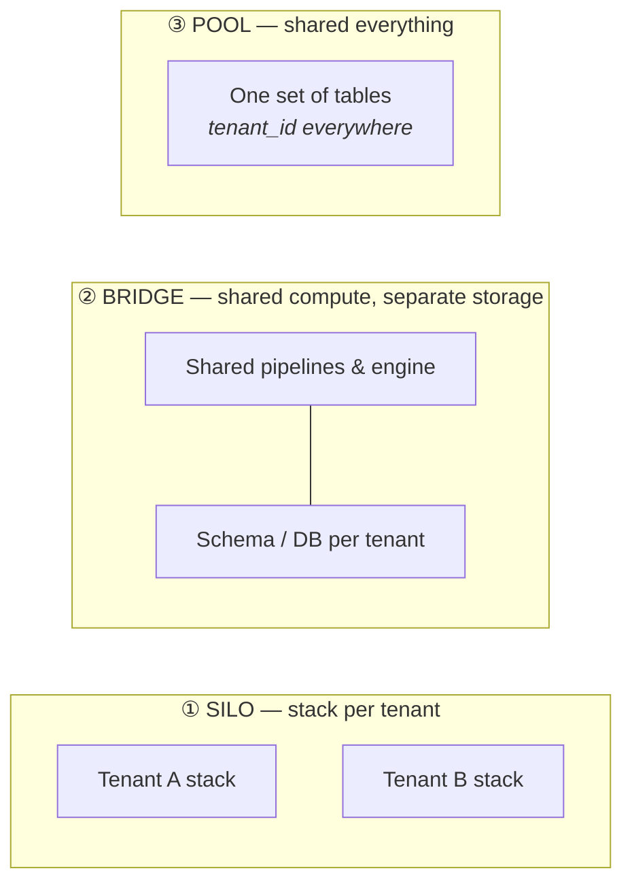

Every school so far served one company's own questions. This part flips the direction: **your platform serves *other companies'* data** — a SaaS product with analytics inside, an agency running one stack for many clients, a data product sold to subscribers. One platform, many customers, and a new prime directive: **customer A must never see customer B's data — and never feel B's workload.**


## What you'll learn

- Choose among silo, bridge and pool tenancy from the constraints, not from the diagram you like.
- Enforce isolation at every layer, and know which layer is your last line of defense.
- Prevent one tenant from ruining performance for everyone else.
- Meter cost per tenant, so pricing and capacity decisions rest on numbers.

**Prerequisites:** Parts 2-3 (warehouse and lakehouse). Part 8's small-data honesty applies to your smallest tenants.

## 1. The birth pain

Multi-tenancy is born the day your second customer signs. Clone the whole stack per customer and you get perfect isolation — and a platform team whose job title becomes "upgrading N copies of everything". Put everyone in one database with a `tenant_id` column and you get one deployment — and one `WHERE` clause standing between you and a breach headline. The whole school is the space between those two cliffs.

## 2. The three tenancy models



- **Silo** — each tenant gets their own stack (own database, sometimes own account). Maximum isolation, maximum compliance story, cost scales linearly with tenants, operations scale worse than linearly. The model regulated or very large customers *demand*.
- **Pool** — all tenants share tables; every row carries `tenant_id`; every query filters on it. Cheapest per tenant, trivially onboards tenant #1000, and concentrates all risk into access control done perfectly, everywhere, forever.
- **Bridge** — shared pipelines and compute, but storage separated per tenant (schema-per-tenant or database-per-tenant). The pragmatic middle that most B2B platforms converge on.

The real answer for a grown platform is usually **tiered**: pool for the long tail of small tenants, bridge for mid-tier, silo for the two enterprise customers whose security team sends questionnaires.

## 3. Isolation, layer by layer

Tenancy is not one decision — it's the same question at four layers:

| Layer | Pool answer | The trap |
|---|---|---|
| **Storage** | `tenant_id` column + partitioning by tenant | A missing filter returns *everyone's* rows |
| **Query** | Row-level security (RLS) policies in the engine, not `WHERE` clauses in app code | Policies applied to *some* access paths — the BI tool bypasses them |
| **Compute** | Workload management: queues, resource groups, per-tenant quotas | One tenant's Black-Friday dashboard starves everyone (noisy neighbor) |
| **Pipelines** | Parameterized-by-tenant jobs, fair scheduling | One tenant's malformed file blocks the shared run for all |

Two habits carry most of the safety. First, **push isolation into the platform, not the application**: RLS in the database beats a `WHERE tenant_id = ?` that every developer must remember, and tenant-scoped credentials beat both. Second, **test the boundary adversarially** — an automated check that logs in as tenant A and tries to read B should run in CI forever.

## 4. The noisy neighbor and the cost ledger

Shared compute means shared fate: one heavy tenant degrades everyone's p95. The mitigations are mechanical — quotas, query timeouts, separate warehouses/pools per tier, admission control — but the *organizing tool* is economic: **metering per tenant**. Tag every query, every pipeline run, every GB stored with the tenant that caused it. This gives you three superpowers at once:

1. **Ops:** the noisy neighbor is visible in minutes, not in a war room.
2. **Pricing:** you learn what a tenant actually costs — before your contract renewal does.
3. **Architecture:** the metering data *is* the evidence for moving a tenant between tiers (pool → bridge → silo).

Per-tenant cost is not a finance afterthought; in this school it is a first-class design requirement (Part 12 generalizes this).

## 5. Scoring on the five axes

- **Team:** shared platform = one codebase to run, but tenancy bugs are security bugs; the bar for review and testing rises permanently.
- **Scale:** the pool model onboards thousands of tenants; the silo model onboards auditors.
- **Latency:** inherited from the underlying school (a pooled Part 5 OLAP layer is common for embedded analytics).
- **Budget:** the whole game — per-tenant marginal cost decides your product's gross margin.
- **Compliance:** tenant data residency ("EU customers' data stays in the EU") can force region-level silos regardless of your preferences (Part 10 again).

## 6. Three customers (of yours, this time)

- **SaaS startup:** start pooled with RLS from day one — retrofitting `tenant_id` discipline later is grim. Embedded dashboards ride a pooled Part 5 engine.
- **Agency / consultancy:** bridge — schema-per-client on shared infrastructure; client offboarding becomes `DROP SCHEMA`, which auditors love.
- **B2B platform with enterprise buyers:** tiered — pool for the tail, silo (up to dedicated accounts) for the whales; sales will sell the silo tier whether you built it or not, so design it first.

## Practice (25 minutes — write the adversarial test that a real tenancy bug would fail)

Isolation is one of the few architecture properties you can actually unit-test, and the test is short. This is the check that belongs in CI forever:

```sql
-- duckdb tenancy.db  — a POOL model: one table, a tenant_id column, shared everything
CREATE TABLE orders(tenant_id VARCHAR, order_id VARCHAR, amount DECIMAL(10,2));
INSERT INTO orders VALUES
  ('acme','A-1',100),('acme','A-2',250),
  ('globex','G-1',999),('globex','G-2',50),
  ('initech','I-1',10);

-- 1. The intended access path: every query is scoped by tenant
CREATE VIEW v_orders_acme AS SELECT * FROM orders WHERE tenant_id = 'acme';
SELECT count(*) AS rows_visible, sum(amount) AS total FROM v_orders_acme;

-- 2. THE ADVERSARIAL TEST — this must return 0, forever, in CI
SELECT count(*) AS leaked FROM v_orders_acme WHERE tenant_id <> 'acme';

-- 3. The aggregate leak nobody tests for: totals that reveal other tenants
SELECT count(DISTINCT tenant_id) AS tenants_visible FROM v_orders_acme;   -- must be 1
SELECT max(amount) AS max_seen FROM v_orders_acme;                        -- must not be 999

-- 4. Metering: cost and usage per tenant, which is also your noisy-neighbor detector
SELECT tenant_id, count(*) AS rows, sum(amount) AS value,
       round(100.0 * count(*) / (SELECT count(*) FROM orders), 1) AS pct_of_platform
FROM orders GROUP BY 1 ORDER BY rows DESC;
```

Then do the paper half, which is where the real decision lives. For your own system, fill in one row per tenant class:

| Tenant class | Model (silo/bridge/pool) | Why | What breaks first at 10x |
|---|---|---|---|
| … | … | … | … |

Expected results: query 2 is the one that matters, and it should look boringly redundant — that's the point. Isolation bugs are silent: nothing errors, a customer simply sees another customer's data, and you find out from them. A test that asserts zero cross-tenant rows on every access path turns "we filter by tenant" from a convention into something CI enforces. Query 3 catches the subtler version people forget: filters can be correct while an aggregate still reveals the existence, count or magnitude of other tenants. Query 4 is what lets you answer "which customer is making the platform slow?" with a number instead of a hunch.

## Check yourself

1. Your application filters every query by `tenant_id` in the data-access layer, and code review enforces it. Why is this not enough?
2. One tenant runs a report that scans everything and every other tenant's dashboard goes slow. Which model were you on, and what are your options?
3. When is the silo model — one isolated stack per tenant — the *cheaper* choice despite the duplication?

<details><summary>See answers</summary>

1. Because it depends on every developer remembering, forever, on every new query path — including ad-hoc analysis, exports, admin tools and future joins. Push the constraint down a layer where it cannot be forgotten: row-level security in the database, separate schemas, or separate credentials per tenant. Then keep the adversarial test in CI as the thing that proves it.
2. Pool: shared compute with no per-tenant limits. Options in increasing cost: queue or rate-limit heavy queries per tenant, give large tenants their own compute (the bridge model) while small ones stay pooled, or set hard resource caps per tenant. The metering query is how you find which tenant to move.
3. When isolation is a contractual or regulatory requirement, when a tenant is large enough that they'd get dedicated capacity anyway, or when tenants need different regions, schedules or versions. Silo also becomes cheaper in engineering time when your pooled design would need so many per-tenant exceptions that the shared path stops being shared.

</details>

## Key takeaways

- Three models — silo, bridge, pool — trading isolation against marginal cost; grown platforms usually tier all three.
- Isolation is a four-layer question (storage, query, compute, pipelines); push it into the platform and adversarially test the boundary in CI.
- Noisy neighbors are solved mechanically with quotas but *managed* economically with per-tenant metering — which also prices your product.
- Data residency can override all of it; know which tenants bring their own geography.

*Next up — Part 10: Data Platforms in Regulated Industries.*
