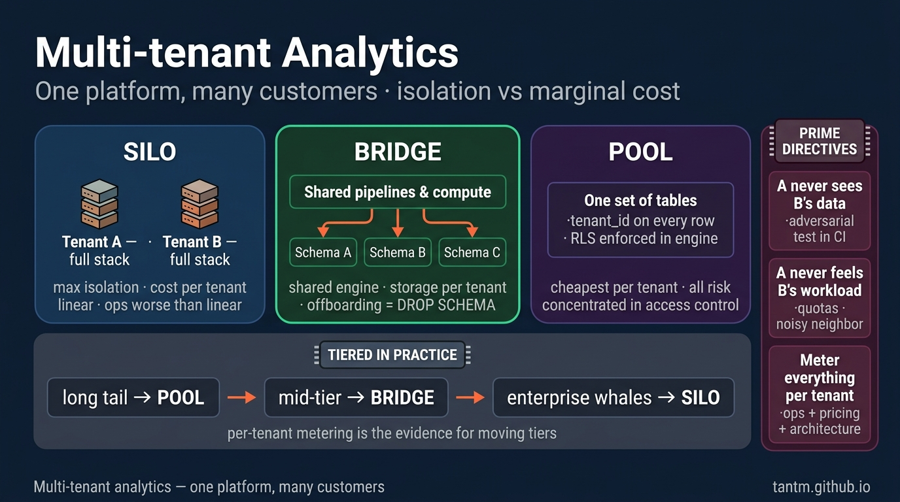
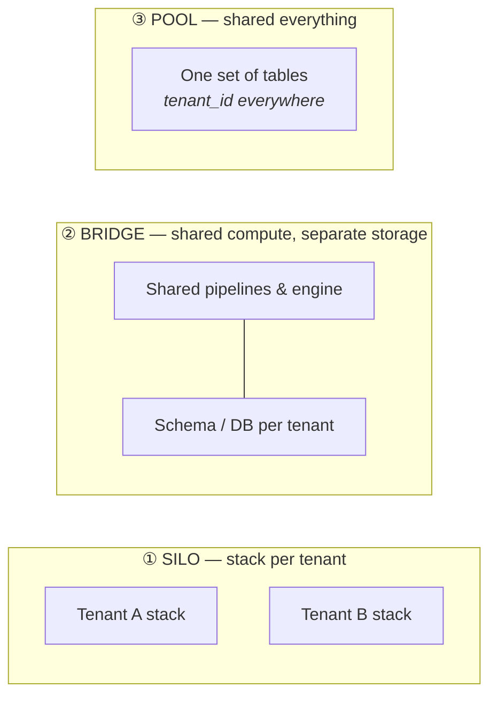

Every school so far served one company's own questions. This part flips the direction: **your platform serves *other companies'* data** — a SaaS product with analytics inside, an agency running one stack for many clients, a data product sold to subscribers. One platform, many customers, and a new prime directive: **customer A must never see customer B's data — and never feel B's workload.**

## The birth pain

Multi-tenancy is born the day your second customer signs. Clone the whole stack per customer and you get perfect isolation — and a platform team whose job title becomes "upgrading N copies of everything". Put everyone in one database with a `tenant_id` column and you get one deployment — and one `WHERE` clause standing between you and a breach headline. The whole school is the space between those two cliffs.

## The three tenancy models

- **Silo** — each tenant gets their own stack (own database, sometimes own account). Maximum isolation, maximum compliance story, cost scales linearly with tenants, operations scale worse than linearly. The model regulated or very large customers *demand*.
- **Pool** — all tenants share tables; every row carries `tenant_id`; every query filters on it. Cheapest per tenant, trivially onboards tenant #1000, and concentrates all risk into access control done perfectly, everywhere, forever.
- **Bridge** — shared pipelines and compute, but storage separated per tenant (schema-per-tenant or database-per-tenant). The pragmatic middle that most B2B platforms converge on.

The real answer for a grown platform is usually **tiered**: pool for the long tail of small tenants, bridge for mid-tier, silo for the two enterprise customers whose security team sends questionnaires.

## Isolation, layer by layer

Tenancy is not one decision — it's the same question at four layers:

| Layer | Pool answer | The trap |
|---|---|---|
| **Storage** | `tenant_id` column + partitioning by tenant | A missing filter returns *everyone's* rows |
| **Query** | Row-level security (RLS) policies in the engine, not `WHERE` clauses in app code | Policies applied to *some* access paths — the BI tool bypasses them |
| **Compute** | Workload management: queues, resource groups, per-tenant quotas | One tenant's Black-Friday dashboard starves everyone (noisy neighbor) |
| **Pipelines** | Parameterized-by-tenant jobs, fair scheduling | One tenant's malformed file blocks the shared run for all |

Two habits carry most of the safety. First, **push isolation into the platform, not the application**: RLS in the database beats a `WHERE tenant_id = ?` that every developer must remember, and tenant-scoped credentials beat both. Second, **test the boundary adversarially** — an automated check that logs in as tenant A and tries to read B should run in CI forever.

## The noisy neighbor & the cost ledger

Shared compute means shared fate: one heavy tenant degrades everyone's p95. The mitigations are mechanical — quotas, query timeouts, separate warehouses/pools per tier, admission control — but the *organizing tool* is economic: **metering per tenant**. Tag every query, every pipeline run, every GB stored with the tenant that caused it. This gives you three superpowers at once:

1. **Ops:** the noisy neighbor is visible in minutes, not in a war room.
2. **Pricing:** you learn what a tenant actually costs — before your contract renewal does.
3. **Architecture:** the metering data *is* the evidence for moving a tenant between tiers (pool → bridge → silo).

Per-tenant cost is not a finance afterthought; in this school it is a first-class design requirement (Part 12 generalizes this).

## Scoring on the five axes

- **Team:** shared platform = one codebase to run, but tenancy bugs are security bugs; the bar for review and testing rises permanently.
- **Scale:** the pool model onboards thousands of tenants; the silo model onboards auditors.
- **Latency:** inherited from the underlying school (a pooled Part 5 OLAP layer is common for embedded analytics).
- **Budget:** the whole game — per-tenant marginal cost decides your product's gross margin.
- **Compliance:** tenant data residency ("EU customers' data stays in the EU") can force region-level silos regardless of your preferences (Part 10 again).

## Three customers (of yours, this time)

- **SaaS startup:** start pooled with RLS from day one — retrofitting `tenant_id` discipline later is grim. Embedded dashboards ride a pooled Part 5 engine.
- **Agency / consultancy:** bridge — schema-per-client on shared infrastructure; client offboarding becomes `DROP SCHEMA`, which auditors love.
- **B2B platform with enterprise buyers:** tiered — pool for the tail, silo (up to dedicated accounts) for the whales; sales will sell the silo tier whether you built it or not, so design it first.

## Key takeaways

- Three models — silo, bridge, pool — trading isolation against marginal cost; grown platforms usually tier all three.
- Isolation is a four-layer question (storage, query, compute, pipelines); push it into the platform and adversarially test the boundary in CI.
- Noisy neighbors are solved mechanically with quotas but *managed* economically with per-tenant metering — which also prices your product.
- Data residency can override all of it; know which tenants bring their own geography.

*Next up — Part 10: Data Platforms in Regulated Industries.*
