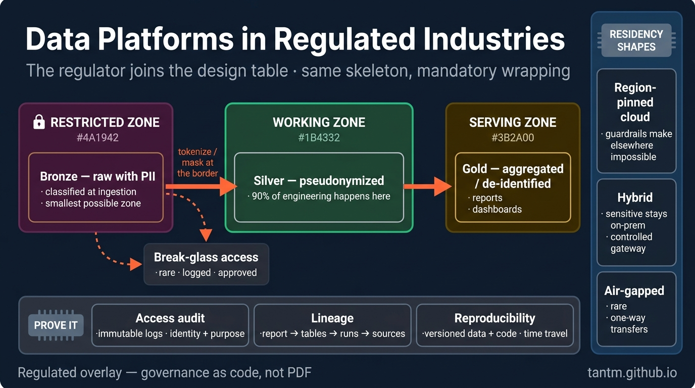
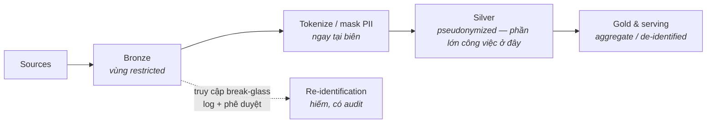

Mọi phần trước đều ngầm định một bộ stakeholder: công ty bạn, người dùng của bạn. Phần này kê thêm chiếc ghế thứ ba vào bàn thiết kế — **cơ quan quản lý** — và cùng nó là archetype ngân hàng / y tế / khu vực công. Bài học tiêu đề đã hé lộ từ Phần 2–3 và đúng ở mọi nơi: quy định hiếm khi thay đổi *bộ khung* kiến trúc. Nó bọc bộ khung đó trong các lớp bắt buộc. Thuộc các lớp ấy như những pattern — thay vì khám phá lại qua mỗi kỳ audit — chính là kỹ năng.

*(Mọi thứ ở đây là catalog pattern công khai, mô tả ở mức archetype.)*

## Bạn sẽ học được gì

- Trả lời câu "chứng minh đi" bằng artifact chứ không bằng lời cam đoan.
- Phân loại dữ liệu trước, phân vùng sau, vì thứ tự đó quyết định mọi thứ phía dưới.
- Chọn hình dạng residency khớp với nghĩa vụ, không chọn cái dễ vẽ nhất.
- Biến lineage và khả năng tái tạo thành tính chất của nền tảng chứ không phải chiến công cá nhân.

**Cần biết trước:** Phần 2-3 (nền tảng platform) và Phần 9 (cách ly). Toàn bộ nội dung ở đây là phòng thủ và ở mức pattern.

## 1. Nỗi đau khai sinh

Ba yêu cầu ập đến mà không trường phái nào trước đó phải tính giá:

1. **"Chứng minh đi."** Không phải "con số có đúng không" mà là *"cho xem ai đã chạm dữ liệu này, lúc nào, với phê duyệt gì, và tái tạo đúng bản báo cáo đã nộp hồi tháng Ba."* Bằng chứng, không phải lời cam đoan.
2. **"Dữ liệu ở yên đây."** Residency: một số dữ liệu phải nằm trong một quốc gia, một region, hay một toà nhà. Lựa chọn cloud region vừa trở thành một câu hỏi pháp lý.
3. **"Quyền tối thiểu, chứng minh được."** PII và các lớp nhạy cảm chỉ được chạm bởi các role có lý do — và bạn phải *chứng minh* được điều đó, không chỉ có ý định tốt.

## 2. Phân loại trước, phân vùng sau

Không thể bảo vệ thứ chưa dán nhãn. Nước đi nền móng là một **bộ phân loại dữ liệu** (public / internal / confidential / restricted-PII là hình dạng bốn bậc phổ biến) áp *ngay lúc ingest*, lưu làm metadata trong catalog, và enforce tự động ở hạ nguồn.

Rồi phân vùng platform theo phân loại — medallion của Phần 3 mọc thêm tường:

Ý cốt lõi: **dồn PII vào vùng nhỏ nhất có thể, sớm nhất có thể.** Tokenize hoặc mask ngay biên bronze/silver để 90% công việc engineering và analytics diễn ra trên dữ liệu pseudonymized — còn truy cập vùng thô trở thành sự kiện hiếm, có log, có phê duyệt ("break-glass"). Riêng pattern này thu nhỏ bề mặt audit của bạn hơn mọi món tool mua thêm.

## 3. Residency và các hình dạng triển khai

Ba hình dạng lặp lại, theo thứ tự độ đau vận hành tăng dần:

- **Cloud ghim region** — toàn bộ storage và compute ghim vào các region được duyệt; guardrail cấp tổ chức (kiểu kiểm soát multi-account của Phần 12) khiến việc tạo tài nguyên nơi khác là *bất khả thi*, không chỉ là bị nhắc nhở.
- **Hybrid** — dữ liệu nhạy cảm (hoặc hệ thống gốc) ở lại on-premises; cloud xử lý compute trên các bản trích pseudonymized, hoặc một lakehouse on-prem giữ dữ liệu restricted trong khi cloud phục vụ phần còn lại. Đường biên cần một gateway có kiểm soát với audit trail riêng — hai nửa *chắc chắn sẽ* trôi dạt về vận hành, nên "parity tự động hoá" giữa chúng là mục tiêu thiết kế, không phải điều có-thì-tốt.
- **Air-gapped / sovereign** — hiếm và đắt: môi trường cô lập hoàn toàn cho workload nhạy cảm nhất, dữ liệu đi qua các cú chuyển một-chiều có review. Không chứng minh được là cần thì đừng xây.

Quyết định residency cũng đổ dây chuyền sang thế giới Phần 9: địa lý của một tenant có thể ép một silo theo region cho riêng họ.

## 4. Audit, lineage và khả năng tái tạo

"Chứng minh đi" dịch thành ba thuộc tính kỹ thuật:

- **Access audit** — mọi lượt đọc dữ liệu restricted được log kèm danh tính và mục đích; log bất biến (write-once storage) và giữ đủ số năm luật định. Nhàm chán, bắt buộc, rẻ nếu làm từ ngày đầu và khốn khổ nếu trang bị lại.
- **Lineage** — với bất kỳ con số nào trong báo cáo đã nộp, đi ngược được: view → bảng → lượt chạy pipeline → bản trích nguồn. Catalog + metadata của orchestrator cho bạn phần lớn; phần kỷ luật là *không cho phép cửa ngách* (file CSV trên laptop của analyst là nơi lineage đến để chết).
- **Khả năng tái tạo** — sinh lại báo cáo quý trước *đúng như nó đã là*: dữ liệu có version (time travel của Phần 3 kiếm cơm ở đây), code có version, dữ liệu tham chiếu có version. Đây là lập luận sát thủ cho table format ở các shop có kiểm soát.

Và meta-pattern trùm lên cả ba: **governance as code.** Chính sách được platform enforce (RLS, masking theo phân loại, guardrail, CI check) là loại duy nhất sống sót qua cả audit lẫn thay người. Chính sách trong file PDF là điều ước; chính sách trong code là một control.

## 5. Chấm theo năm trục

- **Compliance:** hiển nhiên là trục thống trị — nó *phủ quyết* sở thích của các trục khác chứ không trao đổi ngang giá.
- **Budget/Team:** chuẩn bị cho một khoản thuế đáng kể — mã hoá/quản lý khoá, môi trường nhân đôi, tooling bằng chứng, quy trình thay đổi chậm hơn. Đưa hẳn vào roadmap; giả vờ nó miễn phí là cách các chương trình chết vào mùa audit.
- **Latency/Scale:** nguyên tắc không đổi, nhưng mọi streaming log hay OLAP projection giờ thừa kế nghĩa vụ phân loại và residency (các cảnh báo PII của Phần 4–6, giờ thành bắt buộc).

## 6. Ba archetype có kiểm soát

- **Archetype ngân hàng:** trọn thực đơn — phân loại, phân vùng, residency, lineage tới báo cáo đã nộp, cộng cổng change-management cho việc deploy pipeline. Lớp phủ có thể nhân đôi thời gian tới dashboard đầu tiên; đó là giá thật thà của ràng buộc, không phải sự kém cỏi.
- **Archetype y tế:** PII thành PHI và consent bước vào model — *mục đích sử dụng* đi kèm dữ liệu, và chuẩn de-identification do bên ngoài định nghĩa thay vì tự thiết kế.
- **Archetype khu vực công:** chủ quyền thống trị — luật mua sắm, cloud quốc gia hoặc on-prem, và chân trời lưu trữ dài tới mức open format (Phần 3) thành yêu cầu sinh tồn, vì dữ liệu sẽ sống lâu hơn mọi hợp đồng vendor.

## Thực hành (25 phút — trả lời ba câu hỏi của auditor bằng artifact, không bằng lời cam đoan)

Bài này không có lab để chạy, vì sẵn-sàng-cho-audit là một tính chất của tài liệu. Bài tập là trả lời ba câu hỏi mà một auditor thật sự hỏi, về một hệ thống bạn biết, bằng cách viết ra — rồi để ý xem câu trả lời nào bạn không tạo ra nổi.

**Câu 1 — "Dữ liệu cá nhân nằm ở đâu trong platform này?"** Hãy tạo một cái bảng. Không phải một đoạn mô tả, một cái bảng:

| Dataset | Có PII không? | Ở trường nào | Vùng | Retention | Ai đọc được |
|---|---|---|---|---|---|

Nếu điền được cái bảng này cần đi hỏi ba người, thì chính đó là phát hiện: câu trả lời đang nằm trong đầu người ta chứ không nằm trong một catalog, và trong vòng một quý nó sẽ sai.

**Câu 2 — "Ai đã truy cập dữ liệu của khách hàng X trong 90 ngày qua?"** Viết ra chính xác các bước bạn sẽ làm. Rồi đánh dấu mỗi bước là *một câu query bạn chạy được* hay *một người bạn phải đi hỏi*. Một platform sẵn sàng cho audit là khi cả con đường đều là query.

**Câu 3 — "Hãy tái tạo lại báo cáo bạn gửi chúng tôi hồi tháng Ba."** Viết ra những thứ bạn sẽ cần: phiên bản code, dữ liệu tại thời điểm đó, config, và định nghĩa của mọi chỉ số trên báo cáo. Đánh dấu trong bốn thứ đó hôm nay bạn thật sự lấy lại được cái nào.

Kết quả mong đợi: đa số team trả lời được câu 1 một phần, câu 2 nếu chịu khó, và câu 3 thì không — và khoảng trống thứ ba mới là khoảng trống đắt tiền, vì khả năng tái tạo phải được thiết kế vào trước khi có người yêu cầu. Pattern khép cả ba là một: hãy ghi lại nó thành dữ liệu ngay lúc nó xảy ra (một dòng trong catalog, một access log, một snapshot bất biến có version), vì không cái nào dựng lại được về sau. Nếu chỉ viết ra một artifact duy nhất từ bài tập này, hãy chọn cái bảng ở câu 1 — mọi biện pháp kiểm soát khác đều phụ thuộc vào việc biết dữ liệu nhạy cảm nằm ở đâu.

## Tự kiểm tra

1. Một cơ quan quản lý hỏi platform của bạn có tuân thủ không. Vì sao "có" là câu trả lời tệ ngay cả khi nó đúng?
2. Team bạn mask PII ở tầng analytics, còn dữ liệu thô nằm không mask trong lake với quyền đọc rộng rãi. Sai ở đâu?
3. Vì sao "xoá dữ liệu của khách hàng này" lại khó trên một platform không được thiết kế với điều đó trong đầu?

Xem đáp án

1. Vì tuân thủ là thứ được *chứng minh*, không phải thứ được khẳng định. Câu trả lời hữu ích là một bộ artifact: một data catalog cho thấy dữ liệu nhạy cảm nằm đâu, access log cho thấy ai đã đọc gì, lineage cho thấy một con số đến từ đâu, và bằng chứng rằng các biện pháp kiểm soát đã chạy. Một lời khẳng định không có artifact chính là thứ mà một cuộc audit sinh ra để không tin.
2. Biện pháp kiểm soát đặt sai lớp. Mask ở hạ nguồn bảo vệ cái báo cáo, không bảo vệ dữ liệu — bất kỳ ai có quyền vào lake đều đọc được giá trị thô, và mỗi consumer mới là một bản sao mới. Hãy phân loại và hạn chế ngay lúc ingest, để các trường nhạy cảm được bảo vệ tại nơi chúng đáp xuống chứ không phải tại một trong những nơi chúng được đọc.
3. Vì việc xoá phải với tới mọi bản sao: vùng thô, các bảng đã curate, snapshot, backup, cache, search index, vector store và các bản extract hạ nguồn. Platform không thiết kế cho điều đó sẽ tích luỹ bản sao mà không có ghi chép chúng đã đi đâu, nên xoá trở thành một cuộc khai quật không có cách nào chứng minh là đã xoá hết. Thiết kế cho nó nghĩa là theo dõi lineage và giữ cho số lượng bản sao luôn biết được.

## Điều cần nhớ

- Quy định bọc bộ khung chứ không thay nó: phân loại → phân vùng → dồn PII nhỏ và sớm → break-glass vùng thô.
- Residency có ba hình dạng — ghim region, hybrid, air-gapped — mỗi bậc đau vận hành hơn bậc trước một bậc độ lớn.
- "Chứng minh đi" = access audit + lineage + tái tạo được; table format và governance-as-code là thứ khiến nó chịu đựng nổi về chi phí.
- Tính thuế compliance một cách tường minh; chính sách trong code là control, chính sách trong PDF là điều ước.

*Tiếp theo — Phần 11: Data platform sẵn sàng cho AI.*
