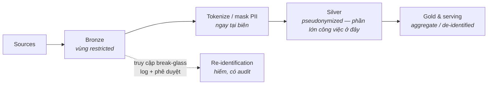

Mọi phần trước đều ngầm định một bộ stakeholder: công ty bạn, người dùng của bạn. Phần này kê thêm chiếc ghế thứ ba vào bàn thiết kế — **cơ quan quản lý** — và cùng nó là archetype ngân hàng / y tế / khu vực công. Bài học tiêu đề đã hé lộ từ Phần 2–3 và đúng ở mọi nơi: quy định hiếm khi thay đổi *bộ khung* kiến trúc. Nó bọc bộ khung đó trong các lớp bắt buộc. Thuộc các lớp ấy như những pattern — thay vì khám phá lại qua mỗi kỳ audit — chính là kỹ năng.

*(Mọi thứ ở đây là catalog pattern công khai, mô tả ở mức archetype.)*

## Nỗi đau khai sinh

Ba yêu cầu ập đến mà không trường phái nào trước đó phải tính giá:

1. **"Chứng minh đi."** Không phải "con số có đúng không" mà là *"cho xem ai đã chạm dữ liệu này, lúc nào, với phê duyệt gì, và tái tạo đúng bản báo cáo đã nộp hồi tháng Ba."* Bằng chứng, không phải lời cam đoan.
2. **"Dữ liệu ở yên đây."** Residency: một số dữ liệu phải nằm trong một quốc gia, một region, hay một toà nhà. Lựa chọn cloud region vừa trở thành một câu hỏi pháp lý.
3. **"Quyền tối thiểu, chứng minh được."** PII và các lớp nhạy cảm chỉ được chạm bởi các role có lý do — và bạn phải *chứng minh* được điều đó, không chỉ có ý định tốt.

## Pattern 1 — Phân loại trước, phân vùng sau

Không thể bảo vệ thứ chưa dán nhãn. Nước đi nền móng là một **bộ phân loại dữ liệu** (public / internal / confidential / restricted-PII là hình dạng bốn bậc phổ biến) áp *ngay lúc ingest*, lưu làm metadata trong catalog, và enforce tự động ở hạ nguồn.

Rồi phân vùng platform theo phân loại — medallion của Phần 3 mọc thêm tường:

Ý cốt lõi: **dồn PII vào vùng nhỏ nhất có thể, sớm nhất có thể.** Tokenize hoặc mask ngay biên bronze/silver để 90% công việc engineering và analytics diễn ra trên dữ liệu pseudonymized — còn truy cập vùng thô trở thành sự kiện hiếm, có log, có phê duyệt ("break-glass"). Riêng pattern này thu nhỏ bề mặt audit của bạn hơn mọi món tool mua thêm.

## Pattern 2 — Residency & các hình dạng triển khai

Ba hình dạng lặp lại, theo thứ tự độ đau vận hành tăng dần:

- **Cloud ghim region** — toàn bộ storage và compute ghim vào các region được duyệt; guardrail cấp tổ chức (kiểu kiểm soát multi-account của Phần 12) khiến việc tạo tài nguyên nơi khác là *bất khả thi*, không chỉ là bị nhắc nhở.
- **Hybrid** — dữ liệu nhạy cảm (hoặc hệ thống gốc) ở lại on-premises; cloud xử lý compute trên các bản trích pseudonymized, hoặc một lakehouse on-prem giữ dữ liệu restricted trong khi cloud phục vụ phần còn lại. Đường biên cần một gateway có kiểm soát với audit trail riêng — hai nửa *chắc chắn sẽ* trôi dạt về vận hành, nên "parity tự động hoá" giữa chúng là mục tiêu thiết kế, không phải điều có-thì-tốt.
- **Air-gapped / sovereign** — hiếm và đắt: môi trường cô lập hoàn toàn cho workload nhạy cảm nhất, dữ liệu đi qua các cú chuyển một-chiều có review. Không chứng minh được là cần thì đừng xây.

Quyết định residency cũng đổ dây chuyền sang thế giới Phần 9: địa lý của một tenant có thể ép một silo theo region cho riêng họ.

## Pattern 3 — Audit, lineage & khả năng tái tạo

"Chứng minh đi" dịch thành ba thuộc tính kỹ thuật:

- **Access audit** — mọi lượt đọc dữ liệu restricted được log kèm danh tính và mục đích; log bất biến (write-once storage) và giữ đủ số năm luật định. Nhàm chán, bắt buộc, rẻ nếu làm từ ngày đầu và khốn khổ nếu trang bị lại.
- **Lineage** — với bất kỳ con số nào trong báo cáo đã nộp, đi ngược được: view → bảng → lượt chạy pipeline → bản trích nguồn. Catalog + metadata của orchestrator cho bạn phần lớn; phần kỷ luật là *không cho phép cửa ngách* (file CSV trên laptop của analyst là nơi lineage đến để chết).
- **Khả năng tái tạo** — sinh lại báo cáo quý trước *đúng như nó đã là*: dữ liệu có version (time travel của Phần 3 kiếm cơm ở đây), code có version, dữ liệu tham chiếu có version. Đây là lập luận sát thủ cho table format ở các shop có kiểm soát.

Và meta-pattern trùm lên cả ba: **governance as code.** Chính sách được platform enforce (RLS, masking theo phân loại, guardrail, CI check) là loại duy nhất sống sót qua cả audit lẫn thay người. Chính sách trong file PDF là điều ước; chính sách trong code là một control.

## Chấm theo năm trục

- **Compliance:** hiển nhiên là trục thống trị — nó *phủ quyết* sở thích của các trục khác chứ không trao đổi ngang giá.
- **Budget/Team:** chuẩn bị cho một khoản thuế đáng kể — mã hoá/quản lý khoá, môi trường nhân đôi, tooling bằng chứng, quy trình thay đổi chậm hơn. Đưa hẳn vào roadmap; giả vờ nó miễn phí là cách các chương trình chết vào mùa audit.
- **Latency/Scale:** nguyên tắc không đổi, nhưng mọi streaming log hay OLAP projection giờ thừa kế nghĩa vụ phân loại và residency (các cảnh báo PII của Phần 4–6, giờ thành bắt buộc).

## Ba archetype có kiểm soát

- **Archetype ngân hàng:** trọn thực đơn — phân loại, phân vùng, residency, lineage tới báo cáo đã nộp, cộng cổng change-management cho việc deploy pipeline. Lớp phủ có thể nhân đôi thời gian tới dashboard đầu tiên; đó là giá thật thà của ràng buộc, không phải sự kém cỏi.
- **Archetype y tế:** PII thành PHI và consent bước vào model — *mục đích sử dụng* đi kèm dữ liệu, và chuẩn de-identification do bên ngoài định nghĩa thay vì tự thiết kế.
- **Archetype khu vực công:** chủ quyền thống trị — luật mua sắm, cloud quốc gia hoặc on-prem, và chân trời lưu trữ dài tới mức open format (Phần 3) thành yêu cầu sinh tồn, vì dữ liệu sẽ sống lâu hơn mọi hợp đồng vendor.

## Điều cần nhớ

- Quy định bọc bộ khung chứ không thay nó: phân loại → phân vùng → dồn PII nhỏ và sớm → break-glass vùng thô.
- Residency có ba hình dạng — ghim region, hybrid, air-gapped — mỗi bậc đau vận hành hơn bậc trước một bậc độ lớn.
- "Chứng minh đi" = access audit + lineage + tái tạo được; table format và governance-as-code là thứ khiến nó chịu đựng nổi về chi phí.
- Tính thuế compliance một cách tường minh; chính sách trong code là control, chính sách trong PDF là điều ước.

*Tiếp theo — Phần 11: Data platform sẵn sàng cho AI.*
