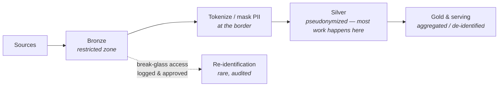

Every previous part assumed one implicit stakeholder set: your company, your users. This part adds a third chair at the design table — **the regulator** — and with it the banking / healthcare / public-sector archetype. The headline lesson was previewed in Parts 2–3 and holds everywhere: regulation rarely changes the *skeleton* of your architecture. It wraps the same skeleton in mandatory layers. Knowing those layers as patterns — rather than rediscovering them per audit — is the skill.

*(Everything here is the public pattern catalog, described at the archetype level.)*

## What you'll learn

- Answer "prove it" with artifacts rather than assurances.
- Classify data first and zone it second, because the order determines everything downstream.
- Pick a residency shape that matches the obligation, not the one that's easiest to draw.
- Make lineage and reproducibility properties of the platform rather than heroics.

**Prerequisites:** Parts 2-3 (platform basics) and Part 9 (isolation). Everything here is defensive and pattern-level.

## 1. The birth pain

Three demands arrive that no earlier school had to price in:

1. **"Prove it."** Not "is the number right" but *"show who touched this data, when, with what approval, and reproduce the report as filed last March."* Evidence, not assurances.
2. **"Data stays here."** Residency: certain data must remain in a country, a region, or a building. Your cloud region choice just became a legal question.
3. **"Least access, provably."** PII and sensitive classes must be reachable only by roles with a reason — and you must be able to demonstrate that, not just intend it.

## 2. Classify first, zone second

You cannot protect what you haven't labeled. The foundational move is a **data classification scheme** (public / internal / confidential / restricted-PII is a common four-tier shape) applied *at ingestion*, stored as metadata in the catalog, and enforced downstream automatically.

Then zone the platform by classification — the medallion of Part 3 grows walls:

The key idea: **push PII into the smallest possible zone, earliest possible.** Tokenize or mask at the bronze/silver border so 90% of engineering and analytics happens on pseudonymized data — and access to the raw zone becomes a rare, logged, approved event ("break-glass"). This single pattern shrinks your audit surface more than any tool purchase.

## 3. Residency and deployment shapes

Three recurring shapes, in increasing order of operational pain:

- **Region-pinned cloud** — all storage and compute pinned to approved regions; org-level guardrails (the Part 12-style multi-account controls) make it *impossible*, not just discouraged, to create resources elsewhere.
- **Hybrid** — sensitive data (or the systems of record) stay on-premises; the cloud handles compute on pseudonymized extracts, or an on-prem lakehouse handles restricted data while cloud serves the rest. The border needs a controlled gateway with its own audit trail — the two halves *will* drift apart operationally, so automation parity across them is a design goal, not a nice-to-have.
- **Air-gapped / sovereign** — rare and expensive: fully isolated environments for the most sensitive workloads, with data crossing via reviewed, one-way transfers. If you don't demonstrably need this, don't build it.

The residency decision also cascades into Part 9's world: one tenant's geography can force a regional silo for them alone.

## 4. Audit, lineage and reproducibility

"Prove it" translates into three technical properties:

- **Access audit** — every read of restricted data logged with identity and purpose; logs immutable (write-once storage) and retained for the mandated years. Boring, mandatory, cheap to do from day one and miserable to retrofit.
- **Lineage** — for any number in a filed report, walk backwards: view → tables → pipeline runs → source extracts. Catalog + orchestrator metadata gets you most of it; the discipline is *not allowing side doors* (the analyst's laptop CSV is where lineage goes to die).
- **Reproducibility** — regenerate last quarter's report *as it was*: versioned data (Part 3's time travel earns its keep here), versioned code, versioned reference data. This is the killer argument for table formats in regulated shops.

And the meta-pattern over all three: **governance as code.** Policies enforced by the platform (RLS, classification-driven masking, guardrails, CI checks) are the only kind that survive both audits and staff turnover. A policy in a PDF is a wish; a policy in code is a control.

## 5. Scoring on the five axes

- **Compliance:** obviously the dominant axis — it *overrides* the others' preferences rather than trading against them.
- **Budget/Team:** expect a meaningful tax — encryption/key management, duplicated environments, evidence tooling, and slower change processes. Price it into the roadmap; pretending it's free is how programs die in audit season.
- **Latency/Scale:** unchanged in principle, but every streaming log or OLAP projection now inherits classification and residency duties (Parts 4–6's PII warnings, now enforced).

## 6. Three regulated archetypes

- **Bank archetype:** the full menu — classification, zoning, residency, lineage to filed reports, plus change-management gates on pipeline deployments. The overlay can double time-to-first-dashboard; that is the constraint's honest cost, not incompetence.
- **Healthcare archetype:** PII becomes PHI and consent enters the model — *purpose of use* travels with the data, and de-identification standards are externally defined rather than designed in-house.
- **Public sector archetype:** sovereignty dominates — procurement rules, national clouds or on-prem, and long retention horizons that make open formats (Part 3) a survival requirement, because the data will outlive every vendor contract.

## Practice (25 minutes — answer three auditor questions with artifacts, not assurances)

This part has no lab to run, because being audit-ready is a documentation property. The exercise is to answer the three questions an auditor actually asks, about a system you know, in writing — and then notice which answers you cannot produce.

**Question 1 — "Where is personal data in this platform?"** Produce a table. Not a description, a table:

| Dataset | Contains PII? | Which fields | Zone | Retention | Who can read it |
|---|---|---|---|---|---|

If filling this in requires asking three people, that is the finding: the answer exists in people's heads rather than in a catalog, and it will be wrong within a quarter.

**Question 2 — "Who accessed customer X's data in the last 90 days?"** Write the exact steps you would take. Then mark each step as either *a query you can run* or *a person you must ask*. A platform is audit-ready when the whole path is queries.

**Question 3 — "Reproduce the report you sent us in March."** Write down what you would need: the code version, the data as of that date, the config, and the definition of every metric on it. Mark which of the four you can actually retrieve today.

Expected results: most teams can answer question 1 partially, question 2 with effort, and question 3 not at all — and the third gap is the expensive one, because reproducibility has to be designed in before it's requested. The pattern that closes all three is the same: capture it as data at the time it happens (a catalog entry, an access log, an immutable snapshot with a version), because none of them can be reconstructed afterwards. If you write only one artifact from this exercise, make it the table in question 1 — every other control depends on knowing where the sensitive data is.

## Check yourself

1. A regulator asks whether your platform is compliant. Why is "yes" a bad answer even when it's true?
2. Your team masks PII in the analytics layer, and the raw data sits unmasked in the lake with broad read access. What's wrong?
3. Why is "delete this customer's data" hard on a platform that was designed without it in mind?

See answers

1. Because compliance is demonstrated, not asserted. The useful answer is a set of artifacts: a data catalog showing where sensitive data lives, access logs showing who read what, lineage showing where a number came from, and evidence that controls ran. A claim without artifacts is exactly what an audit exists to disbelieve.
2. The control is at the wrong layer. Masking downstream protects the report, not the data — anyone with lake access reads the raw values, and every new consumer is a new copy. Classify and restrict at ingestion, so the sensitive fields are protected in the place they land rather than in one of the places they are read.
3. Because deletion has to reach every copy: raw zone, curated tables, snapshots, backups, caches, search indexes, vector stores and downstream extracts. Platforms designed without it accumulate copies with no record of where they went, so deletion becomes an archaeology project with no way to prove completeness. Designing for it means tracking lineage and keeping the number of copies knowable.

## Key takeaways

- Regulation wraps the skeleton, it doesn't replace it: classify → zone → push PII small and early → break-glass the raw zone.
- Residency comes in three shapes — region-pinned, hybrid, air-gapped — each an order of magnitude more operational pain than the last.
- "Prove it" = access audit + lineage + reproducibility; table formats and governance-as-code are what make it affordable.
- Budget the compliance tax explicitly; a policy in code is a control, a policy in a PDF is a wish.

*Next up — Part 11: The AI-Ready Data Platform.*
