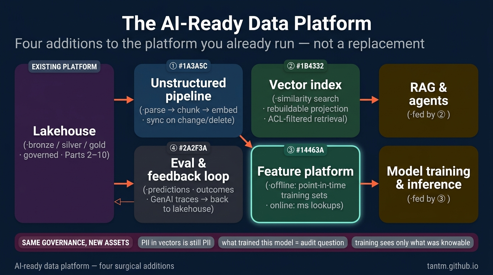
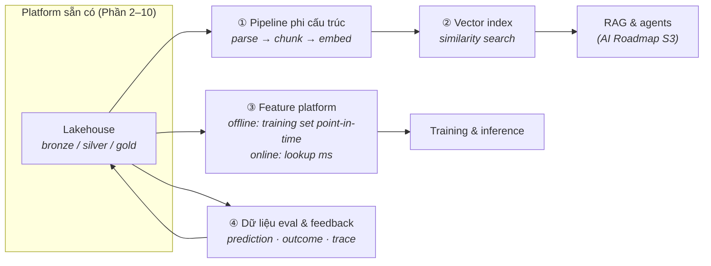

Sớm muộn cũng có một team gõ cửa platform của bạn và nói "bọn em làm AI". Hai phản ứng sai là hai thái cực: đập xây lại tất cả ("cần một AI platform!") hoặc vít thêm một vector database vào hông rồi coi như xong. Phản ứng đúng mang tính phẫu thuật: **AI thêm bốn năng lực cụ thể vào platform bạn đang có** — và thừa kế mọi kỷ luật từ Phần 2–10.



## Bạn sẽ học được gì

- Gọi tên thứ mà workload AI cần nhưng một platform cổ điển chưa có sẵn.
- Thêm bốn mảnh — lưu trữ phi cấu trúc, vector, feature, vòng lặp eval — mà không phải xây lại gì.
- Giữ vector index đồng bộ, và mang phân quyền vào trong chúng.
- Nối dài governance hiện có sang các tài sản mới thay vì đẻ ra một chế độ song song.

**Cần biết trước:** Phần 2-3 (nền móng platform) và Phần 10 (governance trong môi trường có kiểm soát).

## 1. Nỗi đau khai sinh

Analytics cổ điển tiêu thụ *aggregate của quá khứ*. Workload AI tiêu thụ ba thứ platform của bạn có lẽ chưa phục vụ:

- **Ví dụ, không phải aggregate** — training cần lịch sử chi tiết, *đúng như nó trông ở thời điểm đó* (leakage — vô tình để thông tin của ngày mai lọt vào dòng training của hôm qua — là sát thủ thầm lặng của ngành).
- **Dữ liệu phi cấu trúc là công dân hạng nhất** — tài liệu, ticket, transcript, ảnh. Phần 2–3 mới *lưu* chúng; AI cần chúng *được xử lý*: parse, chunk, embed, index.
- **Lookup độ trễ thấp lúc inference** — model đang chấm điểm một request cần feature của đúng khách hàng này trong mili-giây, không phải một câu query warehouse.

Team không lấy được các thứ này từ platform sẽ xây pipeline chui (căn bệnh Phần 7, phiên bản AI) — notebook nuôi model bằng file CSV export, không lineage, không tái tạo được. "AI-ready" phần lớn chính là *ngăn chuyện đó*.

## 2. Bốn phần bổ sung



**① Pipeline phi cấu trúc.** Tài liệu cũng được hưởng chế độ medallion: file thô ở bronze, text đã parse + metadata ở silver, biểu diễn đã chunk-và-embed như một sản phẩm cỡ gold. Phần bị đánh giá thấp là **đồng bộ**: khi tài liệu nguồn đổi hoặc bị xoá, chunk và vector phải đi theo — không thì app RAG của bạn tự tin trích dẫn một chính sách đã bị rút từ quý trước. Coi embedding là một *bảng dẫn xuất* với pipeline refresh, không phải một script chạy một lần.

**② Vector index.** Về kiến trúc, đây là bài học Phần 5 lặp lại: một **hình chiếu tầng serving, không phải nguồn sự thật** — rebuild được từ silver bất cứ lúc nào. Bắt đầu bằng năng lực vector bên trong database bạn đang chạy (pattern pgvector); chỉ lên vector engine chuyên dụng khi scale hay latency đòi hỏi. Các sai lầm đắt ở đây là vận hành, không phải công nghệ: không có chiến lược re-embed khi nâng model, và không lọc ACL lúc query (zoning của Phần 10 áp cho cả *chunk* — retrieval mà bỏ qua quyền là một API rò rỉ dữ liệu).

**③ Feature platform.** Hai mặt của cùng một bảng: store **offline** (bảng lakehouse với point-in-time đúng tuyệt đối cho training) và store **online** (một hình chiếu key-value cho lookup mili-giây lúc inference). Cả kỷ luật nén vào một câu: *training chỉ được thấy thứ có-thể-biết tại thời điểm đó* — và vì thế time travel của Phần 3 cùng timestamp CDC của Phần 6 hết là đồ trang trí. Mua hay tự xây nhỏ đều được; luật đúng-đắn mới là sản phẩm.

**④ Dữ liệu eval & feedback.** Phần bổ sung ai cũng quên: prediction, outcome, feedback người dùng, và (với GenAI) trace prompt/response chảy *ngược về lakehouse* như các bảng hạng nhất. Thiếu vòng lặp này bạn không trả lời nổi "model có tệ đi không?" — Phần 12 của AI Roadmap (evals) đứng trên đúng hệ ống nước này.

## 3. Governance: luật cũ, tài sản mới

Lớp phủ Phần 10 nối dài chứ không làm lại: training set cần **provenance** ("dữ liệu nào đã train model này" giờ là câu hỏi audit), embedding của PII vẫn là PII (xoá-theo-key phải lan xuống vector), và model artifact gia nhập lineage cùng data artifact. Làm tốt Phần 3 và 10 thì đây là thủ tục giấy tờ; làm dở thì AI là lúc món nợ bị đòi.

## 4. Chấm theo năm trục

- **Latency:** online feature store và vector serving mang yêu cầu mili-giây thật — cơ bắp mới cho một platform gốc batch.
- **Team:** team platform có thêm hai nhóm khách với hai bộ từ vựng (DS/ML và app engineer); đường trải nhựa (tư duy platform của Phần 7) thắng ticket.
- **Scale:** embedding nhân storage ở mức vừa phải; compute GPU cho embed/train là dạng bùng nổ theo đợt — hợp tự nhiên với capacity elastic/spot.
- **Budget:** đồng hồ tiền dịch từ storage sang *sự kiện compute* (re-embed cả corpus, retrain); metering theo use case của Phần 12 là van điều khiển.
- **Compliance:** provenance + PII-trong-vector là câu hỏi thi mới; trả lời trước khi model đầu tiên ship, đừng để sau.

## 5. Ba khách hàng

- **Startup:** pgvector + refresh embedding chạy đêm + bảng eval, tất cả trong stack small-data (Phần 8). AI-ready ≠ nặng nề; nó nghĩa là *có kỷ luật*.
- **Tầm trung:** bốn phần bổ sung trên lakehouse, tính đúng feature enforce bằng dbt test, một pipeline ingest RAG dùng chung thay vì script mỗi team một kiểu.
- **Enterprise / có kiểm soát:** mọi thứ trên + provenance model trong catalog, ACL vector soi gương quyền từ nguồn, và trace GenAI lưu theo cùng chế độ audit của Phần 10 — governance của platform chính là *lý do* chương trình AI qua được vòng review.

## Thực hành (25 phút — tìm ra con bug đồng bộ mà mọi vector index rồi cũng dính)

Bốn phần bổ sung thì dễ vẽ và dễ sai một cách tinh vi. Bài tập này tái hiện hai cú hỏng thật sự xảy ra: một index cũ, và một index để lộ tài liệu người dùng không được xem.

```python
# Một "platform" tí hon: một nguồn sự thật, và một vector index dẫn xuất từ nó
DOCS = {                      # nguồn sự thật (bảng lakehouse của bạn)
    "d1": {"text": "Hoàn tiền trong 14 ngày.",     "acl": ["support", "admin"]},
    "d2": {"text": "Gói Pro giá 49 USD mỗi chỗ.",  "acl": ["support", "admin", "public"]},
    "d3": {"text": "Bản nháp kế hoạch cắt giảm Q4.", "acl": ["admin"]},
}
INDEX = {}                    # bản sao dẫn xuất — một hình chiếu, như tầng serving

def reindex():
    INDEX.clear()
    for doc_id, d in DOCS.items():
        INDEX[doc_id] = {"text": d["text"], "acl": d["acl"]}   # ACL đi CÙNG vector

def search(query, user_roles, index=INDEX, enforce_acl=True):
    hits = []
    for doc_id, d in index.items():
        if enforce_acl and not set(d["acl"]) & set(user_roles):
            continue                                            # phân quyền ngay lúc RETRIEVAL
        if any(w in d["text"].lower() for w in query.lower().split()):
            hits.append((doc_id, d["text"]))
    return hits

reindex()
print("support tìm 'kế hoạch':", search("kế hoạch", ["support"]))
print("admin   tìm 'kế hoạch':", search("kế hoạch", ["admin"]))

# HỎNG 1 — index cũ: nguồn đổi, index không đổi
DOCS["d1"]["text"] = "Hoàn tiền trong 30 ngày."         # chính sách đổi hôm nay
print("sau khi đổi chính sách, index vẫn nói:", INDEX["d1"]["text"])
print("  -> trợ lý sẽ tự tin trích dẫn chính sách CŨ")
reindex()
print("sau khi reindex:", INDEX["d1"]["text"])

# HỎNG 2 — rò rỉ ACL: retrieval mà không phân quyền
DOCS["d3"]["acl"] = ["admin"]; reindex()
print("support CÓ kiểm acl   :", search("cắt giảm", ["support"]))
print("support KHÔNG kiểm    :", search("cắt giảm", ["support"], enforce_acl=False),
      " <- tài liệu họ không được đọc, giờ nằm trong prompt LLM")

# HỎNG 3 — cú im lặng: đổi model embedding mà không reindex
print("index dựng bằng model:", "v1", "| query giờ embed bằng:", "v2",
      "-> so sánh tương đồng xuyên hai không gian là vô nghĩa, và không gì báo lỗi")
```

Kết quả mong đợi: cú hỏng 1 là thứ người dùng báo về dưới dạng "AI trả lời sai" trong khi platform chỉ đơn giản là cũ — một vector index là bản sao dẫn xuất, và mọi bản sao dẫn xuất đều cần một hợp đồng làm mới kèm mục tiêu độ tươi có ghi rõ. Cú hỏng 2 là cú không ai báo, vì nó trông y như hệ thống đang chạy tốt: bước retrieval trả về một tài liệu, model tóm tắt nó rất hữu ích, và một nhân viên hỗ trợ vừa đọc xong kế hoạch cắt giảm. Phân quyền phải xảy ra ngay tại retrieval, với ACL lưu cạnh vector, vì tới lúc lắp prompt thì đoạn văn bản đã mất hết xuất xứ. Cú hỏng 3 thì không có triệu chứng nào cả — chỉ là câu trả lời lặng lẽ tệ đi — và đó là lý do phiên bản model embedding thuộc về metadata của index như một phiên bản schema.

## Tự kiểm tra

1. Trợ lý RAG của bạn trích dẫn một chính sách đã đổi hai tuần trước. Bug nằm ở đâu, và hợp đồng nào đang thiếu?
2. Vì sao lọc kết quả *sau* retrieval là thiết kế yếu hơn lọc ngay trong lúc retrieval?
3. Team bạn muốn thêm một vector database, một feature store và một pipeline eval. Bạn xây cái nào trước, và vì sao không làm cả ba?

<details><summary>Xem đáp án</summary>

1. Ở hợp đồng đồng bộ giữa nguồn sự thật và index dẫn xuất — không nằm ở model, cũng không nằm ở prompt. Vector index là một hình chiếu, nên nó cần một đường làm mới được định nghĩa (theo sự kiện hoặc theo lịch) và một mục tiêu độ tươi có người chịu trách nhiệm. Thiếu cái đó thì "AI trả lời sai" thật ra là "platform chưa bao giờ nói cho nó biết".
2. Vì lọc sau nghĩa là tài liệu bị cấm đã vào tới pipeline: nó chiếm một suất retrieval, nó có thể đã nằm trong prompt, và bất kỳ con bug nào trong bộ lọc cũng làm lộ nó. Lọc ngay trong lúc retrieval — với quyền lưu ngay cạnh vector — nghĩa là nội dung không được phép không bao giờ vào tới context, và đó là phiên bản duy nhất sống sót qua một sai lầm ở hạ nguồn.
3. Vòng lặp eval. Thiếu nó thì bạn không nói được vector database hay feature store có cải thiện gì không, nên bạn đang thêm hai hệ thống bằng niềm tin. Eval cũng là thứ rẻ nhất trong ba và là thứ khiến mọi thay đổi về sau đo được — hãy xây phép đo trước khi xây thứ được đo.

</details>

## Điều cần nhớ

- AI thêm bốn năng lực — pipeline phi cấu trúc, vector index, feature platform, vòng lặp eval/feedback — vào platform bạn đang chạy; nó không thay thế platform.
- Embedding và vector index là hình chiếu rebuild-được (luật Phần 5), với đồng bộ và ACL là phần khó.
- Kỷ luật feature là một câu: training chỉ thấy thứ có-thể-biết tại thời điểm đó — time travel và timestamp CDC khiến nó enforce được.
- PII trong vector vẫn là PII, và "cái gì đã train model này" là câu hỏi audit: lớp phủ Phần 10 nối dài sang tài sản AI.

*Tiếp theo — Phần 12: Thiết kế theo chi phí: pattern FinOps.*
