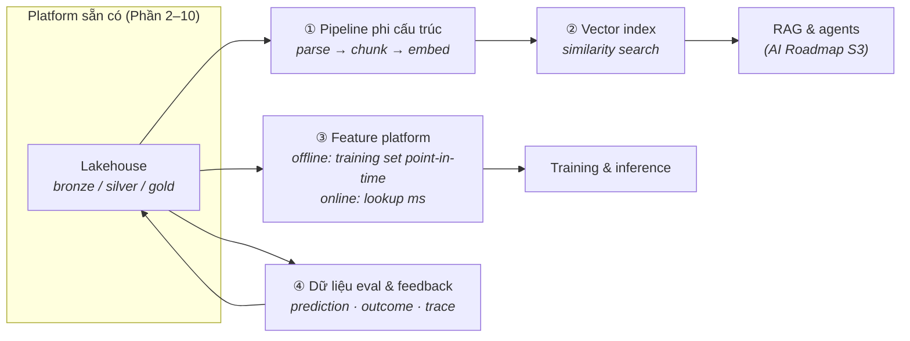

Sớm muộn cũng có một team gõ cửa platform của bạn và nói "bọn em làm AI". Hai phản ứng sai là hai thái cực: đập xây lại tất cả ("cần một AI platform!") hoặc vít thêm một vector database vào hông rồi coi như xong. Phản ứng đúng mang tính phẫu thuật: **AI thêm bốn năng lực cụ thể vào platform bạn đang có** — và thừa kế mọi kỷ luật từ Phần 2–10.

## Nỗi đau khai sinh

Analytics cổ điển tiêu thụ *aggregate của quá khứ*. Workload AI tiêu thụ ba thứ platform của bạn có lẽ chưa phục vụ:

- **Ví dụ, không phải aggregate** — training cần lịch sử chi tiết, *đúng như nó trông ở thời điểm đó* (leakage — vô tình để thông tin của ngày mai lọt vào dòng training của hôm qua — là sát thủ thầm lặng của ngành).
- **Dữ liệu phi cấu trúc là công dân hạng nhất** — tài liệu, ticket, transcript, ảnh. Phần 2–3 mới *lưu* chúng; AI cần chúng *được xử lý*: parse, chunk, embed, index.
- **Lookup độ trễ thấp lúc inference** — model đang chấm điểm một request cần feature của đúng khách hàng này trong mili-giây, không phải một câu query warehouse.

Team không lấy được các thứ này từ platform sẽ xây pipeline chui (căn bệnh Phần 7, phiên bản AI) — notebook nuôi model bằng file CSV export, không lineage, không tái tạo được. "AI-ready" phần lớn chính là *ngăn chuyện đó*.

## Bốn phần bổ sung

**① Pipeline phi cấu trúc.** Tài liệu cũng được hưởng chế độ medallion: file thô ở bronze, text đã parse + metadata ở silver, biểu diễn đã chunk-và-embed như một sản phẩm cỡ gold. Phần bị đánh giá thấp là **đồng bộ**: khi tài liệu nguồn đổi hoặc bị xoá, chunk và vector phải đi theo — không thì app RAG của bạn tự tin trích dẫn một chính sách đã bị rút từ quý trước. Coi embedding là một *bảng dẫn xuất* với pipeline refresh, không phải một script chạy một lần.

**② Vector index.** Về kiến trúc, đây là bài học Phần 5 lặp lại: một **hình chiếu tầng serving, không phải nguồn sự thật** — rebuild được từ silver bất cứ lúc nào. Bắt đầu bằng năng lực vector bên trong database bạn đang chạy (pattern pgvector); chỉ lên vector engine chuyên dụng khi scale hay latency đòi hỏi. Các sai lầm đắt ở đây là vận hành, không phải công nghệ: không có chiến lược re-embed khi nâng model, và không lọc ACL lúc query (zoning của Phần 10 áp cho cả *chunk* — retrieval mà bỏ qua quyền là một API rò rỉ dữ liệu).

**③ Feature platform.** Hai mặt của cùng một bảng: store **offline** (bảng lakehouse với point-in-time đúng tuyệt đối cho training) và store **online** (một hình chiếu key-value cho lookup mili-giây lúc inference). Cả kỷ luật nén vào một câu: *training chỉ được thấy thứ có-thể-biết tại thời điểm đó* — và vì thế time travel của Phần 3 cùng timestamp CDC của Phần 6 hết là đồ trang trí. Mua hay tự xây nhỏ đều được; luật đúng-đắn mới là sản phẩm.

**④ Dữ liệu eval & feedback.** Phần bổ sung ai cũng quên: prediction, outcome, feedback người dùng, và (với GenAI) trace prompt/response chảy *ngược về lakehouse* như các bảng hạng nhất. Thiếu vòng lặp này bạn không trả lời nổi "model có tệ đi không?" — Phần 12 của AI Roadmap (evals) đứng trên đúng hệ ống nước này.

## Governance: luật cũ, tài sản mới

Lớp phủ Phần 10 nối dài chứ không làm lại: training set cần **provenance** ("dữ liệu nào đã train model này" giờ là câu hỏi audit), embedding của PII vẫn là PII (xoá-theo-key phải lan xuống vector), và model artifact gia nhập lineage cùng data artifact. Làm tốt Phần 3 và 10 thì đây là thủ tục giấy tờ; làm dở thì AI là lúc món nợ bị đòi.

## Chấm theo năm trục

- **Latency:** online feature store và vector serving mang yêu cầu mili-giây thật — cơ bắp mới cho một platform gốc batch.
- **Team:** team platform có thêm hai nhóm khách với hai bộ từ vựng (DS/ML và app engineer); đường trải nhựa (tư duy platform của Phần 7) thắng ticket.
- **Scale:** embedding nhân storage ở mức vừa phải; compute GPU cho embed/train là dạng bùng nổ theo đợt — hợp tự nhiên với capacity elastic/spot.
- **Budget:** đồng hồ tiền dịch từ storage sang *sự kiện compute* (re-embed cả corpus, retrain); metering theo use case của Phần 12 là van điều khiển.
- **Compliance:** provenance + PII-trong-vector là câu hỏi thi mới; trả lời trước khi model đầu tiên ship, đừng để sau.

## Ba khách hàng

- **Startup:** pgvector + refresh embedding chạy đêm + bảng eval, tất cả trong stack small-data (Phần 8). AI-ready ≠ nặng nề; nó nghĩa là *có kỷ luật*.
- **Tầm trung:** bốn phần bổ sung trên lakehouse, tính đúng feature enforce bằng dbt test, một pipeline ingest RAG dùng chung thay vì script mỗi team một kiểu.
- **Enterprise / có kiểm soát:** mọi thứ trên + provenance model trong catalog, ACL vector soi gương quyền từ nguồn, và trace GenAI lưu theo cùng chế độ audit của Phần 10 — governance của platform chính là *lý do* chương trình AI qua được vòng review.

## Điều cần nhớ

- AI thêm bốn năng lực — pipeline phi cấu trúc, vector index, feature platform, vòng lặp eval/feedback — vào platform bạn đang chạy; nó không thay thế platform.
- Embedding và vector index là hình chiếu rebuild-được (luật Phần 5), với đồng bộ và ACL là phần khó.
- Kỷ luật feature là một câu: training chỉ thấy thứ có-thể-biết tại thời điểm đó — time travel và timestamp CDC khiến nó enforce được.
- PII trong vector vẫn là PII, và "cái gì đã train model này" là câu hỏi audit: lớp phủ Phần 10 nối dài sang tài sản AI.

*Tiếp theo — Phần 12: Thiết kế theo chi phí: pattern FinOps.*
