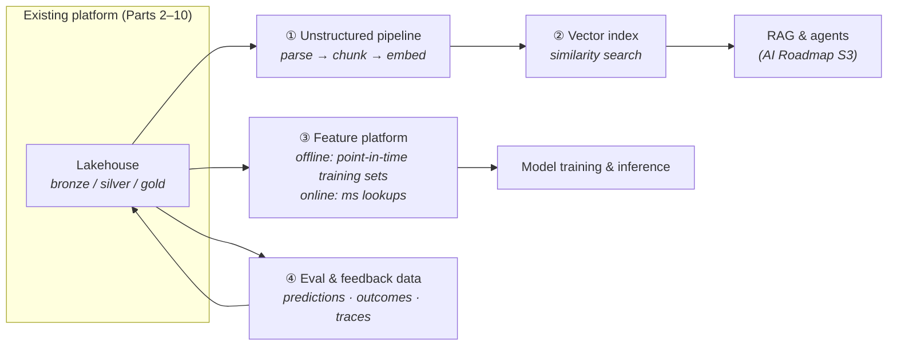

Sooner or later a team shows up at your platform's door saying "we're doing AI now." The wrong responses are the two extremes: rebuilding everything ("we need an AI platform!") or bolting a vector database onto the side and calling it done. The right response is surgical: **AI adds four specific capabilities to the platform you already have** — and inherits every discipline from Parts 2–10.

## The birth pain

Classic analytics consumes *aggregates of the past*. AI workloads consume three things your platform probably doesn't serve yet:

- **Examples, not aggregates** — training needs granular history, *as it looked at the time* (leakage — accidentally letting tomorrow's information into yesterday's training row — is the field's silent killer).
- **Unstructured data as a first-class citizen** — documents, tickets, transcripts, images. Parts 2–3 stored them; AI needs them *processed*: parsed, chunked, embedded, indexed.
- **Low-latency lookups at inference time** — a model scoring a request needs this customer's features in milliseconds, not a warehouse query.

Teams that don't get these from the platform build shadow pipelines (Part 7's disease, AI edition) — notebooks feeding models from CSV exports, with no lineage and no reproducibility. AI-readiness is mostly *preventing that*.

## The four additions

**① The unstructured pipeline.** Documents get the medallion treatment too: raw files in bronze, parsed text + metadata in silver, chunked-and-embedded representations as a gold-like product. The under-appreciated part is **sync**: when the source document changes or is deleted, chunks and vectors must follow — otherwise your RAG app confidently cites a policy that was retracted last quarter. Treat embeddings as a *derived table* with a refresh pipeline, not a one-off script.

**② The vector index.** Architecturally, a Part 5 lesson repeated: it's a **serving-layer projection, not a source of truth** — rebuildable from silver at any time. Start with the vector capability inside a database you already run (the pgvector pattern); adopt a dedicated vector engine only when scale or latency demands it. The expensive mistakes here are operational, not technological: no re-embedding strategy for model upgrades, and no ACL filtering at query time (Part 10's zoning applies to *chunks* too — retrieval that ignores permissions is a data-leak API).

**③ The feature platform.** Two faces of the same table: an **offline** store (lakehouse tables with strict point-in-time correctness for training) and an **online** store (a key-value projection for millisecond inference lookups). The whole discipline compresses to one sentence: *training must only ever see what was knowable at that moment* — which is why Part 3's time travel and Part 6's CDC timestamps stop being nice-to-haves. Buy or build small; the correctness rule is the product.

**④ Eval & feedback data.** The addition everyone forgets: predictions, outcomes, user feedback, and (for GenAI) prompt/response traces flowing *back into the lakehouse* as first-class tables. Without this loop you cannot answer "did the model get worse?" — the AI Roadmap's Part 12 (evals) stands on this plumbing.

## Governance: same rules, new assets

The Part 10 overlay extends, it doesn't restart: training sets need **provenance** ("what data trained this model" is an audit question now), embeddings of PII are still PII (delete-by-key must cascade into vectors), and model artifacts join data artifacts in lineage. If you did Parts 3 and 10 well, this is paperwork; if you didn't, AI is where the debt gets called.

## Scoring on the five axes

- **Latency:** the online feature store and vector serving bring true millisecond requirements — new muscle for a batch-native platform.
- **Team:** the platform team gains two consumers with different vocabularies (DS/ML and app engineers); paved roads (Part 7's platform thinking) beat tickets.
- **Scale:** embeddings multiply storage modestly; GPU compute for embedding/training is bursty — a natural fit for elastic/spot capacity.
- **Budget:** the meter moves from storage to *compute events* (re-embedding a corpus, retraining); Part 12's per-use-case metering is the control.
- **Compliance:** provenance + PII-in-vectors are the new exam questions; answer them before the first model ships, not after.

## Three customers

- **Startup:** pgvector + a nightly embedding refresh + eval tables in the same small-data stack (Part 8). AI-ready ≠ heavy; it means *disciplined*.
- **Mid-size:** the four additions on top of the lakehouse, feature correctness enforced in dbt tests, one shared RAG ingestion pipeline instead of per-team scripts.
- **Enterprise / regulated:** everything above + model provenance in the catalog, vector ACLs mirrored from source permissions, and GenAI traces retained under the same audit regime as Part 10 — the platform's governance is *why* the AI program passes review.

## Key takeaways

- AI adds four capabilities — unstructured pipeline, vector index, feature platform, eval/feedback loop — to the platform you already run; it doesn't replace it.
- Embeddings and vector indexes are rebuildable projections (Part 5's rule) with sync and ACLs as the hard parts.
- Feature discipline is one sentence: training sees only what was knowable at that moment — time travel and CDC timestamps make it enforceable.
- PII in vectors is still PII, and "what trained this model" is an audit question: Part 10's overlay extends to AI assets.

*Next up — Part 12: Architecting for Cost: FinOps Patterns.*
