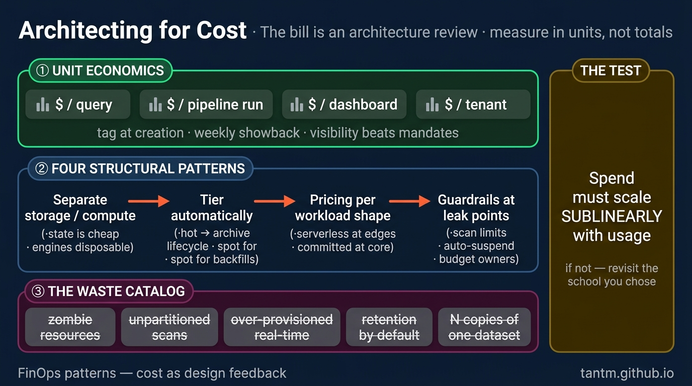

Throughout this series, budget kept appearing as the fourth axis. This part promotes it to the main character — because on a cloud data platform, **cost is not an operations metric, it is design feedback**. Every architectural decision from Parts 2–11 has a meter attached, and reading that meter well is a senior skill.



## What you'll learn

- Measure cost in unit economics, so a rising bill stops being ambiguous.
- Apply the four structural patterns that change the shape of spend, not just its size.
- Recognize the classic waste catalog, all of which is boring and none of which is optional.
- Apply the test that separates a healthy platform from one that will surprise you.

**Prerequisites:** Parts 2-3 (storage and compute choices are where the money goes). Part 9's metering connects directly.

## 1. The birth pain

On-premises, cost was decided once a year in procurement. Cloud made it continuous: every query, every idle cluster, every retained gigabyte bills by the second — spend is decentralized to every engineer, while accountability stayed centralized in one unhappy monthly meeting. FinOps is the discipline of closing that gap; *architecting* for cost is the platform half of it.

## 2. Principle: measure in units, not totals

A total bill going up tells you nothing — maybe the business grew. The FinOps move is **unit economics**: cost per query, per pipeline run, per dashboard, per tenant (Part 9), per use case. Two rules make it work:

1. **Tag everything at creation** — pipeline, team, use case. Untagged spend is unmanageable spend; make tags a deploy-time requirement, not an afterthought (governance-as-code again, Part 10).
2. **Publish showback** — a weekly view of "your team's use cases cost X" changes behavior *without* a single mandate. Chargeback (actually billing teams) is optional; visibility is not.

The unit numbers then drive architecture: a dashboard costing $30/month per viewer is a Part 5 overspend; a pipeline whose reruns dominate its cost is an idempotency problem (S02), not a discount negotiation.

## 3. The four structural patterns

**1. Separate storage from compute — then treat them differently.** Storage is cheap and *keeps state*; compute is expensive and *should be disposable*. This is why the lakehouse (Part 3) wins economically: data in open formats on object storage, engines spun up per workload and turned off. The anti-pattern is the always-on cluster "because the data is there" — the data doesn't need the cluster; queries do.

**2. Tier by access, automatically.** Hot / infrequent / archive storage classes with lifecycle rules (bronze older than N months → cold tiers). Set once at design time, saves forever. The same idea applies to compute: production pipelines on reliable capacity, backfills and experiments on spot/preemptible — batch work that can retry (idempotency pays again) is exactly what cheap interruptible compute is for.

**3. Choose the pricing model per workload shape.** Serverless/on-demand bills per use — perfect for spiky, low-duty-cycle work; expensive at sustained load. Provisioned/committed capacity is the opposite. The platform-level pattern: **serverless at the edges, committed at the core** — steady daily ELT on reserved capacity, exploratory and bursty work on per-use pricing. Revisit yearly; workloads drift.

**4. Put guardrails where the money leaks.** Query timeouts and scan limits (one `SELECT *` over an unpartitioned decade is a real invoice), budget alerts per team *with an owner*, auto-suspend on idle compute, and retention policies decided at design time — "keep everything forever" is a decision too, just an unexamined one.

## 4. The classic waste catalog

Worth naming, because every platform audit finds the same five:

- **Zombie resources** — dev clusters and forgotten dashboards refreshing hourly for an audience of zero.
- **The unpartitioned scan** — full-table reads where a date filter would touch 1%.
- **Over-provisioned real-time** (Part 4's warning, monetized) — streaming infrastructure for reports read weekly.
- **Retention by default** — high-priced storage holding data no one may ever query, with no lifecycle rule.
- **The N-copies problem** — the same dataset materialized by four teams because discovery failed (a catalog is also a cost tool).

## 5. Scoring on the five axes

- **Budget:** now the lens itself — the question becomes "does spend scale *sublinearly* with usage?" A platform whose cost grows faster than its value is architecturally wrong, whatever the diagram says.
- **Latency:** freshness has a price curve that steepens sharply below the hour (Parts 4–5); state the cost next to every freshness request.
- **Team:** FinOps needs an owner and a rhythm (weekly review of units), not a hero and a crisis.
- **Scale/Compliance:** growth without unit metrics *is* the risk; retention law (Part 10) sets the floor under deletion-based savings.

## 6. Three customers

- **Startup:** your FinOps program is three settings — auto-suspend, one budget alert, lifecycle rules — and the Part 8 instinct of not renting distributed systems you don't need.
- **Mid-size:** tagging enforced in CI, monthly showback per use case, spot for backfills, one committed-capacity review per year.
- **Enterprise / multi-tenant:** per-tenant metering (Part 9) merges with FinOps into product pricing; cost allocation becomes contractual, and the platform team runs it like a P&L.

## Practice (25 minutes — compute your unit cost, then find the waste)

Two halves: a spreadsheet-shaped calculation that changes how you read a bill, and a hunt through the waste catalog on a system you own.

**Half 1 — unit economics (10 min).** Take last month's platform bill and one business number that should drive it (orders processed, active customers, GB ingested). Fill this in for three consecutive months:

| Month | Total spend | Business unit count | Cost per unit | Change vs prior |
|---|---|---|---|---|
| … | … | … | … | … |

The column that matters is the fourth. A bill that grew 20% while unit cost fell is a platform succeeding; the same bill with unit cost flat is a platform that merely got busier; unit cost *rising* is the only one of the three that is actually a problem — and none of that is visible from the total alone.

**Half 2 — the waste hunt (15 min).** Go find each of these in a real account, and write down what you find rather than what you assume:

```bash
# 1. Untagged resources — you cannot allocate what you cannot attribute
aws resourcegroupstaggingapi get-resources --query 'ResourceTagMappingList[?length(Tags)==`0`].ResourceARN' | head

# 2. Storage with no lifecycle rule — data that will be paid for forever
aws s3api list-buckets --query 'Buckets[].Name' --output text | tr '\t' '\n' | while read b; do
  aws s3api get-bucket-lifecycle-configuration --bucket "$b" >/dev/null 2>&1 || echo "no lifecycle: $b"
done

# 3. Idle compute — the dev instance nobody turned off
aws ec2 describe-instances --filters Name=instance-state-name,Values=running \
  --query 'Reservations[].Instances[].{id:InstanceId,type:InstanceType,since:LaunchTime}' --output table

# 4. Orphaned volumes and old snapshots — storage attached to nothing
aws ec2 describe-volumes --filters Name=status,Values=available --query 'Volumes[].[VolumeId,Size]' --output table
```

Expected results: half 1 usually reverses someone's conclusion — a bill that looked alarming turns out to be growth, or a flat bill turns out to hide worsening efficiency. Half 2 almost always finds something in category 1 or 3, and untagged resources are the worst finding of the four because they make every future cost question unanswerable: you cannot allocate, chargeback, or even ask "whose is this?" without tags. Fix tagging first, then lifecycle rules, then the idle resources — in that order, because the first one is what lets you measure the rest.

## Check yourself

1. Your platform bill rose 40% this quarter. What do you need before you can say whether that's a problem?
2. A finance stakeholder asks which team is responsible for 60% of the storage spend, and you can't answer. What's the underlying gap?
3. Why is "we'll clean up storage later" more expensive than it sounds?

<details><summary>See answers</summary>

1. The unit cost, and the business number behind it. A 40% rise with 60% more orders processed is a platform getting cheaper per unit; the same rise with flat volume is real waste. Totals are ambiguous by construction — the useful metric is spend divided by whatever the business actually counts.
2. Tagging and allocation. Without a tagging policy enforced at creation, spend cannot be attributed to teams or products, which means no showback, no accountability, and no way for the people generating cost to see it. This is why tagging is the first FinOps control, not a cleanup task.
3. Because storage cost compounds: every month without a lifecycle rule adds data that you then pay for every subsequent month, and the cleanup gets harder as volume grows and provenance fades. Retention decided at design time costs one conversation; retention decided in year three is an archaeology project with legal questions attached.

</details>

## Key takeaways

- Cost is design feedback: measure in units ($/query, $/pipeline, $/tenant), tag at creation, publish showback.
- Four structural patterns: separate storage/compute, tier automatically, match pricing model to workload shape, guardrail the leak points.
- The waste catalog is predictable — zombies, unpartitioned scans, over-provisioned real-time, default retention, N-copies; audit for exactly these.
- The architectural test: spend should scale sublinearly with usage. If it doesn't, revisit the school you chose.

*Next up — Part 13: Migration Architectures: Legacy to Modern Without Falling.*
