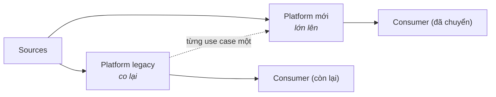
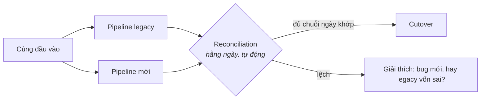

Phần 1 đã cảnh báo: kiến trúc là đồ thuê, không phải đồ mua đứt. Phần này nói về ngày chuyển nhà — kỷ luật để đi từ platform đang có sang trường phái đã chọn, **trong khi business vẫn đọc số hằng ngày**. Migration dữ liệu fail khác migration ứng dụng: app rollback được, nhưng một báo cáo hiện số sai suốt một tháng thì thiệt hại đã xong. Vì thế toàn bộ nghệ thuật nằm ở một câu: *không bao giờ sai trước công chúng.*


## Bạn sẽ học được gì

- Migrate theo use case thay vì theo layer, để giá trị tới trước khi dự án kết thúc.
- Chạy song song cũ và mới, để phép đối soát kiếm lấy niềm tin chứ không phải bộ slide.
- Backfill một cách idempotent và giữ một cánh cửa hai chiều cho tới khi chắc chắn.
- Sắp trình tự cho toàn bộ, kể cả bước khai tử mà không ai xếp lịch.

**Cần biết trước:** Phần 2-3 (các platform bạn đang chuyển giữa chúng) và Phần 12 (chi phí, thứ cấp ngân sách cho cuộc migrate).

## 1. Nỗi đau khai sinh

Cú hích là một trong các tín hiệu tốt nghiệp của Phần 8, một vendor hấp hối, một license không trả nổi, hay một thương vụ M&A. Kế hoạch ngây thơ luôn giống nhau: "xây lại trên stack mới, cuối tuần chuyển, tắt đồ cũ." Nó fail vì đúng ba lý do, lần nào cũng vậy: hệ legacy mã hoá **logic business không tài liệu** (cái câu `CASE` kỳ quặc kia *chính là* định nghĩa doanh thu), consumer **đông hơn bất kỳ ai biết** (spreadsheet, cron job, API của một đối tác), và các vấn đề chất lượng dữ liệu được **phát hiện, chứ không được biết trước** — pipeline mới trung thành tái tạo những con số chưa ai nhận ra là sai, hoặc sửa chúng và làm gãy mọi đường trend.

Vậy nên luật tối thượng: **không big bang.** Mọi thứ bên dưới là cách mua lấy quyền được đi từ từ.

## 2. Strangler fig: migrate theo use case, không theo layer

Đặt tên theo cây si bóp nghẹt: mọc quanh cây chủ cho tới khi cây chủ biến mất. Áp vào data platform: đừng migrate "cái warehouse" — migrate **từng báo cáo, từng pipeline, từng domain một**, mỗi cái chạy trọn đầu-cuối trên stack mới trong khi mọi thứ khác đứng yên.



Hai luật khiến nó chạy. **Chọn use case đầu tiên để học, không phải để gây tiếng vang** — nhỏ, ít chính trị, nhưng chạm trọn con đường (ingest → transform → serve), để xả sớm các ẩn số của platform mới. Và **đóng băng legacy** theo từng mảnh đã chuyển: tính năng mới chỉ đáp lên stack mới, không thì cây si không bao giờ bóp xong. Anti-pattern là migrate theo layer ("toàn bộ ingestion trước") — bạn cõng cả hai platform nguyên trọng lượng suốt dự án mà không có gì được giao trọn vẹn.

## 3. Parallel run và reconciliation: để con số tự kiếm niềm tin

Với use case nào mà con số quan trọng, chạy **cũ và mới song song** trên cùng đầu vào, và **đối soát tự động**:



Tay nghề nằm ở chi tiết: so ở nhiều độ hạt (tổng trước, rồi từng lát dimension — tổng có thể khớp trong khi từng phân khúc lệch tung toé); định nghĩa **tolerance từ đầu** (bit-identical thường bất khả giữa hai engine — thống nhất "bằng nhau" nghĩa là gì trước lượt chạy đầu tiên); và coi mỗi lần lệch là một ngã ba: *bug mới* (sửa) hay *legacy vốn sai* (ghi nhận, xin business ký duyệt con số mới — chuyện này xảy ra thường xuyên hơn mọi người tưởng rất nhiều). Chỉ cutover sau một **chuỗi ngày xanh đã thoả thuận trước**, không phải "khi thấy có vẻ ổn".

Parallel run tốn compute gấp đôi trong nhiều tuần. Đó không phải lãng phí; đó là giá của việc *không bao giờ sai trước công chúng* — và nó tạm thời, nên lăng kính Phần 12 phải tính nó là chi phí dự án, không phải run-rate.

## 4. Backfill và cánh cửa hai chiều

Chuyển lịch sử có vật lý riêng: backfill theo **chunk có partition, idempotent, resume được** (câu thần chú S02 ở quy mô terabyte), validate số đếm từng chunk ngay khi đi, và chuẩn bị tinh thần quá khứ bẩn hơn hiện tại — các phiên bản schema không ai nhớ, timezone từng đổi, ID từng bị tái sử dụng.

Và thiết kế cutover như **cánh cửa hai chiều**: giữ đường legacy ấm (nhưng đóng băng) trong một khoảng thoả thuận sau khi chuyển, với đường quay lại đã tổng duyệt. Chỉ riêng việc tồn tại một kế hoạch rollback đã biến cutover từ một canh bạc thành một quyết định. Decommission — vạch đích thật — chỉ diễn ra sau khi một chu kỳ business trọn vẹn (thường là chốt sổ cuối tháng hoặc cuối quý) chạy ngon trên stack mới. Migration bỏ qua bước này chưa xong; nó đang *tạm dừng ở tư thế rủi ro nhất có thể*, và trả tiền cho hai platform vô thời hạn.

## 5. Playbook trình tự

1. **Kiểm kê consumer trước tiên** — không thể bóp nghẹt thứ mình không nhìn thấy; query log và lineage của catalog (tooling Phần 10, tái sử dụng) tìm ra cái đuôi dài spreadsheet-và-cron.
2. **Use case đầu: học trên tiếng vang** (như trên).
3. **Đóng băng tính năng legacy** từ ngày đầu của mỗi mảnh đã chuyển.
4. **Parallel run nơi con số quan trọng; swap thẳng nơi không** (một dashboard khám phá nội bộ không cần chế độ đối soát).
5. **Cutover bằng bằng chứng** (chuỗi xanh), giữ cửa mở, decommission sau một chu kỳ trọn vẹn.

## 6. Chấm theo năm trục

- **Team:** migration là một *chương trình*, không phải nhiệm vụ phụ — phải có người sở hữu bản kiểm kê, các chuỗi xanh, và kỷ luật đóng băng, không thì entropy thắng.
- **Budget:** chạy đôi là tạm thời nhưng có thật; thứ tự bóp nghẹt (mảnh legacy đắt nhất trước) có thể khiến migration tự nuôi mình.
- **Latency/Scale:** thường là *lý do* của cuộc chuyển — nhưng cưỡng lại việc nâng cấp latency giữa chừng; mỗi lần đổi một biến thôi.
- **Compliance:** hồ sơ reconciliation và audit trail của legacy-đóng-băng chính xác là loại bằng chứng mà chế độ Phần 10 đòi — migration làm kiểu này *cải thiện* tư thế audit của bạn.

## 7. Ba khách hàng

- **Startup tốt nghiệp từ Phần 8:** open format biến nó thành dốc thoải — engine mới đọc cùng đống Parquet; "migration" có khi là một tuần đấu lại ống. Đây là phần thưởng của thiết kế có lối ra.
- **Tầm trung thay warehouse legacy:** trọn playbook ở trên, từng domain một, 6–18 tháng nếu nói thật; cái bẫy là dừng ở 80% rồi chạy cả hai mãi mãi.
- **Enterprise / có kiểm soát:** thêm cổng change-management cho từng cutover và bằng chứng đối soát nhìn được bởi cơ quan quản lý; chuỗi xanh parallel-run thành tiêu chí nghiệm thu chính thức, và cánh cửa hai chiều không phải tuỳ chọn.

## Thực hành (25 phút — chạy một cú đối soát, và tìm ra khác biệt KHÔNG phải bug)

Chạy song song chỉ hữu ích ngang với phép so sánh bạn chạy trên nó. Bài tập này dựng phép so sánh đó rồi đưa vào hai kiểu chênh lệch mà mọi cuộc migrate thật đều sinh ra:

```sql
-- duckdb migrate.db  — cùng một câu hỏi business, hai hệ thống
CREATE TABLE legacy_daily(d DATE, orders INT, revenue DECIMAL(12,2));
CREATE TABLE new_daily   (d DATE, orders INT, revenue DECIMAL(12,2));

INSERT INTO legacy_daily VALUES
 ('2026-03-01', 1000, 52000.00), ('2026-03-02',  980, 50100.00),
 ('2026-03-03', 1010, 51750.00), ('2026-03-04', 1005, 51900.00);

INSERT INTO new_daily VALUES
 ('2026-03-01', 1000, 52000.00),          -- giống hệt: ngày dễ
 ('2026-03-02',  980, 50100.05),          -- làm tròn: một khác biệt KHÔNG phải bug
 ('2026-03-03', 1013, 51890.00),          -- thừa 3 đơn: dữ liệu muộn mà job cũ bỏ sót
 ('2026-03-04',  950, 49100.00);          -- thiếu đáng kể: CÁI NÀY mới là bug
```

```sql
-- 1. Câu query đối soát — cái artifact kiếm lấy niềm tin
SELECT l.d,
       l.orders  AS legacy_orders, n.orders  AS new_orders, n.orders - l.orders AS d_orders,
       l.revenue AS legacy_rev,    n.revenue AS new_rev,
       round(100.0 * (n.revenue - l.revenue) / l.revenue, 4) AS pct_diff,
       CASE WHEN abs(100.0*(n.revenue-l.revenue)/l.revenue) < 0.01 THEN 'trong dung sai'
            WHEN abs(100.0*(n.revenue-l.revenue)/l.revenue) < 1.0  THEN 'cần điều tra'
            ELSE 'CHẶN' END AS verdict
FROM legacy_daily l JOIN new_daily n USING (d) ORDER BY l.d;

-- 2. Cổng cutover: N ngày xanh LIÊN TIẾP, không phải "hôm qua nhìn ổn"
SELECT count(*) AS green_days FROM (
  SELECT d FROM legacy_daily l JOIN new_daily n USING (d)
  WHERE abs(100.0*(n.revenue-l.revenue)/NULLIF(l.revenue,0)) < 0.01);
```

Kết quả mong đợi: ngày 1 khớp chính xác, và đó là ngày cám dỗ các team tuyên bố chiến thắng. Ngày 2 lệch nửa xu — một khác biệt do làm tròn *không* phải bug, và nếu dung sai của bạn bằng 0 thì bạn sẽ mất một tuần cho nó. Ngày 3 có *nhiều* đơn hơn ở hệ thống mới, trông đáng báo động và thường là pipeline mới đang đúng ở chỗ pipeline cũ bỏ rơi dữ liệu tới muộn; bạn phải điều tra mới biết, và đôi khi câu trả lời là con số cũ mà ai cũng tin đã hơi sai suốt nhiều năm. Ngày 4 mới là cú chặn thật sự. Bài học nằm ở cột verdict: bạn cần một mức dung sai được tuyên bố *trước khi* bắt đầu so sánh, nếu không mọi khác biệt đều thành một cuộc tranh cãi — và cần một luật cutover dựa trên số ngày xanh liên tiếp chứ không dựa trên một buổi sáng trông đẹp.

## Tự kiểm tra

1. Lượt chạy song song cho thấy hệ thống mới báo doanh thu cao hơn hệ cũ 1,3%. Đây có phải cú chặn không?
2. Ban lãnh đạo muốn bỏ giai đoạn chạy song song để tiết kiệm hai tháng. Bạn nói gì?
3. Cuộc migrate "xong rồi" mà hệ thống cũ vẫn chạy. Rủi ro là gì, và lẽ ra phải xếp lịch cho việc gì?

<details><summary>Xem đáp án</summary>

1. Không hẳn — đó là mức *cần điều tra*, và cuộc điều tra có ba kết cục hợp lý: hệ thống mới sai, hệ thống cũ đã sai từ lâu (dữ liệu muộn, dòng bị bỏ trong im lặng, một quy ước làm tròn), hoặc hai bên định nghĩa chỉ số khác nhau. Cả ba đều đáng biết trước khi cutover, và kết cục thứ hai chính là lý do chạy song song có giá trị chứ không chỉ là thận trọng.
2. Rằng chạy song song là cách bạn biết được hệ thống mới có đúng không *trước khi* nó là hệ thống duy nhất. Thiếu nó, cutover là một canh bạc, và kiểu hỏng là phát hiện ra chênh lệch sau khi hệ cũ đã biến mất và chẳng còn gì để so. Nếu thời gian là ràng buộc, hãy rút ngắn cửa sổ song song hoặc thu hẹp về các chỉ số giá trị nhất — đừng bỏ phép so sánh.
3. Bạn đang trả tiền cho hai platform và, tệ hơn, vẫn còn consumer đang đọc cái cũ — nên các con số có thể lệch nhau trong im lặng mà không ai biết một báo cáo cụ thể đã lấy từ nguồn nào. Việc khai tử phải được xếp lịch như một phần của cuộc migrate, thường là một chu kỳ kinh doanh đầy đủ sau cutover, kèm một phép kiểm tường minh rằng không còn gì query hệ cũ.

</details>

## Điều cần nhớ

- Không big bang: migrate từng use case (strangler fig), đóng băng legacy theo từng bước — đừng bao giờ theo layer.
- Parallel run + đối soát tự động là cách con số kiếm niềm tin; thống nhất tolerance và ngưỡng chuỗi-xanh *trước* lần so đầu tiên.
- Backfill idempotent theo chunk; cutover là cánh cửa hai chiều; decommission chỉ sau một chu kỳ business trọn vẹn — đó mới là vạch đích.
- Chuẩn bị tinh thần phát hiện legacy đôi khi vốn sai; xin business ký duyệt *con số mới đúng* là một phần của migration, không phải việc gây xao nhãng.

*Tiếp theo — Phần 14: Chọn kiến trúc: một decision framework.*
