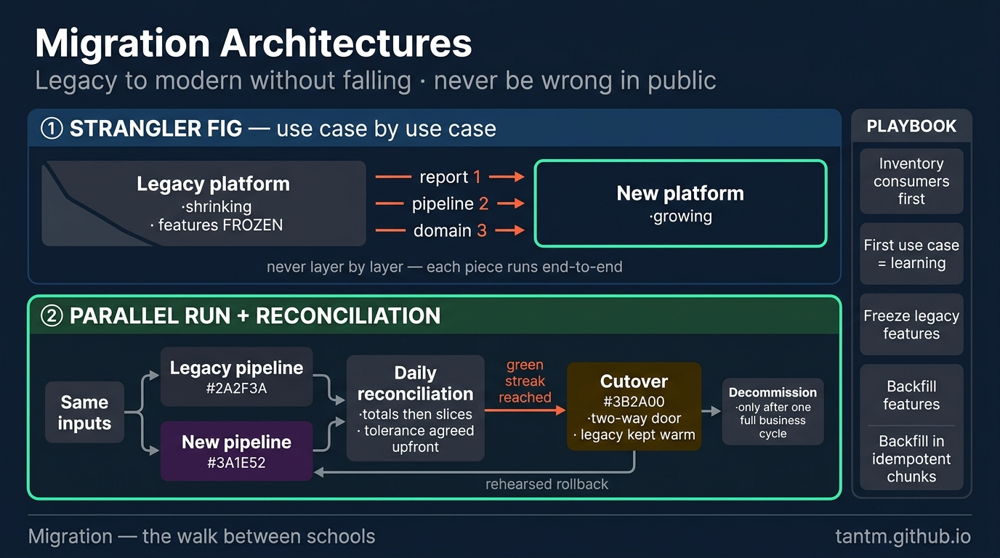
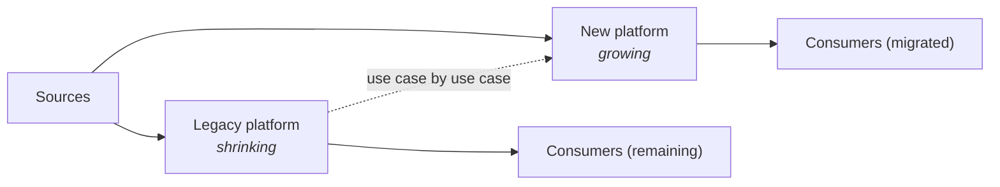
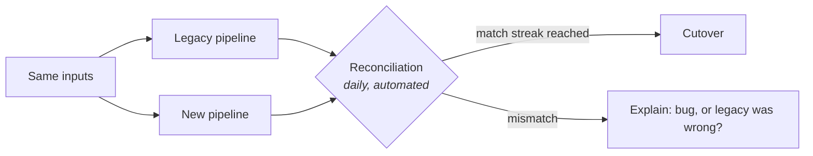

Part 1 warned that architectures are rented, not bought. This part is about moving day — the discipline of getting from the platform you have to the school you chose, **while the business keeps reading its numbers**. Data migrations fail differently from app migrations: the app can be rolled back, but a report that showed wrong numbers for a month has already done its damage. Hence the whole art: *never be wrong in public.*

## The birth pain

The trigger is one of Part 8's graduation signals, a dying vendor, an unpayable license, or an acquisition. The naive plan is always the same: "rebuild on the new stack, switch over on a weekend, decommission." It fails for the same three reasons every time: the legacy system encodes **undocumented business logic** (that weird `CASE` statement *is* the revenue definition), consumers are **more numerous than anyone knows** (spreadsheets, cron jobs, a partner's API), and data quality issues are **discovered, not known** — the new pipeline faithfully reproduces numbers nobody realized were wrong, or fixes them and breaks every trendline.

So the master rule: **no big bang.** Everything below is a way of buying the right to be gradual.

## Pattern 1 — The strangler fig: migrate by use case, not by layer

Named after the fig that grows around a tree until the tree is gone. Applied to data platforms: don't migrate "the warehouse" — migrate **one report, one pipeline, one domain at a time**, each running end-to-end on the new stack while everything else stays put.

Two rules make it work. **Pick the first use case for learning, not impact** — small, low-politics, but touching the full path (ingest → transform → serve), so it flushes out the platform's unknowns early. And **freeze the legacy** as each piece migrates: new features land only on the new stack, or the fig never finishes strangling. The anti-pattern is migrating layer-by-layer ("all ingestion first") — you carry both platforms at full weight for the entire project with nothing fully delivered.

## Pattern 2 — Parallel run + reconciliation: earn trust with numbers

For any use case whose numbers matter, run **old and new side by side** on the same inputs, and **reconcile automatically**:

The craft is in the details: compare at multiple grains (totals first, then per-dimension slices — totals can match while segments are wildly off); define **tolerance up front** (bit-identical is often impossible across engines — agree what "equal" means before the first run); and treat every mismatch as a fork: *new bug* (fix it) or *legacy was wrong* (document it, get the business to sign off on the new number — this happens far more often than anyone expects). Cut over only after a **pre-agreed green streak**, not "when it feels stable".

Parallel run costs double compute for weeks. That is not waste; it is the price of *never being wrong in public* — and it's temporary, which the Part 12 lens should treat as a project cost, not a run-rate.

## Pattern 3 — Backfill and the two-way door

Moving history has its own physics: backfill in **partitioned, idempotent, resumable** chunks (S02's mantra at terabyte scale), validate counts per chunk as you go, and expect the past to be dirtier than the present — schema versions nobody remembers, timezones that changed, IDs that were recycled.

And design the cutover as a **two-way door**: keep the legacy path warm (but frozen) for an agreed period after switching, with a rehearsed way back. The mere existence of a rollback plan changes cutover from a bet into a decision. Decommissioning — the actual finish line — happens only after a full business cycle (often month-end or quarter-end close) proves out on the new stack. Migrations that skip this step aren't finished; they're *paused in the riskiest possible position*, paying for two platforms indefinitely.

## The sequencing playbook

1. **Inventory consumers first** — you cannot strangle what you can't see; query logs and catalog lineage (Part 10's tooling, reused) find the spreadsheet-and-cron long tail.
2. **First use case: learning over impact** (see above).
3. **Freeze legacy features** from day one of each migrated piece.
4. **Parallel run where numbers matter; direct swap where they don't** (an internal exploratory dashboard doesn't need a reconciliation regime).
5. **Cut over on evidence** (green streak), keep the door open, decommission after a full cycle.

## Scoring on the five axes

- **Team:** migrations are a *program*, not a side quest — someone owns the inventory, the streaks, and the freeze discipline, or entropy wins.
- **Budget:** double-running is temporary but real; the strangler order (highest-cost legacy pieces first) can make the migration self-funding.
- **Latency/Scale:** often the *reason* for the move — but resist upgrading latency mid-migration; change one variable at a time.
- **Compliance:** reconciliation records and the frozen-legacy audit trail are exactly the evidence Part 10 regimes demand — a migration done this way *improves* your audit posture.

## Three customers

- **Startup graduating from Part 8:** open formats make it a ramp — new engine reads the same Parquet; "migration" may be a week of pipeline rewiring. This is the payoff of the exit-ramp design.
- **Mid-size replacing a legacy warehouse:** the full playbook above, one domain at a time, 6–18 months honestly; the trap is stopping at 80% and running both forever.
- **Enterprise / regulated:** add change-management gates per cutover and regulator-visible reconciliation evidence; the parallel-run streak becomes a formal acceptance criterion, and the two-way door is not optional.

## Key takeaways

- No big bang: migrate use case by use case (strangler fig), freezing legacy as you go — never layer by layer.
- Parallel run + automated reconciliation is how numbers earn trust; agree tolerance and the green-streak threshold *before* the first comparison.
- Backfill idempotently in chunks; design cutover as a two-way door; decommission only after a full business cycle — that's the real finish line.
- Expect to discover that legacy was sometimes wrong; getting the business to sign off on *new correct numbers* is part of the migration, not a distraction from it.

*Next up — Part 14: Choosing Your Architecture: a Decision Framework.*
