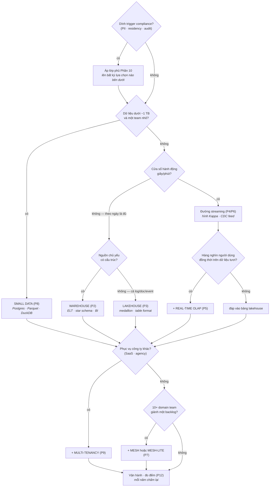

Mười ba phần, hơn mười trường phái. Bài chốt này nén tất cả thành thứ bạn thực sự cần trong một cuộc họp thiết kế: **một đường quyết định, năm blueprint sẵn, và các câu hỏi trung thực.** Bookmark bài này; phần còn lại của series là phụ lục của nó.

## Bước 0 — Chấm năm trục (lần nữa, thành tiếng)

Viết đáp án ra trước khi mở tool vẽ sơ đồ — bài tập của Phần 1, giờ có răng:

1. **Scale** — tổng lịch sử và tốc độ tăng (GB / TB / PB)?
2. **Latency** — *cửa sổ hành động*: trong bao lâu thì có người hành động khác đi? (câu hỏi gác cổng Phần 4)
3. **Team** — bao nhiêu người *vận hành* được platform, nói thật?
4. **Budget** — run-rate hằng tháng bạn bảo vệ được sau một năm nữa?
5. **Compliance** — PII, residency, audit, cơ quan quản lý — dính trigger nào của Phần 10 không?

Tiền đề của framework: **đa số sai lầm kiến trúc là sai lầm về trục** — một đáp án latency chép từ hội thảo, một đáp án team chép từ mơ mộng.

## Đường quyết định

Đọc nó như *các lớp*, không phải các lối ra: lớp phủ compliance bọc mọi nền; multi-tenancy và mesh là phần đắp thêm trên một trường phái nền; AI-readiness (Phần 11) vít lên bất kỳ nền nào bạn đáp xuống; và mọi con đường đều kết ở chiếc đồng hồ đo Phần 12. Migration (Phần 13) là cạnh bạn đi mỗi khi *chấm lại* cái cây này ra đáp án khác năm ngoái.

## Năm blueprint

| Archetype | Nền | Đắp thêm | Cố ý vắng mặt |
|---|---|---|---|
| **Startup** (2 eng, <100 GB) | Small data (P8) | pgvector nếu làm AI (P11) · format có lối ra | Cluster, streaming, mesh — tất cả |
| **SME** (data team nhỏ, vài TB) | Warehouse hoặc lakehouse-lite (P2/P3) | Kỷ luật dbt · một CDC feed nếu cần (P6) | Real-time OLAP "cho dashboard của sếp" |
| **Enterprise** (nhiều team, TB–PB) | Lõi lakehouse (P3) | Đường streaming (P4) · OLAP serving (P5) · mesh-lite → mesh (P7) · chương trình FinOps (P12) | Tư duy một-engine-cho-tất-cả |
| **Regulated** (archetype bank/y tế/công) | Blueprint enterprise | Lớp phủ Phần 10 từ ngày đầu · chế độ bằng chứng migration (P13) | Bất kỳ thành phần nào thiếu lineage & audit |
| **Công ty data-product** (analytics *là* sản phẩm) | Lakehouse + real-time OLAP (P3+P5) | Multi-tenancy phân bậc + metering per-tenant (P9) · online feature & vector (P11) | Bản năng BI-nội-bộ áp lên SLA bên ngoài |

Blueprint là vị trí xuất phát, không phải đích — cú chấm lại hằng năm quyết định khi nào bạn đã thành một archetype khác.

## Các câu hỏi trung thực

Năm câu bắt đúng các màn tự dối kinh điển mà series này gặp đi gặp lại:

1. *"Ai hành động trên dữ liệu này trong vòng một giờ?"* — cả phòng im lặng thì bạn không cần streaming (P4).
2. *"Thành viên nào của team vận hành thành phần này lúc 2 giờ sáng?"* — một cái tên, không phải một chức danh (toàn bộ luận đề P8).
3. *"Mỗi tháng cái này tốn bao nhiêu ở mức dùng gấp 3?"* — dưới tuyến tính hoặc thôi (P12).
4. *"Chúng ta rời lựa chọn này bằng cách nào?"* — open format và cánh cửa hai chiều, tính giá ngay từ giờ (P3, P13).
5. *"Ta chọn nó vì ràng buộc đòi hỏi — hay vì nó đang trên sân khấu năm nay?"* — cảnh báo Phần 1, hỏi thành tiếng, trong cuộc họp, mọi lần.

## Đi tiếp từ đây

Series này cho bạn bản đồ; các series hàng xóm cho kỹ năng: **Lộ trình Data Engineer** dạy bạn *xây* thứ đã chọn ở đây, **Lộ trình AI Engineer** dạy xây gì *trên nó*, và **AWS từ cơ bản đến nâng cao** dạy các viên gạch cloud bên dưới. Bước tiếp theo tốt nhất rất cụ thể: lấy platform hiện tại của bạn, chấm năm trục, đi cái cây, xem có đáp xuống đúng chỗ đang đứng không. Nếu không — Phần 13 đang đợi.

## Điều cần nhớ

- Chấm năm trục thành tiếng trước: đa số sai lầm kiến trúc là sai lầm về trục.
- Đi cái cây theo lớp: trường phái nền → lớp phủ compliance → đắp tenancy/mesh → vít AI → luôn kết ở đồng hồ đo.
- Năm blueprint phủ các archetype; cú chấm lại hằng năm báo khi bạn đổi archetype — và Phần 13 là con đường ở giữa.
- Năm câu hỏi trung thực là bài review kiến trúc rẻ nhất bạn từng chạy.

*Khép lại series Các kiến trúc Data Platform — [xem toàn bộ series](/vi/series/dp-architectures).*
