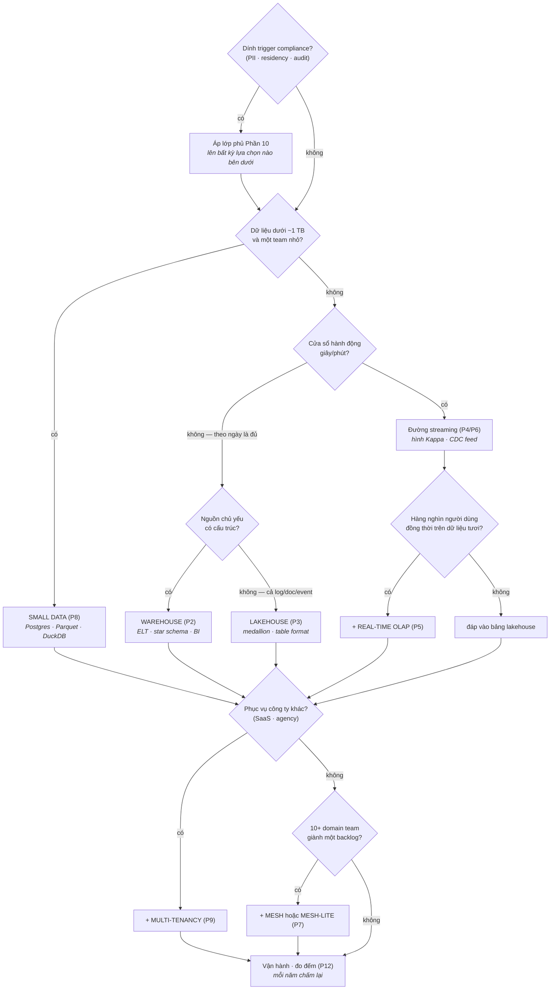

Mười ba phần, hơn mười trường phái. Bài chốt này nén tất cả thành thứ bạn thực sự cần trong một cuộc họp thiết kế: **một đường quyết định, năm blueprint sẵn, và các câu hỏi trung thực.** Bookmark bài này; phần còn lại của series là phụ lục của nó.

## Bạn sẽ học được gì

- Chấm năm trục thành tiếng, để các ràng buộc dẫn dắt lựa chọn thay vì khẩu vị.
- Đi qua đường quyết định đúng thứ tự — theo lớp, không theo công nghệ ưa thích.
- Khớp tình huống của bạn với một trong năm blueprint, và biết mỗi cái tốn gì.
- Đặt các câu hỏi trung thực ngăn một kiến trúc nghe hợp lý trở thành một kiến trúc đắt tiền.

**Cần biết trước:** Cả series — bài này là phần tổng hợp, không phải phần nhập môn.

## 1. Chấm năm trục (lần nữa, thành tiếng)

Viết đáp án ra trước khi mở tool vẽ sơ đồ — bài tập của Phần 1, giờ có răng:

1. **Scale** — tổng lịch sử và tốc độ tăng (GB / TB / PB)?
2. **Latency** — *cửa sổ hành động*: trong bao lâu thì có người hành động khác đi? (câu hỏi gác cổng Phần 4)
3. **Team** — bao nhiêu người *vận hành* được platform, nói thật?
4. **Budget** — run-rate hằng tháng bạn bảo vệ được sau một năm nữa?
5. **Compliance** — PII, residency, audit, cơ quan quản lý — dính trigger nào của Phần 10 không?

Tiền đề của framework: **đa số sai lầm kiến trúc là sai lầm về trục** — một đáp án latency chép từ hội thảo, một đáp án team chép từ mơ mộng.

## 2. Đường quyết định

Đọc nó như *các lớp*, không phải các lối ra: lớp phủ compliance bọc mọi nền; multi-tenancy và mesh là phần đắp thêm trên một trường phái nền; AI-readiness (Phần 11) vít lên bất kỳ nền nào bạn đáp xuống; và mọi con đường đều kết ở chiếc đồng hồ đo Phần 12. Migration (Phần 13) là cạnh bạn đi mỗi khi *chấm lại* cái cây này ra đáp án khác năm ngoái.

## 3. Năm blueprint

| Archetype | Nền | Đắp thêm | Cố ý vắng mặt |
|---|---|---|---|
| **Startup** (2 eng, <100 GB) | Small data (P8) | pgvector nếu làm AI (P11) · format có lối ra | Cluster, streaming, mesh — tất cả |
| **SME** (data team nhỏ, vài TB) | Warehouse hoặc lakehouse-lite (P2/P3) | Kỷ luật dbt · một CDC feed nếu cần (P6) | Real-time OLAP "cho dashboard của sếp" |
| **Enterprise** (nhiều team, TB–PB) | Lõi lakehouse (P3) | Đường streaming (P4) · OLAP serving (P5) · mesh-lite → mesh (P7) · chương trình FinOps (P12) | Tư duy một-engine-cho-tất-cả |
| **Regulated** (archetype bank/y tế/công) | Blueprint enterprise | Lớp phủ Phần 10 từ ngày đầu · chế độ bằng chứng migration (P13) | Bất kỳ thành phần nào thiếu lineage & audit |
| **Công ty data-product** (analytics *là* sản phẩm) | Lakehouse + real-time OLAP (P3+P5) | Multi-tenancy phân bậc + metering per-tenant (P9) · online feature & vector (P11) | Bản năng BI-nội-bộ áp lên SLA bên ngoài |

Blueprint là vị trí xuất phát, không phải đích — cú chấm lại hằng năm quyết định khi nào bạn đã thành một archetype khác.

## 4. Các câu hỏi trung thực

Năm câu bắt đúng các màn tự dối kinh điển mà series này gặp đi gặp lại:

1. *"Ai hành động trên dữ liệu này trong vòng một giờ?"* — cả phòng im lặng thì bạn không cần streaming (P4).
2. *"Thành viên nào của team vận hành thành phần này lúc 2 giờ sáng?"* — một cái tên, không phải một chức danh (toàn bộ luận đề P8).
3. *"Mỗi tháng cái này tốn bao nhiêu ở mức dùng gấp 3?"* — dưới tuyến tính hoặc thôi (P12).
4. *"Chúng ta rời lựa chọn này bằng cách nào?"* — open format và cánh cửa hai chiều, tính giá ngay từ giờ (P3, P13).
5. *"Ta chọn nó vì ràng buộc đòi hỏi — hay vì nó đang trên sân khấu năm nay?"* — cảnh báo Phần 1, hỏi thành tiếng, trong cuộc họp, mọi lần.

## 5. Đi tiếp từ đây

Series này cho bạn bản đồ; các series hàng xóm cho kỹ năng: **Lộ trình Data Engineer** dạy bạn *xây* thứ đã chọn ở đây, **Lộ trình AI Engineer** dạy xây gì *trên nó*, và **AWS từ cơ bản đến nâng cao** dạy các viên gạch cloud bên dưới. Bước tiếp theo tốt nhất rất cụ thể: lấy platform hiện tại của bạn, chấm năm trục, đi cái cây, xem có đáp xuống đúng chỗ đang đứng không. Nếu không — Phần 13 đang đợi.

## Thực hành (30 phút — viết bản ghi quyết định kiến trúc mà sáu tháng sau bạn còn bảo vệ được)

Đây là bài capstone của series, nên bài tập chính là cái artifact mà một kỹ sư senior thật sự bị hỏi xin: một bản ghi quyết định một trang cho một hệ thống có thật. Hãy viết nó ra, đừng phác qua.

**Phần 1 — các ràng buộc (10 phút).** Chấm năm trục cho hệ thống của bạn bằng con số và nguồn, không bằng tính từ:

| Trục | Giá trị của bạn | Bạn biết nhờ đâu | Nó loại bỏ điều gì |
|---|---|---|---|
| Latency | vd "mỗi giờ là đủ; không ai hành động nhanh hơn" | ai hành động, trong cửa sổ nào | đường streaming |
| Scale | vd "80 GB, +2 GB/tháng" | hoá đơn lưu trữ hiện tại | xử lý phân tán |
| Team | vd "2 kỹ sư, không có lịch trực" | nhân sự | mọi thứ có pager |
| Budget | vd "dưới 2k/tháng" | con số đã duyệt | cluster luôn-bật |
| Compliance | vd "có PII, cư trú EU" | nghĩa vụ thật sự | một số region và vendor |

**Phần 2 — quyết định (10 phút).** Gọi tên blueprint bạn chọn và, quan trọng hơn, hai cái bạn từ chối *cùng lý do* — diễn đạt bằng các trục ở trên, không bằng sở thích. Một bản ghi chỉ nói có với một thứ là quảng cáo; một bản ghi nói không với hai thứ khác mới là kỹ thuật.

**Phần 3 — điều kiện xem lại (10 phút).** Viết ra các điều kiện sẽ khiến quyết định này thành sai: "nếu vượt X GB", "nếu có team thứ hai cần pipeline riêng", "nếu ai đó cần độ tươi dưới một phút". Thêm một ngày để xem lại. Đây là phần tách một quyết định khỏi một niềm tin — bạn đã cam kết trước rằng sẽ đổi ý khi có bằng chứng.

Kết quả mong đợi: phần 1 thường là chỗ bất ngờ xuất hiện — viết "biết nhờ đâu" cạnh mỗi trục làm lộ ra trục nào được đo và trục nào chỉ được giả định, và rất hay gặp trường hợp cái trục dẫn dắt cả thiết kế lại là phỏng đoán của ai đó. Phần 2 buộc phép so sánh phải tường minh trong lúc bạn còn nhớ lập luận, và đó là thứ khiến bản ghi hữu ích cho người kế thừa nó. Phần 3 là phần các team bỏ qua rồi hối tiếc: thiếu điều kiện xem lại, một kiến trúc từng được chọn đúng cho ràng buộc năm ngoái sẽ lặng lẽ trở thành sai, và không ai nhận ra vì không ai viết xuống thế nào thì gọi là nhận ra.

## Tự kiểm tra

1. Hai team có cùng khối lượng dữ liệu chọn hai kiến trúc khác nhau. Có phải một bên sai không?
2. Bản ghi quyết định của bạn viết "chúng tôi chọn lakehouse vì đó là chuẩn hiện đại". Thiếu cái gì?
3. Khi nào thì một quyết định kiến trúc nên được xem lại?

Xem đáp án

1. Gần như chắc chắn là không. Khối lượng dữ liệu là một trục trong năm, và bốn trục còn lại — nhu cầu latency, quy mô và kỹ năng team, ngân sách, nghĩa vụ tuân thủ — thường xuyên khác nhau đủ để biện minh cho hai lựa chọn ngược nhau. Một kiến trúc là sự vừa khít với ràng buộc, nên hai team cùng khối lượng mà khác ràng buộc thì *nên* xây khác nhau.
2. Các ràng buộc, và những phương án bị từ chối. "Đó là chuẩn hiện đại" là một phát biểu về thời thượng, không nói gì về latency, scale, team, ngân sách hay nghĩa vụ của bạn — và nó không cho người đọc bản ghi hai năm sau bất cứ thứ gì để đánh giá. Hãy thay bằng điểm số năm trục và hai phương án bạn đã gạt đi.
3. Theo lịch *và* theo điều kiện kích hoạt. Cái lịch bắt sự trôi chậm (mỗi năm một lần thường là đủ); các điều kiện bắt những bước nhảy mà bạn đã viết ra trước — vượt một ngưỡng khối lượng, thêm một team cần tự chủ, một yêu cầu latency mới, hay một nghĩa vụ tuân thủ mới. Cam kết trước các điều kiện đó là thứ giữ cho việc xem lại trung thực thay vì phòng thủ.

## Điều cần nhớ

- Chấm năm trục thành tiếng trước: đa số sai lầm kiến trúc là sai lầm về trục.
- Đi cái cây theo lớp: trường phái nền → lớp phủ compliance → đắp tenancy/mesh → vít AI → luôn kết ở đồng hồ đo.
- Năm blueprint phủ các archetype; cú chấm lại hằng năm báo khi bạn đổi archetype — và Phần 13 là con đường ở giữa.
- Năm câu hỏi trung thực là bài review kiến trúc rẻ nhất bạn từng chạy.

*Khép lại series Các kiến trúc Data Platform — [xem toàn bộ series](/vi/series/dp-architectures).*
