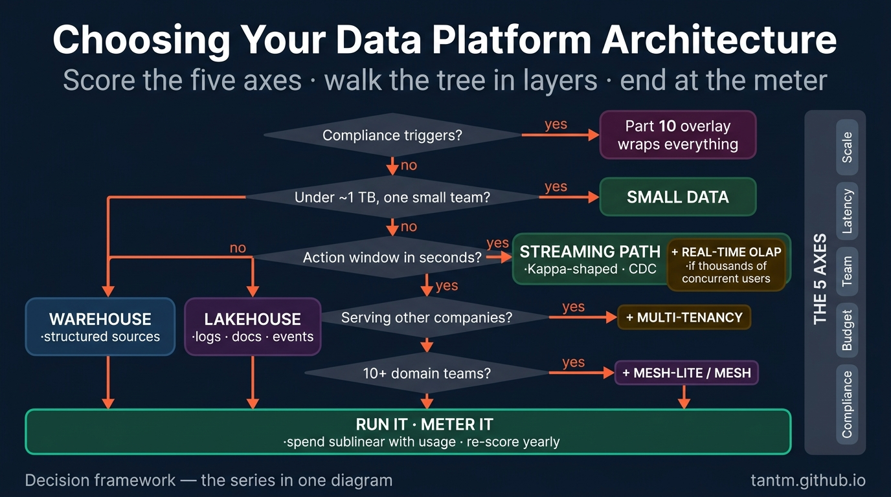
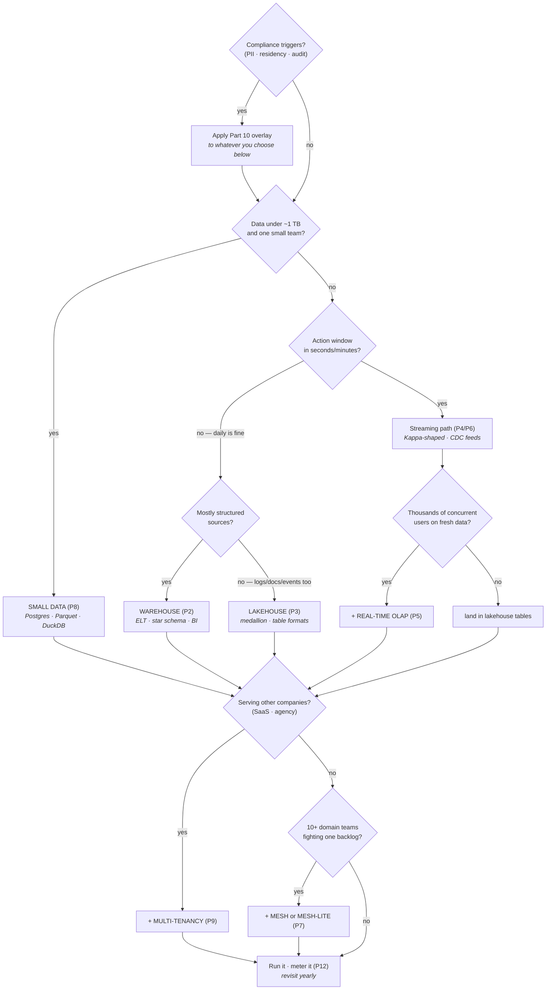

Thirteen parts, ten-plus schools. This finale compresses them into the thing you actually need in a design meeting: **a decision path, five ready blueprints, and the honesty questions.** Bookmark this one; the rest of the series is its appendix.

## What you'll learn

- Score the five axes out loud, so the constraints drive the choice instead of taste.
- Walk the decision path in the right order — by layer, not by favorite technology.
- Match your situation to one of five blueprints, and know what each one costs.
- Ask the honesty questions that stop a plausible architecture from becoming an expensive one.

**Prerequisites:** The whole series — this part is the synthesis, not an introduction.

## 1. Score the five axes (again, out loud)

Write the answers down before opening a diagramming tool — Part 1's exercise, now with teeth:

1. **Scale** — total history and growth rate (GB / TB / PB)?
2. **Latency** — the *action window*: within what time does someone act differently? (Part 4's gate question)
3. **Team** — how many people can *operate* platforms, honestly?
4. **Budget** — monthly run-rate you can defend a year from now?
5. **Compliance** — PII, residency, audit, regulators — any of the Part 10 triggers?

The framework's premise: **most architecture mistakes are axis mistakes** — a latency answer copied from a conference, a team answer copied from wishful thinking.

## 2. The decision path

Read it as *layers*, not exits: the compliance overlay wraps any base; multi-tenancy and mesh are additions on top of a base school; AI-readiness (Part 11) bolts onto whichever base you land on; and every path ends at Part 12's meter. Migration (Part 13) is the edge you travel whenever a *re-run* of this tree gives a different answer than last year.

## 3. Five blueprints

| Archetype | Base | Additions | Deliberately absent |
|---|---|---|---|
| **Startup** (2 eng, <100 GB) | Small data (P8) | pgvector if AI (P11) · exit-ramp formats | Clusters, streaming, mesh — all of it |
| **SME** (small data team, low TB) | Warehouse or lakehouse-lite (P2/P3) | dbt discipline · one CDC feed if needed (P6) | Real-time OLAP "for the CEO dashboard" |
| **Enterprise** (many teams, TB–PB) | Lakehouse core (P3) | Streaming path (P4) · OLAP serving (P5) · mesh-lite → mesh (P7) · FinOps program (P12) | One-engine-for-everything thinking |
| **Regulated** (bank/health/public archetype) | Enterprise blueprint | Part 10 overlay from day one · migration evidence regime (P13) | Any component without lineage & audit |
| **Data-product company** (analytics *is* the product) | Lakehouse + real-time OLAP (P3+P5) | Tiered multi-tenancy + per-tenant metering (P9) · online features & vectors (P11) | Internal-BI instincts applied to external SLAs |

Blueprints are starting positions, not destinations — the yearly re-score decides when you've become a different archetype.

## 4. The honesty questions

Five questions that catch the classic self-deceptions this series kept meeting:

1. *"Who acts on this data within the hour?"* — if the room goes quiet, you don't need streaming (P4).
2. *"Which team member operates this component at 2 a.m.?"* — a name, not a role title (P8's whole thesis).
3. *"What does this cost per month at 3× usage?"* — sublinear or bust (P12).
4. *"How would we leave this choice?"* — open formats and two-way doors, priced in now (P3, P13).
5. *"Are we choosing this because our constraints demand it — or because it's on stage this year?"* — Part 1's warning, asked out loud, in the meeting, every time.

## 5. Where to go from here

This series gave you the map; the neighbors give you the skills: the **Data Engineer Roadmap** teaches you to *build* what you chose here, the **AI Engineer Roadmap** what to build *on top of it*, and **AWS from Zero to Advanced** the cloud primitives underneath. The best next step is concrete: take your current platform, score the five axes, walk the tree, and see whether you land where you're standing. If not — Part 13 is waiting.

## Practice (30 minutes — write the architecture decision record you'd defend in six months)

This is the capstone of the series, so the exercise is the artifact a senior engineer is actually asked for: a one-page decision record for a real system. Write it, don't sketch it.

**Part 1 — the constraints (10 min).** Score the five axes for your system with numbers and sources, not adjectives:

| Axis | Your value | How you know | What it rules out |
|---|---|---|---|
| Latency | e.g. "hourly is fine; nobody acts faster" | who acts, in what window | streaming path |
| Scale | e.g. "80 GB, +2 GB/month" | current storage bill | distributed processing |
| Team | e.g. "2 engineers, no on-call rota" | headcount | anything with a pager |
| Budget | e.g. "under 2k/month" | approved figure | always-on clusters |
| Compliance | e.g. "PII, EU residency" | the actual obligation | some regions and vendors |

**Part 2 — the decision (10 min).** Name the blueprint you're choosing and, more importantly, the two you rejected *and why* — in terms of the axes above, not preferences. A record that only says yes to one thing is marketing; a record that says no to two others is engineering.

**Part 3 — the review trigger (10 min).** Write the conditions that would make this decision wrong: "if we exceed X GB", "if a second team needs their own pipelines", "if anyone needs sub-minute freshness". Add a date to revisit. This is the part that separates a decision from a belief — you've pre-committed to changing your mind on evidence.

Expected results: part 1 is usually where the surprise lands — writing "how you know" next to each axis exposes which constraints are measured and which are assumed, and it's common to find that the axis driving the whole design was somebody's guess. Part 2 forces the comparison to be explicit while you still remember the reasoning, which is what makes the record useful to the person who inherits it. Part 3 is the one teams skip and then regret: without a review trigger, an architecture chosen correctly for last year's constraints quietly becomes the wrong one, and nobody notices because nobody wrote down what would count as noticing.

## Check yourself

1. Two teams with the same data volume choose different architectures. Is one of them wrong?
2. Your decision record says "we chose a lakehouse because it's the modern standard." What's missing?
3. When should an architecture decision be revisited?

See answers

1. Almost certainly not. Data volume is one axis of five, and the other four — latency needs, team size and skills, budget, compliance obligations — routinely differ enough to justify opposite choices. An architecture is a fit to constraints, so two teams with the same volume and different constraints *should* build differently.
2. The constraints, and the rejected alternatives. "It's the modern standard" is a statement about fashion, not about your latency, scale, team, budget or obligations — and it gives whoever reads the record in two years nothing to evaluate. Replace it with the axis scores and the two options you turned down.
3. On a schedule *and* on a trigger. The schedule catches slow drift (annually is usually enough); the triggers catch step changes you wrote down in advance — crossing a data volume, adding a team that needs autonomy, a new latency requirement, or a new compliance obligation. Pre-committing to the triggers is what keeps the revisit honest rather than defensive.

## Key takeaways

- Score the five axes out loud first: most architecture mistakes are axis mistakes.
- Walk the tree in layers: base school → compliance overlay → tenancy/mesh additions → AI bolt-ons → always end at the meter.
- Five blueprints cover the archetypes; the yearly re-score tells you when you've changed archetypes — and Part 13 is the road between.
- The five honesty questions are the cheapest architecture review you will ever run.

*This concludes the Data Platform Architectures series — [view the full series](/series/dp-architectures).*
