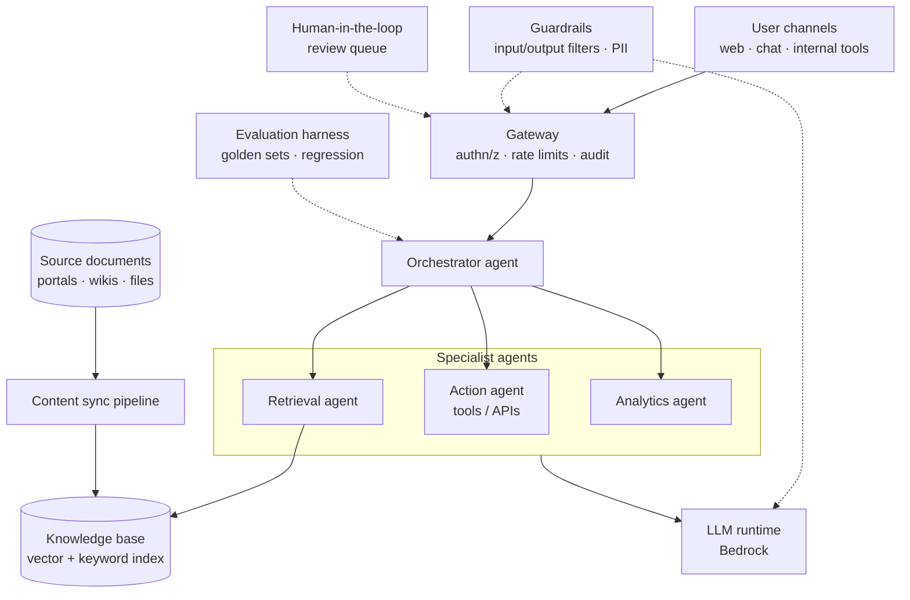

Building a GenAI agent demo takes a weekend. Making it something an enterprise can rely on
takes months — and almost none of that time is spent on prompts. Having led the build of a
multi-agent assistant platform on AWS Bedrock, here is where the real work went.

> As always on this blog: patterns generalized from real delivery, no client specifics.

## The demo-to-production gap

A demo needs one happy path. Production needs answers to questions the demo never asks:

- What happens when the model is *confidently wrong*?
- Who approved this answer before it reached a customer-facing channel?
- Why did the agent pick that tool, and can we audit it later?
- How do we know this week's release didn't make answers worse?

Each question becomes an architectural component, not a prompt tweak.

## Architecture of a production agent platform



Three things in this diagram do most of the heavy lifting — and none of them are the LLM.

## RAG that stays fresh

Retrieval quality decides assistant quality, and retrieval quality decays silently.
Documents change, portals get reorganized, and last quarter's index answers this quarter's
questions incorrectly.

Treat the knowledge base as a *data product* with a real pipeline:

- **Automated content sync** — scheduled ingestion from source systems into the index, with
  the same rigor as any ELT job: idempotent runs, failure alerts, freshness metrics.
- **Chunking tuned to the corpus** — heading-aware splitting for structured docs beats
  fixed-size chunks; keep chunk metadata (source, section, updated date) for citations.
- **Hybrid retrieval** — vector similarity plus keyword/BM25, because exact codes, product
  names and abbreviations are precisely what embeddings fumble.
- **Citations always** — every answer links back to sources. It builds trust and it turns
  every wrong answer into a debuggable retrieval trace.

If you run a lakehouse (see [the previous post](/blog/2026/modern-data-platform-on-aws)),
the sync pipeline is just another consumer of it.

## Multi-agent: only when it earns its keep

A single agent with ten tools degrades: tool-selection errors climb and prompts bloat.
Splitting into specialist agents behind an orchestrator keeps each context small:

```python
@tool
def search_knowledge_base(query: str, top_k: int = 5) -> list[Document]:
    """Retrieve the most relevant documents for a user question."""
    return kb.hybrid_search(query, top_k=top_k)

orchestrator = Agent(
    system_prompt=ROUTING_PROMPT,
    agents=[retrieval_agent, action_agent, analytics_agent],
)
```

But multi-agent is a complexity budget, not a badge. Start with one agent; split when you
can *measure* routing errors, not when the architecture diagram looks lonely.

## Guardrails and human-in-the-loop

Two layers that make enterprise deployment possible:

1. **Guardrails** on both directions — input filtering (prompt injection, off-topic,
   PII) and output filtering (toxicity, data leakage, unsupported claims). Managed
   guardrails get you 80%; domain-specific rules cover the rest.
2. **Human review where stakes demand it** — for high-impact channels, answers enter a
   review queue before publication. Reviewer edits are gold: they become few-shot examples
   and regression tests, so the review loop *improves* the system instead of just
   gatekeeping it.

## Evaluation: the real moat

The teams that ship GenAI successfully are the ones that can answer "did it get better?"
with a number:

- **Golden question sets** per domain, curated with subject-matter experts, versioned in git.
- **Automated regression runs** on every change to prompts, retrieval, or models —
  scoring answer correctness, citation accuracy and refusal behavior.
- **LLM-as-judge with calibration** — usable at scale once you've checked it against human
  ratings on a sample.
- **Production feedback loop** — thumbs-down answers flow back into the eval set.

Without this, every prompt change is a leap of faith; with it, iteration becomes routine
engineering.

## Lessons learned

1. **Retrieval beats prompting.** Most "the model is wrong" bugs are "the context was
   wrong" bugs.
2. **Latency is a feature.** Multi-agent hops add up; stream tokens early and keep the
   orchestrator's routing decisions cheap.
3. **Log every step.** Tool calls, retrieved chunks, agent handoffs — full traces turn
   incident analysis from vibes into engineering.
4. **Cost scales with success.** Token budgets per request, caching for repeated
   questions, and small models for routing keep the bill sane.
5. **Ship the boring parts first.** Auth, audit, guardrails and eval are what make the
   difference between a pilot and a platform.

---

*The common thread with the data platform post: in both worlds, the durable asset isn't
the shiny engine — it's the disciplined substrate underneath it.*
