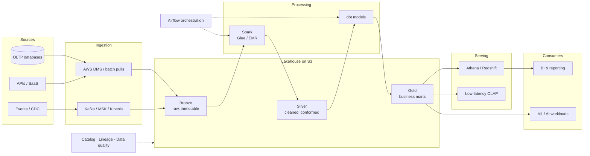

After delivering data platforms for banks, consumer finance, aviation and FMCG companies,
I've converged on a blueprint that keeps working across industries. This post walks through
that reference architecture and — more importantly — the decisions behind it.

> Everything here is generalized from real deliveries. No client specifics, just the
> patterns that survived contact with production.

## The platform, not the pipeline

Teams usually start by building *pipelines*: one source, one transformation, one dashboard.
It works until the fifth pipeline, when you discover five different ingestion styles, no
shared catalog, and nobody knows which numbers to trust.

A *platform* flips the mindset: build the shared substrate first — storage layout,
ingestion patterns, orchestration, governance — then every new use case is a thin layer on
top instead of a new snowflake.

## Reference architecture



The shape is boring on purpose. The value is in the decisions each box hides.

## Decision 1 — Medallion layers with hard contracts

Bronze/Silver/Gold is well known; what matters is enforcing *contracts* between layers:

- **Bronze** is raw and immutable — land data exactly as received, partitioned by ingestion
  time. You will thank yourself during every incident replay.
- **Silver** is where schema, deduplication and conformance happen. One dataset, one owner,
  one definition.
- **Gold** is business-facing marts, built with dbt so logic is versioned, tested and
  documented as code.

The anti-pattern to avoid: consumers reading Bronze "just this once". Every exception
becomes a permanent dependency on raw data.

## Decision 2 — Open table format from day one

Plain Parquet on S3 gets you surprisingly far, until you need upserts, schema evolution,
time travel or concurrent writers. Retrofitting a table format onto hundreds of existing
tables is painful — adopting Apache Iceberg (or Delta) from day one is nearly free:

```sql
CREATE TABLE lakehouse.silver.customers (
  customer_id   BIGINT,
  full_name     STRING,
  segment       STRING,
  updated_at    TIMESTAMP
)
USING iceberg
PARTITIONED BY (days(updated_at));
```

Merge-based CDC ingestion then becomes a first-class operation instead of a
rewrite-the-partition hack.

## Decision 3 — Batch and streaming share one backbone

Most "streaming requirements" are really *freshness* requirements. Push events through
Kafka/MSK into the same Bronze layer, then let the required latency decide the processing
path:

| Freshness needed | Path |
|---|---|
| Hours | Scheduled Spark/dbt batch |
| Minutes | Micro-batch on the same tables |
| Seconds | Stream processing into a low-latency OLAP store |

Keeping one storage backbone means the real-time view and the historical view never
disagree about what happened.

## Decision 4 — Governance is a feature, not a phase

Every platform I've seen defer governance "until phase 2" ended up re-ingesting datasets to
fix ownership, quality and lineage. Minimum viable governance from the start:

- **Catalog**: every dataset registered with an owner and a description (Glue Catalog +
  a metadata layer such as OpenMetadata).
- **Data quality**: automated checks (volume, nulls, referential, freshness) wired into the
  orchestrator — failures block downstream tasks, not just send a Slack message.
- **Lineage**: emitted from the tools you already use (dbt, Airflow), not hand-drawn.

## Decision 5 — Everything is code

Terraform for infrastructure, dbt for transformations, Airflow DAGs in git, CI on every
change. A data platform has too many moving parts for click-ops to survive its second team
member. This is also what makes the platform *repeatable* — the next environment (or the
next client) is a plan-and-apply away.

## Lessons learned

1. **Design for replay.** Every ingestion and transformation must be safely re-runnable.
   Idempotency is the closest thing data engineering has to a superpower.
2. **Freshness SLAs before tech choices.** "Real-time" often dissolves into "every 15
   minutes is fine" once you ask what decision the data drives.
3. **Quality checks that block, not warn.** Alerts get muted; failed DAGs get fixed.
4. **Keep the serving layer swappable.** Query engines change; your S3 + Iceberg tables
   are the durable asset.
5. **Platform teams serve use cases.** Ship one visible business use case with each
   platform increment — a platform with no consumers is a very expensive folder structure.

---

*Next up: how the AI side connects — feature pipelines, RAG knowledge bases and agentic
workloads all consume from this same lakehouse. That's [the next post](/blog/2026/genai-agents-from-demo-to-production).*
