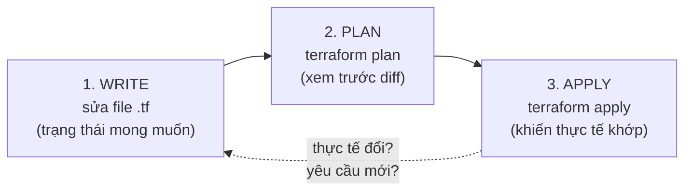
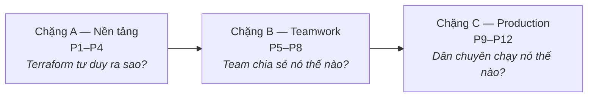

<!-- TODO(img): hero — SP-F blueprint: bên trái bàn tay click cửa sổ cloud console (gạch chéo X), bên phải file text nhãn "MAIN.TF" nối vào cánh tay robot đang dựng tủ rack server; tiêu đề "STOP CLICKING, START DECLARING" -->

Ai đó đã dựng hạ tầng cloud của công ty bạn bằng cách click chuột trên web console. Không ai nhớ chính xác họ đã click gì. Giờ mỗi thay đổi đều đáng sợ, và không ai dựng lại được môi trường nếu nó biến mất. **Infrastructure as Code (IaC)** sửa điều này — và Terraform là công cụ phổ biến nhất cho nó. Khoá học này đưa bạn từ resource đầu tiên tới vận hành IaC như một team chuyên nghiệp.

## Bạn sẽ học được gì

- Giải thích được vì sao "click ops" (quản hạ tầng bằng click console) trở thành nợ kỹ thuật.
- Mô tả vòng lặp lõi của Terraform: declare → plan → apply.
- Hiểu "declarative" và "idempotent" nghĩa là gì, kèm ví dụ.
- Nắm lộ trình 12 bài của khoá.

**Cần biết trước:** bài này không cần gì. Từ bài 2, bạn nên có tài khoản AWS free-tier và biết terminal cơ bản. Không cần biết Docker.

## 1. Vấn đề: hạ tầng dựng bằng click chuột

Click console cho cảm giác nhanh. Cái giá đến sau, dưới 3 hình dạng:

- **Không có lịch sử.** Ai mở port 8080 trên security group đó? Lúc nào? Vì sao? Console không trả lời.
- **Không có review.** Code đi qua pull request. Một cú click console đi thẳng vào production, không ai duyệt.
- **Không dựng lại được.** Nếu môi trường mất — hoặc bạn cần thêm một bản staging — "tài liệu" duy nhất là trí nhớ của ai đó.

Nói gọn: hạ tầng quản bằng click là **một hệ thống production không có source code**. IaC trao cho nó source code: bạn mô tả hạ tầng trong file text, lưu vào git, review qua pull request, và để công cụ khiến cloud khớp theo.

## 2. Terraform tư duy thế nào: declare, đừng script

Có hai cách tự động hoá hạ tầng. Hiểu khác biệt này là ý tưởng quan trọng nhất của cả khoá.

**Imperative** (một script): "tạo server, rồi tạo bucket, rồi gắn policy." Bạn liệt kê *các bước*. Script chết giữa chừng → bạn ở trạng thái không xác định. Chạy hai lần → bạn có hai server.

**Declarative** (Terraform): "một server tên `web` *tồn tại*, một bucket tên `reports` *tồn tại*." Bạn mô tả *đích đến*, công cụ tự tính các bước.

```hcl
resource "aws_s3_bucket" "reports" {
  bucket = "myco-reports-dev"
  tags = {
    team = "data"
    env  = "dev"
  }
}
```

Đoạn này không nói "hãy tạo". Nó nói "bucket này tồn tại với các thuộc tính này". Hai hành vi hữu ích tự động theo sau:

- Chạy khi bucket chưa có → Terraform tạo nó.
- Chạy lại lần nữa → Terraform thấy bucket đã khớp và **không làm gì cả**.

Hành vi thứ hai gọi là **idempotent** (chạy nhiều lần cho cùng kết quả như chạy một lần). Idempotency là lý do IaC an toàn để chạy lại, an toàn để tự động hoá, an toàn để đưa vào pipeline.

<!-- TODO(img): concept — SP-F blueprint: 2 panel cạnh nhau. Trái "IMPERATIVE": checklist dài đánh số (STEP 1..5), bước 3 gạch X đỏ và dấu hỏi bên dưới. Phải "DECLARATIVE": một sơ đồ đích đơn giản (bucket + server có dấu tick) và cánh tay robot chỉnh thực tế cho khớp; chú thích "YOU DECLARE THE DESTINATION, THE TOOL DRIVES" -->

## 3. Vòng lặp lõi: write → plan → apply

Mọi thứ bạn làm với Terraform đều là vòng lặp 3 bước này:



- **Write.** Bạn sửa các file `.tf` mô tả thứ nên tồn tại.
- **Plan.** `terraform plan` so sánh ba thứ: file của bạn (mong muốn), trí nhớ của Terraform về thứ nó đã dựng (**state** — khái niệm quan trọng tới mức chiếm trọn bài 3), và cloud thật. Nó in ra một bản diff: `+` tạo, `~` sửa, `-` xoá.
- **Apply.** `terraform apply` thực thi đúng bản plan đó.

Bước plan là siêu năng lực. Nó nghĩa là **bạn luôn thấy điều sắp xảy ra trước khi nó xảy ra** — như review một pull request, nhưng cho thay đổi hạ tầng. Team chuyên nghiệp không bao giờ apply mà chưa đọc plan (bài 8 biến điều này thành workflow đầy đủ cho team).

Một cảnh báo thật thà khi đang học: dòng `-` và `-/+` trong plan nghĩa là **xoá**. Trên một database, nghĩa là mất dữ liệu. Bài 4 dạy bạn đọc plan như dân chuyên; trước lúc đó, cứ thấy dấu trừ là chậm lại.

## 4. Lộ trình phía trước: 12 bài, 3 chặng



- **Chặng A (P1–P4):** mental model (bài này), resource đầu tiên từng dòng, đào sâu state, đọc plan và vòng đời resource.
- **Chặng B (P5–P8):** remote state và lock, variables và đa môi trường, module đúng cách, workflow PR.
- **Chặng C (P9–P12):** CI/CD cho hạ tầng, import đồ cũ và chống drift, testing và policy guardrails, rồi các pattern và so sánh thật thà với CDK/Pulumi.

Nếu bạn đã dùng Terraform hằng ngày, bắt đầu từ bài 5 — chặng B và C là nơi đa số người tự học có lỗ hổng.

## Thực hành (10 phút — không cần tài khoản cloud)

Cài Terraform, rồi chứng minh vòng lặp hoạt động với một file local (không AWS, không tốn tiền):

```bash
# 1. Tạo thư mục và file config
mkdir tf-hello && cd tf-hello
cat > main.tf <<'EOF'
resource "local_file" "hello" {
  filename = "hello.txt"
  content  = "managed by terraform"
}
EOF

# 2. Vòng lặp
terraform init      # tải provider "local"
terraform plan      # hiện: 1 to add
terraform apply     # gõ yes -> tạo hello.txt

# 3. Test idempotency
terraform plan      # hiện: no changes  <-- phép màu ở đây

# 4. Test drift: phá thực tế, xem Terraform phát hiện
echo "sua tay" > hello.txt
terraform plan      # hiện: 1 to change (nó bắt được drift!)

# 5. Dọn dẹp
terraform destroy   # gõ yes
```

Kết quả mong đợi: bước 3 hiện "No changes". Bước 4 hiện Terraform phát hiện thực tế không còn khớp khai báo. Bạn vừa trải nghiệm desired state, idempotency, và drift detection — ba ý tưởng mà cả khoá này xây trên đó.

## Tự kiểm tra

1. Đồng nghiệp viết một bash script gọi AWS CLI để tạo server. Đó là declarative hay imperative, và điều gì hỏng nếu script chạy hai lần?
2. `terraform plan` so sánh ba thứ gì?
3. Vì sao phải có idempotency thì mới tự động hoá thay đổi hạ tầng trong pipeline một cách an toàn được?

<details><summary>Xem đáp án</summary>

1. Imperative — nó liệt kê các bước. Chạy hai lần sẽ tạo server trùng (hoặc lỗi), vì script không hề biết thứ gì đã tồn tại.
2. File `.tf` của bạn (trạng thái mong muốn), state file của Terraform (trí nhớ về thứ nó quản), và hạ tầng thật trên cloud.
3. Pipeline hay chạy lại: khi retry, khi merge mới. Nếu chạy lại có thể nhân đôi hay làm hỏng hạ tầng thì tự động hoá thành nguy hiểm. Idempotency khiến chạy lại thành không-làm-gì khi không có thay đổi.

</details>

## Điều cần nhớ

- Click-ops là hệ thống production không có source code: không lịch sử, không review, không dựng lại được. IaC trao cho hạ tầng kỷ luật của code.
- Terraform là declarative: bạn mô tả đích đến, nó tính các bước — và chạy lại an toàn vì idempotent.
- Tất cả là vòng lặp: viết `.tf` → `plan` (đọc diff, tôn trọng dấu trừ) → `apply`.
- Khoá học: chặng A mental model, chặng B teamwork, chặng C production. Người có kinh nghiệm bắt đầu từ bài 5.

**Đọc thêm:** bản tóm tắt IaC một-bài nằm trong series AWS Phần 11; container (bạn đồng hành tự nhiên của IaC) bắt đầu ở Docker & Kubernetes Phần 1.

*Bài tiếp theo — Phần 2: Những resource đầu tiên, từng dòng.*
