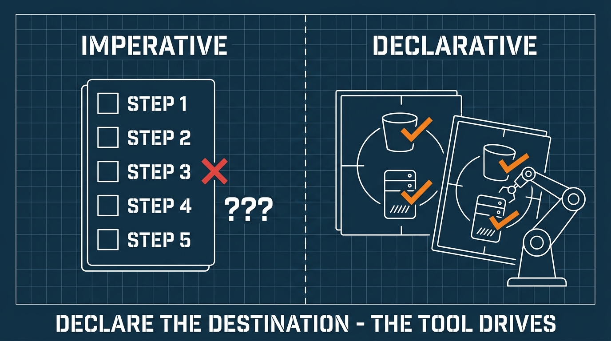
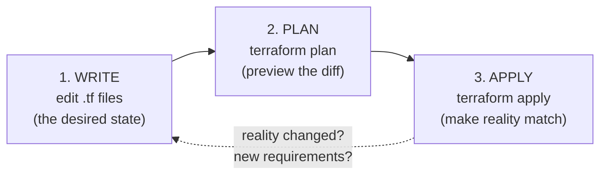
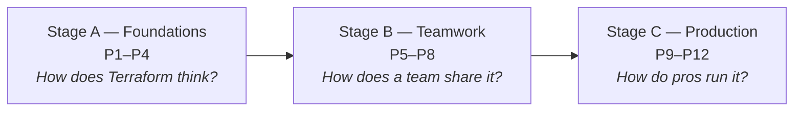

Somebody built your company's cloud by clicking buttons in a web console. Nobody remembers exactly what they clicked. Now every change is scary, and nobody can rebuild the environment if it disappears. **Infrastructure as Code (IaC)** fixes this — and Terraform is the most widely used tool for it. This course takes you from your first resource to running IaC like a professional team.

## What you'll learn

- Explain why "click ops" (managing cloud by console clicks) becomes technical debt.
- Describe Terraform's core loop: declare → plan → apply.
- Understand what "declarative" and "idempotent" mean, with examples.
- Navigate the 12-part roadmap of this course.

**Prerequisites:** none for this part. From Part 2 on, you'll want an AWS free-tier account and basic terminal skills. Docker knowledge is not required.

## 1. The problem: infrastructure built by clicking

Clicking a console feels fast. The cost arrives later, in three forms:

- **No history.** Who opened port 8080 on that security group? When? Why? The console doesn't say.
- **No review.** Code goes through pull requests. A console click goes straight to production, unreviewed.
- **No rebuild.** If the environment is lost — or you need a second one for staging — the only "documentation" is someone's memory.

In short: infrastructure managed by clicks is a **production system with no source code**. IaC gives it source code: you describe your infrastructure in text files, store them in git, review them in pull requests, and let a tool make the cloud match.

## 2. How Terraform thinks: declare, don't script

There are two ways to automate infrastructure. Understanding the difference is the single most important idea in this course.

**Imperative** (a script): "create a server, then create a bucket, then attach a policy." You list *steps*. If the script fails halfway, you're in an unknown state. If you run it twice, you get two servers.

**Declarative** (Terraform): "a server named `web` *exists*, a bucket named `reports` *exists*." You describe the *destination*, and the tool computes the steps.

```hcl
resource "aws_s3_bucket" "reports" {
  bucket = "myco-reports-dev"
  tags = {
    team = "data"
    env  = "dev"
  }
}
```

This snippet doesn't say "create". It says "this bucket exists with these properties". Two useful behaviors follow automatically:

- Run it when the bucket doesn't exist → Terraform creates it.
- Run it again → Terraform sees the bucket already matches and does **nothing**.

That second behavior is called **idempotent** (running it many times gives the same result as running it once). Idempotency is why IaC is safe to re-run, safe to automate, and safe to put in a pipeline.



## 3. The core loop: write → plan → apply

Everything you'll ever do with Terraform is this three-step loop:



- **Write.** You edit `.tf` files describing what should exist.
- **Plan.** `terraform plan` compares three things: your files (desired), Terraform's memory of what it built (**state** — a concept so important it gets all of Part 3), and the real cloud. It prints a diff: `+` create, `~` change, `-` destroy.
- **Apply.** `terraform apply` executes exactly that plan.

The plan step is the superpower. It means **you always see what will happen before it happens** — like reviewing a pull request, but for infrastructure changes. Professional teams never apply without reading the plan (Part 8 turns this into a full team workflow).

One honest warning while learning: `-` and `-/+` lines in a plan mean **destroy**. On a database, that means data loss. Part 4 teaches you to read plans like a pro; until then, slow down whenever you see a minus sign.

## 4. The road ahead: 12 parts, 3 stages



- **Stage A (P1–P4):** the mental model (this part), your first resources line by line, state deep-dive, reading plans and resource lifecycle.
- **Stage B (P5–P8):** remote state and locking, variables and multi-environment, modules done right, the PR workflow.
- **Stage C (P9–P12):** CI/CD for infrastructure, importing legacy and fighting drift, testing and policy guardrails, then patterns and the honest CDK/Pulumi comparison.

If you already use Terraform daily, start at Part 5 — Stages B and C are where most self-taught users have gaps.

## Practice (10 minutes — no cloud account needed)

Install Terraform, then prove the loop works with a local file (no AWS, no cost):

```bash
# 1. Make a folder and a config file
mkdir tf-hello && cd tf-hello
cat > main.tf <<'EOF'
resource "local_file" "hello" {
  filename = "hello.txt"
  content  = "managed by terraform"
}
EOF

# 2. The loop
terraform init      # downloads the "local" provider
terraform plan      # shows: 1 to add
terraform apply     # type yes -> creates hello.txt

# 3. Idempotency test
terraform plan      # shows: no changes  <-- this is the magic

# 4. Drift test: break reality, watch Terraform notice
echo "manual edit" > hello.txt
terraform plan      # shows: 1 to change (it detected the drift!)

# 5. Clean up
terraform destroy   # type yes
```

Expected result: step 3 shows "No changes". Step 4 shows Terraform detecting that reality no longer matches your declaration. You just experienced desired state, idempotency, and drift detection — the three ideas this whole course builds on.

## Check yourself

1. Your teammate wrote a bash script that calls the AWS CLI to create servers. Is that declarative or imperative, and what breaks if the script runs twice?
2. What are the three things `terraform plan` compares?
3. Why is idempotency required before you can safely automate infrastructure changes in a pipeline?

<details><summary>See answers</summary>

1. Imperative — it lists steps. Running it twice creates duplicate servers (or errors), because the script has no idea what already exists.
2. Your `.tf` files (desired state), Terraform's state file (its memory of what it manages), and the real infrastructure in the cloud.
3. A pipeline re-runs things: on retries, on every merge. If re-running could duplicate or corrupt infrastructure, automation would be dangerous. Idempotency makes re-runs a no-op when nothing changed.

</details>

## Key takeaways

- Click-ops is a production system with no source code: no history, no review, no rebuild. IaC gives infrastructure the same discipline as code.
- Terraform is declarative: you describe the destination, it computes the steps — and re-running is safe because it's idempotent.
- Everything is the loop: write `.tf` → `plan` (read the diff, respect the minus signs) → `apply`.
- The course: Stage A mental model, Stage B teamwork, Stage C production. Experienced users can start at Part 5.

**Read more:** the one-post summary of IaC inside the AWS series is AWS Part 11; containers (a natural companion to IaC) start in Docker & Kubernetes Part 1.

*Next — Part 2: Your First Resources, Line by Line.*
