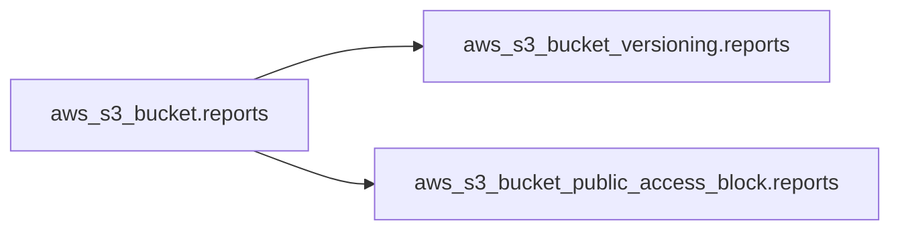
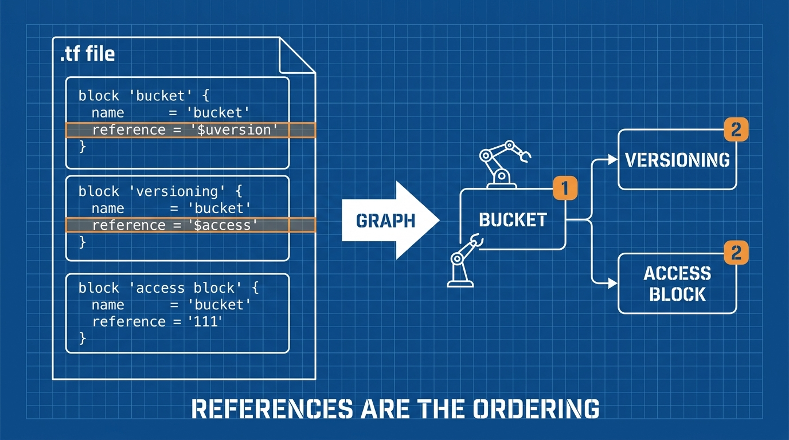

Bài 1 trao bạn vòng lặp: write → plan → apply. Bài này dạy phần *write*. Ngôn ngữ của Terraform tên là **HCL** (HashiCorp Configuration Language), và nó ít bộ phận chuyển động hơn vẻ ngoài: bốn loại block phủ 95% mọi file bạn sẽ đọc.

## Bạn sẽ học được gì

- Đọc và viết 4 block lõi: `terraform`, `provider`, `resource`, `data`.
- Reference một resource từ resource khác — và hiểu dependency graph nó tạo ra.
- Dự đoán được thứ tự Terraform tạo mọi thứ (bạn không sắp; nó sắp).
- Dựng một ví dụ AWS thật, an toàn: S3 bucket private có tags.

**Cần biết trước:** Bài 1. Tài khoản AWS free-tier với credentials đã cấu hình (`aws configure`). Mọi thứ ở đây nằm trong free tier.

## 1. Bốn block

Một file khởi đầu điển hình, từ trên xuống:

```hcl
# Block 1: terraform — cài đặt cho chính công cụ
terraform {
  required_providers {
    aws = {
      source  = "hashicorp/aws"
      version = "~> 5.0"          # nhận 5.x, từ chối 6.0
    }
  }
}

# Block 2: provider — cách nói chuyện với một cloud/dịch vụ
provider "aws" {
  region = "ap-southeast-1"
}

# Block 3: resource — một thứ PHẢI TỒN TẠI
resource "aws_s3_bucket" "reports" {
  bucket = "myco-reports-dev-4821"   # duy nhất toàn cầu
  tags = {
    team = "data"
    env  = "dev"
  }
}

# Block 4: data — đọc thứ ĐÃ TỒN TẠI (không tạo)
data "aws_caller_identity" "me" {}
```

Hai luật ngữ pháp mở khoá tất cả:

- Một block bắt đầu bằng **loại** và tối đa hai **nhãn**: `resource "aws_s3_bucket" "reports"` = loại block `resource`, loại resource `aws_s3_bucket`, và tên *của bạn* `reports`.
- Tên của bạn (`reports`) chỉ tồn tại bên trong Terraform. AWS không bao giờ thấy nó. Đó là tên biến bạn dùng để reference block này ở nơi khác.

Phân biệt `resource` vs `data` quan trọng hằng ngày: **resource = Terraform quản vòng đời** (tạo, sửa, xoá). **data = tra cứu chỉ-đọc** thứ được quản ở nơi khác — một VPC có sẵn, account ID của chính bạn, AMI mới nhất.

## 2. Reference: các block thành một graph thế nào

Các block nối nhau bằng cách reference **attribute** của nhau:

```hcl
resource "aws_s3_bucket" "reports" {
  bucket = "myco-reports-dev-4821"
}

# Block này DÙNG bucket ở trên — chú ý cú reference:
resource "aws_s3_bucket_versioning" "reports" {
  bucket = aws_s3_bucket.reports.id     # <- loại.tên.attribute
  versioning_configuration {
    status = "Enabled"
  }
}
```

Đường reference luôn là **`loại.tên.attribute`** (với data source: `data.loại.tên.attribute`). Không có ngoặc kép — nó là biểu thức, không phải chuỗi.

Đây là phần quan trọng: cú reference đó không chỉ là một giá trị. Nó là một **dependency**. Terraform đọc mọi reference trong file của bạn và dựng một graph:



Từ graph đó, Terraform tự quyết thứ tự: bucket trước, rồi hai block trỏ vào nó — hai block đó chạy *song song*, vì không gì nối chúng với nhau. Bạn không bao giờ viết "bước 1, bước 2". **Reference chính là thứ tự.** Đây là cơ chế đứng sau lời hứa của bài 1 rằng declarative thắng imperative.



Một hệ quả đáng biết ngay: reference vòng tròn (A cần B, B cần A) không thể sắp thứ tự, và Terraform từ chối bằng lỗi cycle. Gặp nó thì thiết kế của bạn — không phải Terraform — cần được sửa.

## 3. Đọc plan cho config này

Chạy `terraform plan` với config ba block ở trên, bạn nhận:

```text
Terraform will perform the following actions:

  # aws_s3_bucket.reports will be created
  + resource "aws_s3_bucket" "reports" {
      + bucket = "myco-reports-dev-4821"
      + id     = (known after apply)
      ...
```

Đọc ba thứ trong mọi plan, mọi lần:

- **Dòng động từ** — `will be created` / `updated in-place` / `destroyed`. Dòng tổng kết cuối (`Plan: 3 to add, 0 to change, 0 to destroy`) là phép kiểm tra tỉnh táo của bạn.
- **`(known after apply)`** — các attribute chưa tồn tại cho tới khi cloud cấp (ID, ARN). Bình thường, không phải lỗi.
- **Bất kỳ thứ gì bạn không ngờ tới.** Plan có bất ngờ nghĩa là mental model của bạn và thực tế đang cãi nhau — dừng lại tìm hiểu *trước khi* apply.

## Thực hành (15 phút — free tier)

Dựng một bucket private, có tag, chặn public — bài "hello world" thực chiến của Terraform trên AWS:

```bash
mkdir tf-bucket && cd tf-bucket
cat > main.tf <<'EOF'
terraform {
  required_providers {
    aws = { source = "hashicorp/aws", version = "~> 5.0" }
  }
}

provider "aws" {
  region = "ap-southeast-1"
}

resource "aws_s3_bucket" "lab" {
  bucket = "tf-lab-DOI-THANH-TEN-DUY-NHAT"
  tags   = { env = "lab", managed_by = "terraform" }
}

# Chặn TOÀN BỘ public access — mặc định an toàn, luôn luôn
resource "aws_s3_bucket_public_access_block" "lab" {
  bucket                  = aws_s3_bucket.lab.id
  block_public_acls       = true
  block_public_policy     = true
  ignore_public_acls      = true
  restrict_public_buckets = true
}

data "aws_caller_identity" "me" {}

output "account_id" { value = data.aws_caller_identity.me.account_id }
EOF

terraform init
terraform plan          # mong đợi: 2 to add
terraform apply         # gõ yes
terraform plan          # mong đợi: no changes (kiểm idempotency)
terraform destroy       # gõ yes — không để lại gì
```

Kết quả mong đợi: plan hiện đúng 2 resource (block `data` chỉ đọc, không bao giờ tạo). Apply in ra account ID của bạn ở output. Plan lần hai nói "No changes". Destroy xoá cả hai.

## Tự kiểm tra

1. Trong `resource "aws_s3_bucket" "reports"`, phần nào AWS nhìn thấy, phần nào chỉ Terraform biết?
2. Block `resource` và block `data` khác nhau thế nào?
3. Bạn viết hai resource không có reference nào giữa chúng. Terraform tạo chúng theo thứ tự nào?

<details><summary>Xem đáp án</summary>

1. AWS thấy object thật của loại resource và tên `bucket` bên trong. Nhãn `reports` chỉ Terraform biết — tên local để reference.
2. `resource` = Terraform sở hữu vòng đời (tạo/sửa/xoá). `data` = tra cứu chỉ-đọc thứ đã tồn tại; plan không bao giờ "create" nó.
3. Không xác định — có thể song song. Không có reference thì không có dependency, nên Terraform tự do tạo theo bất kỳ thứ tự nào. Nếu thứ tự quan trọng, đó là dấu hiệu đang thiếu một reference.

</details>

## Điều cần nhớ

- Bốn block phủ gần hết: `terraform` (cài đặt công cụ), `provider` (cách kết nối), `resource` (thứ phải tồn tại), `data` (tra cứu chỉ-đọc).
- Reference dùng `loại.tên.attribute`, không ngoặc kép — và mỗi reference cũng là một cạnh dependency.
- Bạn không bao giờ sắp thứ tự thao tác: graph reference sắp. Song song khi có thể, tuần tự khi có reference, báo lỗi khi có vòng.
- Đọc mọi plan cùng một cách: động từ, dòng tổng kết add/change/destroy, và thứ bạn không ngờ tới.

*Bài tiếp theo — Phần 3: State: bộ nhớ của Terraform, đào sâu.*
