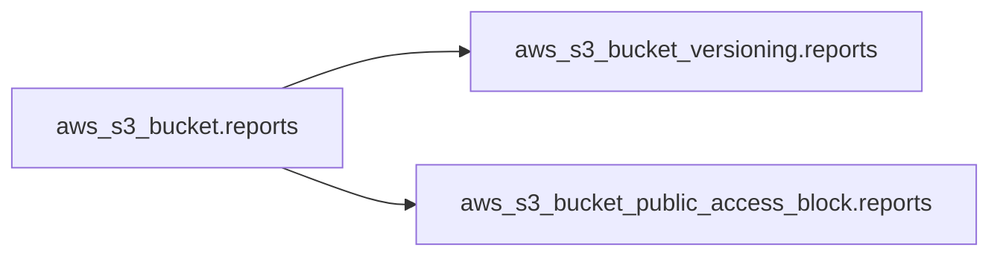

Part 1 gave you the loop: write → plan → apply. This part teaches the *writing*. Terraform's language is called **HCL** (HashiCorp Configuration Language), and it has fewer moving parts than it looks: four block types cover 95% of every file you'll ever read.

## What you'll learn

- Read and write the four core blocks: `terraform`, `provider`, `resource`, `data`.
- Reference one resource from another — and understand the dependency graph this creates.
- Predict the order Terraform creates things in (you don't order them; it does).
- Build a real, safe AWS example: a private S3 bucket with tags.

**Prerequisites:** Part 1. An AWS free-tier account with credentials configured (`aws configure`). Everything here stays inside the free tier.

## 1. The four blocks

A typical starter file, top to bottom:

```hcl
# Block 1: terraform — settings for the tool itself
terraform {
  required_providers {
    aws = {
      source  = "hashicorp/aws"
      version = "~> 5.0"          # accept 5.x, refuse 6.0
    }
  }
}

# Block 2: provider — how to talk to one cloud/service
provider "aws" {
  region = "ap-southeast-1"
}

# Block 3: resource — one thing that should EXIST
resource "aws_s3_bucket" "reports" {
  bucket = "myco-reports-dev-4821"   # globally unique
  tags = {
    team = "data"
    env  = "dev"
  }
}

# Block 4: data — read something that ALREADY exists (no create)
data "aws_caller_identity" "me" {}
```

Two grammar rules unlock all of it:

- A block starts with a **type** and up to two **labels**: `resource "aws_s3_bucket" "reports"` = block type `resource`, resource type `aws_s3_bucket`, and *your* name `reports`.
- Your name (`reports`) exists only inside Terraform. AWS never sees it. It's the variable name you'll use to reference this block elsewhere.

The `resource` vs `data` distinction matters daily: **resource = Terraform manages its lifecycle** (create, update, destroy). **data = read-only lookup** of something managed elsewhere — an existing VPC, your own account ID, the newest AMI.

## 2. References: how blocks become a graph

Blocks connect by referencing each other's **attributes**:

```hcl
resource "aws_s3_bucket" "reports" {
  bucket = "myco-reports-dev-4821"
}

# This block USES the bucket above — note the reference:
resource "aws_s3_bucket_versioning" "reports" {
  bucket = aws_s3_bucket.reports.id     # <- type.name.attribute
  versioning_configuration {
    status = "Enabled"
  }
}
```

The reference path is always **`type.name.attribute`** (for data sources: `data.type.name.attribute`). No quotes — it's an expression, not a string.

Here is the important part: that reference is not just a value. It is a **dependency**. Terraform reads every reference in your files and builds a graph:



From the graph, Terraform decides the order by itself: the bucket first, then the two blocks that point at it — those two in *parallel*, because nothing connects them. You never write "step 1, step 2". **The references are the ordering.** This is the mechanism behind Part 1's promise that declarative beats imperative.


One consequence worth knowing now: a circular reference (A needs B, B needs A) is impossible to order, and Terraform rejects it with a cycle error. If you hit one, your design — not Terraform — needs the fix.

## 3. Reading the plan for this config

Run `terraform plan` against the three-block config above and you get:

```text
Terraform will perform the following actions:

  # aws_s3_bucket.reports will be created
  + resource "aws_s3_bucket" "reports" {
      + bucket = "myco-reports-dev-4821"
      + id     = (known after apply)
      ...
```

Read three things in every plan, every time:

- **The verb line** — `will be created` / `updated in-place` / `destroyed`. The summary at the bottom (`Plan: 3 to add, 0 to change, 0 to destroy`) is your sanity check.
- **`(known after apply)`** — attributes that don't exist until the cloud assigns them (IDs, ARNs). Normal, not an error.
- **Anything you didn't expect.** A plan with surprises means your mental model and reality disagree — stop and find out why *before* applying.

## Practice (15 minutes — free tier)

Build a private, tagged, versioned bucket — the real-world "hello world" of AWS Terraform:

```bash
mkdir tf-bucket && cd tf-bucket
cat > main.tf <<'EOF'
terraform {
  required_providers {
    aws = { source = "hashicorp/aws", version = "~> 5.0" }
  }
}

provider "aws" {
  region = "ap-southeast-1"
}

resource "aws_s3_bucket" "lab" {
  bucket = "tf-lab-CHANGE-ME-TO-SOMETHING-UNIQUE"
  tags   = { env = "lab", managed_by = "terraform" }
}

# Block ALL public access — the safe default, always
resource "aws_s3_bucket_public_access_block" "lab" {
  bucket                  = aws_s3_bucket.lab.id
  block_public_acls       = true
  block_public_policy     = true
  ignore_public_acls      = true
  restrict_public_buckets = true
}

data "aws_caller_identity" "me" {}

output "account_id" { value = data.aws_caller_identity.me.account_id }
EOF

terraform init
terraform plan          # expect: 2 to add
terraform apply         # type yes
terraform plan          # expect: no changes (idempotency check)
terraform destroy       # type yes — leave nothing behind
```

Expected results: the plan shows exactly 2 resources (the `data` block reads, it never creates). Apply prints your account ID as an output. The second plan says "No changes". Destroy removes both.

## Check yourself

1. In `resource "aws_s3_bucket" "reports"`, which parts does AWS see, and which part is Terraform-only?
2. What's the difference between a `resource` and a `data` block?
3. You wrote two resources with no reference between them. What order does Terraform create them in?

<details><summary>See answers</summary>

1. AWS sees the resource type's real object and the `bucket` name inside it. The label `reports` is Terraform-only — a local name for references.
2. `resource` = Terraform owns the lifecycle (create/update/destroy). `data` = read-only lookup of something that already exists; plans never "create" it.
3. Undefined — possibly in parallel. Without a reference there is no dependency, so Terraform is free to create them in any order. If order matters, that's a sign a reference is missing.

</details>

## Key takeaways

- Four blocks cover almost everything: `terraform` (tool settings), `provider` (how to connect), `resource` (things that must exist), `data` (read-only lookups).
- References use `type.name.attribute`, unquoted — and every reference is also a dependency edge.
- You never order operations: the reference graph does. Parallel where possible, sequential where referenced, error on cycles.
- Read every plan the same way: verbs, the add/change/destroy summary, and anything you didn't expect.

*Next — Part 3: State: Terraform's Memory, Deep Dive.*
