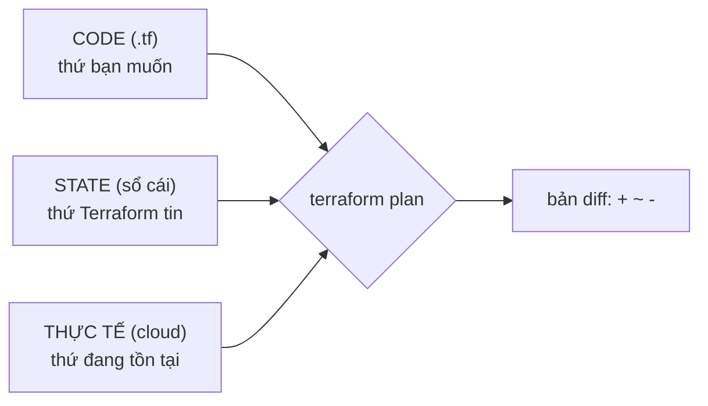

Mọi điều khó hiểu Terraform từng làm đều truy về một file: **state**. Bài 1 mới nhắc lướt; bài này khiến bạn thông thạo. Sự thông thạo quan trọng vì rắc rối state là nơi người mới kẹt hàng giờ — và nơi các lệnh cẩu thả thật sự phá huỷ hạ tầng.

## Bạn sẽ học được gì

- Giải thích vì sao Terraform cần state (2 lý do cụ thể).
- Đọc phép so sánh ba bên (code / state / thực tế) sau mỗi plan.
- Dùng 4 lệnh state sửa rắc rối thực chiến: `list`, `show`, `mv`, `rm`.
- Nhận diện các tình huống state và thực tế cãi nhau, và chọn đúng cách xử lý.

**Cần biết trước:** Bài 1–2. Phần thực hành tái dùng setup local-file của bài 1 — không cần cloud.

## 1. Vì sao Terraform cần bộ nhớ?

Lời hứa của Terraform là: đọc file `.tf`, so với thực tế, apply phần chênh lệch. Vậy sao còn giữ một file riêng? Hai lý do cụ thể:

- **Theo dõi.** File của bạn nói `resource "aws_s3_bucket" "reports"`. Cloud có 200 bucket. Cái nào là *của bạn*? State ghi lại ánh xạ: "`reports` của tôi = bucket thật với đúng ID này". Thiếu nó, Terraform không phân biệt nổi resource của mình với của người khác — kể cả những thứ con người tạo bằng click.
- **Xoá.** Bạn xoá một block resource khỏi file. Terraform giờ phải *destroy* một thứ không còn được mô tả ở bất kỳ đâu trong code. Nơi duy nhất còn nhớ nó từng tồn tại là state.

Vậy state là một **cuốn sổ cái**: mọi resource Terraform quản, kèm ID thật và các thuộc tính biết đến gần nhất.

## 2. Phép so sánh ba bên

Có sổ cái rồi, `terraform plan` so sánh ba nguồn sự thật:



Mỗi cặp bất đồng sinh ra một loại plan khác nhau:

| Bất đồng | Ví dụ | Plan nói |
|---|---|---|
| Code ≠ state | Bạn thêm tag trong file | `~ update` |
| Code ít hơn state | Bạn xoá một block resource | `- destroy` |
| Thực tế ≠ state | Ai đó sửa bucket trên console | `~ update` về theo code — **bắt được drift** |
| Có trong state, mất ngoài thực tế | Ai đó xoá bucket bằng tay | `+ create` lại |

Đọc hàng cuối hai lần: nếu một người xoá resource của bạn trên console, Terraform không hoảng — plan kế tiếp đơn giản tạo lại nó. Trạng thái mong muốn luôn thắng. Đó là tính tự-chữa-lành, và cũng là lý do các cú "sửa tay cho nhanh" bị lặng lẽ revert (bài 10 xử lý vấn đề văn hoá này).

## 3. Bên trong file có gì (nhìn, đừng chạm)

`terraform.tfstate` là JSON. Mở một lần cho hết bí ẩn — bạn sẽ thấy danh sách `resources`, mỗi cái có loại, tên của bạn, ID thật, và mọi thuộc tính đã biết:

```json
{
  "resources": [{
    "type": "local_file",
    "name": "hello",
    "instances": [{ "attributes": { "filename": "hello.txt", "content": "..." } }]
  }]
}
```

Hai cảnh báo nghiêm túc đi kèm file này:

- **State có thể chứa secret.** Password sinh tự động của database, private key — chúng nằm đó như thuộc tính thường. Đối xử với state như một file credentials: không bao giờ commit vào git (bài 5 chuyển nó lên remote backend có khoá và mã hoá).
- **Không bao giờ sửa bằng tay.** Một lỗi gõ trong JSON và bức tranh thế giới của Terraform hỏng. Mọi thay đổi state đi qua các lệnh sinh ra cho việc đó — mục kế tiếp.

## 4. Bốn lệnh state sửa rắc rối thật

Cả bốn là công cụ đọc-hoặc-phẫu-thuật cho sổ cái — không lệnh nào chạm vào cloud thật:

```bash
terraform state list                 # mọi resource trong sổ cái
terraform state show local_file.hello   # thuộc tính đầy đủ của một mục
terraform state mv  local_file.hello local_file.greeting
                                     # đổi tên resource trong code? mv mục
                                     # sổ cái để Terraform khỏi DESTROY
                                     # cái cũ + CREATE cái mới
terraform state rm  local_file.hello # quên nó đi: Terraform ngừng quản,
                                     # nhưng thứ THẬT vẫn tồn tại
```

Hai lệnh phải khắc cốt:

- **`state mv` — vị cứu tinh khi đổi tên.** Đổi `"hello"` thành `"greeting"` trong code nhìn vô hại. Với Terraform đó là "destroy `hello`, create `greeting`" — trên một database, đổi tên = mất dữ liệu. `state mv` cập nhật sổ cái để plan thành "no changes". (Terraform hiện đại còn khai báo được ngay trong code bằng block `moved {}` — cùng ý tưởng, review được trong PR.)
- **`state rm` — ly hôn, không phải án mạng.** Nó chỉ xoá *mục sổ cái*. Dùng khi một resource cần ngừng được Terraform quản (bàn giao bucket cho team khác). Chiều ngược lại — nhận nuôi một resource có sẵn *vào* sổ cái — là `terraform import` (bài 10).

## Thực hành (15 phút — không cần cloud)

```bash
mkdir tf-state-lab && cd tf-state-lab
cat > main.tf <<'EOF'
resource "local_file" "hello" {
  filename = "hello.txt"
  content  = "state lab"
}
EOF
terraform init && terraform apply -auto-approve

# 1. Đọc sổ cái
terraform state list
terraform state show local_file.hello

# 2. Cái bẫy đổi tên — trước hết, xem cách SAI:
sed -i 's/"hello"/"greeting"/' main.tf
terraform plan        # đọc kỹ: 1 to add, 1 to DESTROY — chỉ vì đổi tên!

# 3. Cách đúng: chuyển mục sổ cái trước
terraform state mv local_file.hello local_file.greeting
terraform plan        # giờ: no changes

# 4. Cú ly hôn: ngừng quản, giữ nguyên file
terraform state rm local_file.greeting
terraform state list  # sổ cái rỗng
ls hello.txt          # file thật vẫn còn!
terraform plan        # 1 to add — Terraform đã quên và muốn tạo lại

# 5. Dọn dẹp
rm -rf tf-state-lab
```

Kết quả mong đợi: plan bước 2 hiện một cú destroy chỉ vì đổi tên. Bước 3 biến nó thành "no changes". Bước 4 chứng minh `state rm` không hề chạm vào thực tế.

## Tự kiểm tra

1. Vì sao Terraform không thể chạy chỉ với code + thực tế, không cần state?
2. Bạn đổi tên `aws_db_instance "main"` thành `"primary"` trong code. Plan kế tiếp nói gì, và lẽ ra bạn nên làm gì?
3. `terraform state rm` khác `terraform destroy` thế nào?

<details><summary>Xem đáp án</summary>

1. Thiếu sổ cái, nó không biết resource thật nào là *của mình* (theo dõi), và không biết phải xoá thứ bạn đã bỏ khỏi code (xoá) — thực tế tự nó không nói ai quản cái gì.
2. Plan nói destroy + create — với database là mất dữ liệu. Lẽ ra chạy `terraform state mv` (hoặc thêm block `moved {}`) trước, biến cú đổi tên thành no-op.
3. `destroy` xoá resource thật lẫn mục sổ cái. `state rm` chỉ xoá mục sổ cái — resource thật sống tiếp, không ai quản.

</details>

## Điều cần nhớ

- State tồn tại để theo dõi (thứ thật nào là của tôi) và để xoá (nhớ cái cần gỡ) — nó là sổ cái, không phải cache.
- Mỗi plan là phép so sánh ba bên code/state/thực tế; drift và xoá tay chỉ là các hàng trong phép so đó, và trạng thái mong muốn luôn thắng.
- State có thể chứa secret, không bao giờ sửa tay hay commit git — bài 5 khoá nó trong remote backend.
- `state mv` trước khi đổi tên (hoặc block `moved {}`), `state rm` để thôi-quản mà không phá huỷ — và `import` (bài 10) cho chiều ngược lại.

*Bài tiếp theo — Phần 4: Đọc plan & vòng đời resource.*
