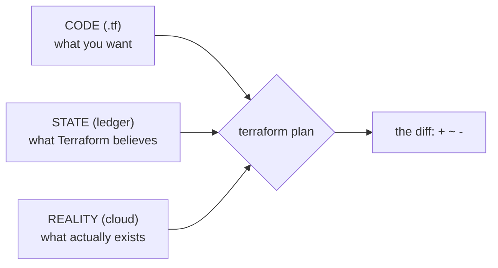

Every confusing thing Terraform ever does traces back to one file: the **state**. Part 1 introduced it in passing; this part makes you fluent. Fluency matters because state problems are where beginners get stuck for hours — and where careless commands genuinely destroy infrastructure.

## What you'll learn

- Explain why Terraform needs state at all (two concrete reasons).
- Read the three-way comparison (code / state / reality) behind every plan.
- Use the four state commands that fix real-world messes: `list`, `show`, `mv`, `rm`.
- Recognize the situations where state and reality disagree, and pick the right fix.

**Prerequisites:** Parts 1–2. The practice section reuses the local-file setup from Part 1 — no cloud needed.

## 1. Why does Terraform need a memory?

Terraform's promise is: read your `.tf` files, compare with reality, apply the difference. So why keep a separate file? Two concrete reasons:

- **Tracking.** Your file says `resource "aws_s3_bucket" "reports"`. The cloud has 200 buckets. Which one is *yours*? The state records the mapping: "my `reports` = the real bucket with this exact ID". Without it, Terraform can't tell its resources from everyone else's — including resources humans made by clicking.
- **Deleting.** You remove a resource block from your file. Terraform must now *destroy* something that is no longer described anywhere in your code. The only place that remembers it existed is the state.

So the state is a **ledger**: every resource Terraform manages, with its real-world ID and last-known attributes.

## 2. The three-way comparison

With the ledger in place, `terraform plan` compares three sources of truth:



Each pairwise disagreement produces a different plan:

| Disagreement | Example | Plan says |
|---|---|---|
| Code ≠ state | You added a tag in the file | `~ update` |
| Code has less than state | You deleted a resource block | `- destroy` |
| Reality ≠ state | Someone changed the bucket in the console | `~ update` back to code — **drift detected** |
| In state, gone from reality | Someone deleted the bucket manually | `+ create` it again |

Read that last row twice: if a human deletes your resource in the console, Terraform doesn't panic — the next plan simply recreates it. Desired state always wins. That's the self-healing property, and also why "quick manual fixes" get silently reverted (Part 10 deals with this culture problem).

## 3. What's inside the file (look, don't touch)

`terraform.tfstate` is JSON. Open it once to demystify it — you'll see a `resources` list, each with its type, your name, the real ID, and every known attribute:

```json
{
  "resources": [{
    "type": "local_file",
    "name": "hello",
    "instances": [{ "attributes": { "filename": "hello.txt", "content": "..." } }]
  }]
}
```

Two serious warnings come with this file:

- **State can contain secrets.** A database resource's generated password, private keys — they're stored as plain attributes. Treat the state file like a credentials file: never commit it to git (Part 5 moves it to a locked remote backend with encryption).
- **Never edit it by hand.** A typo in the JSON and Terraform's picture of the world is corrupted. Every state change goes through commands built for it — next section.

## 4. The four state commands that fix real messes

All four are read-or-surgery tools for the ledger — none of them touch the actual cloud:

```bash
terraform state list                 # every resource in the ledger
terraform state show local_file.hello   # full attributes of one entry
terraform state mv  local_file.hello local_file.greeting
                                     # renamed a resource in code? mv the
                                     # ledger entry so Terraform doesn't
                                     # DESTROY old + CREATE new
terraform state rm  local_file.hello # forget it: Terraform stops managing it,
                                     # but the REAL thing keeps existing
```

The two you must internalize:

- **`state mv` — the rename saver.** Renaming `"hello"` to `"greeting"` in code looks harmless. To Terraform it's "destroy `hello`, create `greeting`" — on a database, that's data loss from a rename. `state mv` updates the ledger so the plan becomes "no changes". (Modern Terraform can also declare this in code with a `moved {}` block — same idea, reviewable in the PR.)
- **`state rm` — the divorce, not the murder.** It removes the *ledger entry* only. Use it when a resource should stop being Terraform-managed (handing a bucket to another team). The opposite direction — adopting an existing resource *into* the ledger — is `terraform import` (Part 10).

## Practice (15 minutes — no cloud needed)

```bash
mkdir tf-state-lab && cd tf-state-lab
cat > main.tf <<'EOF'
resource "local_file" "hello" {
  filename = "hello.txt"
  content  = "state lab"
}
EOF
terraform init && terraform apply -auto-approve

# 1. Read the ledger
terraform state list
terraform state show local_file.hello

# 2. The rename trap — first, the WRONG way to see it:
sed -i 's/"hello"/"greeting"/' main.tf
terraform plan        # read it: 1 to add, 1 to DESTROY — from a rename!

# 3. The right way: move the ledger entry first
terraform state mv local_file.hello local_file.greeting
terraform plan        # now: no changes

# 4. The divorce: stop managing, but keep the file
terraform state rm local_file.greeting
terraform state list  # empty ledger
ls hello.txt          # the real file still exists!
terraform plan        # 1 to add — Terraform forgot it and wants to recreate

# 5. Clean up
rm -rf tf-state-lab
```

Expected results: step 2's plan shows a destroy caused purely by a rename. Step 3 turns it into "no changes". Step 4 proves `state rm` never touches reality.

## Check yourself

1. Why can't Terraform work from just code + reality, with no state file?
2. You renamed `aws_db_instance "main"` to `"primary"` in code. What does the next plan say, and what should you have done?
3. `terraform state rm` vs `terraform destroy` — what's the difference?

<details><summary>See answers</summary>

1. Without the ledger it can't know which real resources are *its* (tracking), and it can't know to delete things you removed from code (deleting) — reality alone doesn't say who manages what.
2. The plan says destroy + create — for a database, data loss. You should run `terraform state mv` (or add a `moved {}` block) first, making the rename a no-op.
3. `destroy` deletes the real resource and its ledger entry. `state rm` only deletes the ledger entry — the real resource lives on, unmanaged.

</details>

## Key takeaways

- State exists for tracking (which real thing is mine) and deleting (remember what to remove) — it's a ledger, not a cache.
- Every plan is a three-way comparison of code, state, and reality; drift and manual deletions are just rows in that comparison, and desired state always wins.
- The state can hold secrets and must never be hand-edited or committed to git — Part 5 locks it in a remote backend.
- `state mv` before renames (or a `moved {}` block), `state rm` to un-manage without destroying — and `import` (Part 10) for the reverse.

*Next — Part 4: Reading Plans & Resource Lifecycle.*
