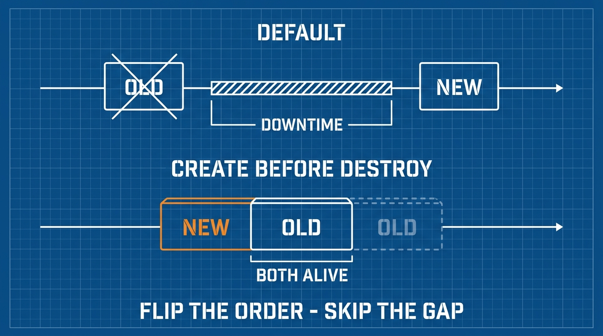

Một bản plan của Terraform là một bản hợp đồng: nó liệt kê chính xác điều sắp xảy ra với hạ tầng của bạn. Dân chuyên đọc mọi plan theo cùng một kỷ luật — vì một ký hiệu trong output đó, rất dễ lướt qua, nghĩa là "phá huỷ rồi tạo lại". Trên một database, đó là khác biệt giữa một ngày thứ Ba bình thường và một ngày rất tệ.

## Bạn sẽ học được gì

- Đọc trôi chảy 4 ký hiệu plan: `+`, `~`, `-`, `-/+`.
- Giải thích vì sao một số thay đổi attribute ép **replacement** — và bắt được chúng trong plan.
- Dùng 3 chốt an toàn `lifecycle`: `prevent_destroy`, `create_before_destroy`, `ignore_changes`.
- Cố ý ép replacement khi một resource bị hỏng.

**Cần biết trước:** Bài 1–3. Thực hành lại chỉ cần local — không cần tài khoản cloud.

## 1. Bốn ký hiệu

Mỗi dòng plan bắt đầu bằng một ký hiệu. Hai cái bình thản, một cái đáng chú ý, một cái là chuông báo động:

| Ký hiệu | Nghĩa | Rủi ro |
|---|---|---|
| `+` create | Resource mới xuất hiện | Thấp — không đụng thứ đang có |
| `~` update in-place | Attribute đổi trên resource đang sống | Thấp — resource giữ nguyên danh tính và dữ liệu |
| `-` destroy | Resource bị xoá | **Cao** — bên trong có gì stateful không? |
| `-/+` replace | Phá huỷ, rồi tạo mới | **Cao nhất** — một cú xoá nấp trong một "thay đổi" |

Dòng tổng kết cuối là con số kiểm tra của bạn: `Plan: 1 to add, 2 to change, 1 to destroy.` Nếu các con số làm bạn bất ngờ, dừng lại. Một bản plan không bao giờ nên chứa tin mới.

## 2. Vì sao có replacement

Một số attribute đổi được trên resource đang sống (tag, size, timeout). Số khác **bị nướng cứng lúc tạo** — *tên* của S3 bucket, *AMI* của EC2 instance, *engine* của database. Cloud đơn giản là không có API để đổi chúng tại chỗ.

Nên khi bạn sửa một attribute như vậy, Terraform nói thật: đường duy nhất tới đích là destroy + create. Plan đánh dấu tường minh attribute thủ phạm:

```text
-/+ resource "aws_s3_bucket" "reports" {
      ~ bucket = "reports-dev" -> "reports-prod"  # forces replacement
      ...
```

Dòng chú thích — **`# forces replacement`** — là dòng quan trọng nhất trong mọi bản plan. Săn nó mỗi lần thấy `-/+`. Nó trả lời chính xác câu "vì sao Terraform phá cái này?".

Hai thói quen theo sau:

- **Biết các attribute bất biến** trước khi đổi tên thứ gì. Tên, AZ, loại engine thường bất biến; tag và size thường không. Không chắc thì chạy plan — nó sinh ra để làm việc đó.
- **Replace trên resource có state là một cuộc migration, không phải một cú sửa.** Bucket, database, disk: *nội dung* của chúng không tự di chuyển chỉ vì Terraform dựng lại cái vỏ. Lên kế hoạch chuyển dữ liệu riêng, hoặc đừng đổi.

## 3. Chốt an toàn lifecycle: dây an toàn viết bằng code

Block `lifecycle` bên trong resource thay đổi cách Terraform đối xử với nó. Ba đối số phủ gần như mọi nhu cầu:

```hcl
resource "aws_db_instance" "main" {
  # ...

  lifecycle {
    prevent_destroy = true          # chốt 1: từ chối MỌI plan phá resource này

    create_before_destroy = true    # chốt 2: khi replace, dựng cái mới TRƯỚC,
                                    # rồi mới gỡ cái cũ (không có khoảng hở)

    ignore_changes = [tags["updated_by"]]   # chốt 3: attribute này do bên khác
                                            # quản; đừng giành lại
  }
}
```

- **`prevent_destroy`** — dây an toàn cho database và mọi thứ stateful. Nếu một plan sẽ phá resource, Terraform *báo lỗi thay vì lên plan*. Muốn gỡ chốt phải sửa code — nghĩa là một PR, nghĩa là có người review. Đó chính là mục đích.
- **`create_before_destroy`** — đảo thứ tự replace để tránh downtime. Thiết yếu cho resource có thứ khác trỏ vào (certificate, launch template, security group): cái mới tồn tại trước khi cái cũ biến mất. Lưu ý: hai bản tồn tại song song trong chốc lát, nên resource có tên duy nhất cần tên linh hoạt (`name_prefix` thay vì `name`).
- **`ignore_changes`** — hiệp ước hoà bình. Autoscaler đổi `desired_count`; một hệ bên ngoài đóng tag. Thiếu chốt này, mọi plan sẽ cố "sửa lại" thay đổi của họ (bạn đã thấy hành vi drift này ở bài 3). Liệt kê attribute, Terraform để yên.



## 4. Cố ý ép replacement

Đôi khi resource *hỏng thật* — một VM lỗi, một instance đơ — và bạn *muốn* destroy + create dù config không đổi. Đừng sửa config để lừa Terraform. Nói thẳng điều mình muốn:

```bash
terraform apply -replace=aws_instance.web
```

Plan hiện một cú `-/+` sạch sẽ cho đúng resource đó, review được như mọi thay đổi khác. (Tutorial cũ dùng `terraform taint` — cùng hiệu ứng, nay đã deprecated nhường chỗ cho `-replace`, thứ hiện rõ trong plan thay vì nấp bên state.)

## Thực hành (15 phút — không cần cloud)

Thấy đủ bốn ký hiệu và một cái chốt, ngay tại local:

```bash
mkdir tf-plan-lab && cd tf-plan-lab
cat > main.tf <<'EOF'
resource "local_file" "a" {
  filename = "a.txt"
  content  = "v1"
}
EOF
terraform init && terraform apply -auto-approve      # ký hiệu: +

# ~ update tại chỗ: content đổi được... khoan, nhìn kỹ!
sed -i 's/v1/v2/' main.tf
terraform plan
# local_file thực ra REPLACE khi content đổi — đọc plan:
# nó hiện -/+ với "content" đánh dấu "# forces replacement".
# Bài học hoàn hảo: đừng bao giờ giả định — plan nói cho bạn attribute nào ép.

terraform apply -auto-approve

# Ép replacement khi config không đổi
terraform apply -replace=local_file.a -auto-approve   # -/+ có chủ đích

# Test dây an toàn
cat >> main.tf <<'EOF'

resource "local_file" "protected" {
  filename = "keep.txt"
  content  = "quy gia"
  lifecycle { prevent_destroy = true }
}
EOF
terraform apply -auto-approve
terraform destroy                                     # LỖI: prevent_destroy chặn
# muốn dọn thật: xoá dòng lifecycle, rồi destroy
```

Kết quả mong đợi: plan "đổi content" hiện `-/+` kèm `# forces replacement` (bất ngờ — chính thói quen mà lab này rèn). Cú `destroy` cuối fail với lỗi không-được-phép-phá cho tới khi bạn gỡ chốt.

## Tự kiểm tra

1. Plan hiện `-/+` trên database production vì ai đó sửa một attribute bất biến. Bạn tìm gì trong plan, và làm gì?
2. Khi nào `create_before_destroy` là thiết yếu, và nó gây rắc rối đặt tên gì?
3. Autoscaler cứ đổi `desired_count`, và mọi plan Terraform đòi đổi lại. Cách sửa?

<details><summary>Xem đáp án</summary>

1. Tìm attribute đánh dấu `# forces replacement` để biết chính xác lý do. Rồi dừng: replace trên database nghĩa là mất dữ liệu — revert thay đổi, hoặc lên kế hoạch migration thật. Lý tưởng là resource đó có sẵn `prevent_destroy` để plan lỗi ngay.
2. Khi resource bị replace có thứ khác tham chiếu (cert, launch template, SG) và khoảng hở nghĩa là downtime. Hai bản song song trong chốc lát, nên tên cố định sẽ đụng nhau — dùng kiểu `name_prefix`.
3. `lifecycle { ignore_changes = [desired_count] }` — khai báo attribute này do bên khác quản, Terraform ngừng giành với autoscaler.

</details>

## Điều cần nhớ

- Bốn ký hiệu, một chuông báo động: `-/+` là cú xoá nấp trong một thay đổi — và `# forces replacement` luôn gọi tên attribute thủ phạm.
- Attribute bất biến ép replacement; trên resource có state, replace là cuộc migration dữ liệu, không phải cú sửa.
- Ba dây an toàn: `prevent_destroy` cho đồ stateful, `create_before_destroy` cho đồ bị tham chiếu, `ignore_changes` cho attribute bên khác quản.
- Resource hỏng, config không đổi? `apply -replace=...` nói thẳng điều bạn muốn, hiện rõ trong plan.

*Bài tiếp theo — Phần 5: Remote state & làm việc theo team.*
