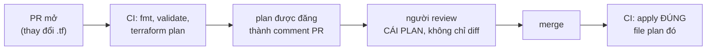

<!-- TODO(img): hero — comic 4 panel, clean flat colors: (1) dev opens laptop with a small ".tf" file and an arrow to a PR box; (2) a robot stamps a document labeled "PLAN" onto the PR conversation; (3) two reviewers with magnifying glasses over the plan, one pointing at a line labeled "REPLACE"; (4) a green "MERGE" button pressed and a robot arm turning a key labeled "APPLY"; title "THE PLAN IS THE REVIEW" -->

Bài 5 đã dời state lên backend dùng chung; bài 7 cho bạn module. Còn lại một câu hỏi workflow, và nó quyết định IaC có thật sự giao được lời hứa hay không: **ai chạy `terraform apply`, từ đâu, và cả team đã thấy gì trước khi nó xảy ra?** Câu trả lời chín muồi thì nhàm chán mà đẹp: không ai apply từ laptop. PR là đơn vị thay đổi, plan là artifact review, và CI giữ chìa khoá.

## Bạn sẽ học được gì

- Dựng flow chuẩn: PR mở → CI đăng plan → review → merge → CI apply.
- Đọc plan như reviewer đọc `EXPLAIN` — ba phép kiểm trong chín mươi giây.
- Cấp cho CI credentials least-privilege mà laptop không bao giờ cầm.
- Đưa một thay đổi đi qua các môi trường bằng cùng một artifact, không phải sửa mới.

**Cần biết trước:** Bài 4–5 (đọc plan, remote state). CI nào cũng được — ý tưởng giống hệt nhau ở mọi hệ.

## 1. Flow: plan lúc PR, apply lúc merge



Cái nhìn khiến flow này chạy: **diff code là ý định; plan là hậu quả.** Một dòng sửa variable của module có thể replace cả database (dòng `# forces replacement` của bài 4). Chỉ review diff `.tf` là duyệt ý định trong khi mù hậu quả. Nên CI chạy `terraform plan -out=tfplan` trên mọi PR và đăng bản dễ-đọc thành comment — hậu quả nằm ngay trong cuộc hội thoại, cạnh đoạn code gây ra nó.

Hai cơ chế đáng copy nguyên xi:

- **Lưu file plan** (`-out=tfplan`) và apply *đúng file đó* sau merge — `terraform apply tfplan`. Điều này bảo đảm thứ được apply là thứ đã được review; `apply` trần sau merge sẽ plan lại trên một thế giới có thể đã đổi.
- **Plan cũ phải fail.** Nếu PR khác merge trước, file plan đã lưu không còn khớp thực tế — apply nó sẽ lỗi (serial của state đã nhích), và đó là hệ thống đang bảo vệ bạn. Plan lại, review lại phần chênh, merge lại. Phiền đúng bằng số lần nó cứu bạn.

## 2. Đọc plan như đọc EXPLAIN

Series SQL dạy đọc `EXPLAIN` trước khi tin một query; review plan là cùng kỹ năng với cùng ngân sách thời gian. Ba phép kiểm, chín mươi giây:

1. **Động từ.** Quét ký hiệu trước (bảng của bài 4): có `-` hay `-/+` không? Một cú *replace* trên bất kỳ thứ gì stateful là khoảnh khắc gọi-tác-giả, không phải approve-cho-qua.
2. **Số đếm vs ý định.** PR nói "thêm một bucket S3"; plan nói `3 to add, 0 to change, 0 to destroy` — hai cái thừa cần lời giải thích (có thể ổn: object policy + versioning; có thể là bất ngờ từ default của module).
3. **Ẩn số.** `(known after apply)` trên các giá trị mà hệ khác tiêu thụ (ID, endpoint) — có gì ở hạ nguồn vỡ trong khoảng giữa apply và lúc giá trị tồn tại không?

Luật văn hoá khiến review thành thật: **tác giả viết một câu ý định** ("đổi instance type của API; không có replacement — đã kiểm trong plan") và approve của reviewer nghĩa là "plan khớp câu đó." Ý định → hậu quả → khớp. Toàn bộ cuộc review chỉ có thế.

## 3. CI giữ chìa khoá — không phải laptop

Apply từ CI không chỉ là gọn gàng; đó là nơi least privilege (S04-P02) gặp IaC:

- **Job CI assume một role** (liên kết OIDC phía cloud — không secret sống lâu lưu trong CI) giới hạn đúng phạm vi config quản. Role của pipeline dev không chạm được state prod hay resource prod — cách chia state theo môi trường của bài 5 trở thành cách chia *quyền*.
- **Laptop giữ quyền read-only.** Engineer vẫn `plan` local trên dev để lặp nhanh, nhưng credentials có thể `apply` lên prod chỉ tồn tại trong pipeline. Laptop bị trộm, key bị lộ, cú sửa-nhanh chiều thứ Sáu — không cái nào chạm thẳng được production.
- **Audit trail miễn phí.** Mọi thay đổi là một PR: ai đề xuất, ai duyệt, plan hiện gì, apply lúc nào. Khi auditor (hoặc cuộc điều tra drift bài 3) hỏi "ngày 14 đã đổi gì?", câu trả lời là một cái link, không phải một cuộc khảo cổ.

## 4. Promotion: cùng một thay đổi đi bộ lên các môi trường

Với layout bài 6 (cùng module, thư mục theo env), một thay đổi là *một cú sửa vào module dùng chung* và promotion của nó thuần cơ học: merge apply dev → kiểm (smoke test, dashboard) → PR tiếp theo nâng staging lên cùng version module → cùng kiểu review plan, ít bất ngờ hơn → rồi prod, nơi plan nên đọc như *không có tin gì mới*: đúng các thay đổi resource bạn đã xem hai lần. Môi trường chỉ khác tfvars (bất biến bài 6), nên "cùng một thay đổi" theo nghĩa đen là cùng một đoạn code đi bộ lên — pin version module theo env (bài 7) là bước đi bộ hiện rõ trong diff.

Anti-pattern mà flow này giết chết: sửa tay prod "chỉ lần này thôi" vì thay đổi đã chạy tốt ở dev. Đó là drift có cớ đẹp — và bài 3 đã dạy drift dẫn tới đâu.

## Thực hành (20 phút — với CI nào cũng được, hoặc chỉ cần git + một đồng nghiệp)

Mô phỏng trọn nghi thức ngay local — không cần CI để luyện cơ bắp:

```bash
# 1. Trong repo lab bài 6, tạo branch và đổi một thứ thật:
#    nâng file_count trong envs/dev/terraform.tfvars từ 1 lên 3
git checkout -b resize-dev

# 2. Sản xuất artifact review đúng như CI sẽ làm:
(cd envs/dev && terraform plan -out=tfplan)
(cd envs/dev && terraform show -no-color tfplan > plan.txt)

# 3. Review plan.txt trong vai NGƯỜI ĐỌC (hoặc đổi vai với đồng nghiệp):
#    chạy ba phép kiểm — động từ? số đếm vs ý định? ẩn số?
#    Viết câu ý định một dòng; kiểm plan có khớp.

# 4. "Merge" và apply đúng artifact đã review — không plan mới:
(cd envs/dev && terraform apply tfplan)

# 5. Cảm nhận chốt chặn plan-cũ: đổi tfvars lần nữa, plan -out,
#    rồi sửa CÙNG giá trị thêm lần nữa và thử apply tfplan cũ
(cd envs/dev && terraform apply tfplan)     # lỗi: plan đã lưu bị cũ
```

Kết quả mong đợi: bước 4 apply chính xác thứ bước 3 đã review. Bước 5 fail với lỗi plan-cũ — chốt chặn bảo đảm review-bằng-thực-tế, thấy ngay local trước khi bạn nối vào CI.

## Tự kiểm tra

1. Vì sao review plan thay vì (chỉ) diff code?
2. Apply file plan *đã lưu* bảo vệ khỏi điều gì, và lỗi plan-cũ liên quan thế nào?
3. Credentials apply-prod sống ở đâu, và vì sao vị trí đó quan trọng hơn mọi luật quy trình?

<details><summary>Xem đáp án</summary>

1. Diff cho thấy ý định; plan cho thấy hậu quả. Diff nhỏ có thể mang hậu quả lớn (replacement bị ép, bất ngờ từ default của module) mà chỉ plan mới lộ ra.
2. Nó bảo đảm thay đổi được apply giống từng byte với thứ đã review. Nếu thế giới đã đổi (một merge khác), plan đã lưu không còn apply sạch được và báo lỗi — ép plan lại và review lại thay vì lặng lẽ apply lên thực tế đã khác.
3. Chỉ trong CI, dưới dạng role assume ngắn hạn giới hạn theo môi trường. Luật quy trình ("xin đừng apply từ laptop") dựa vào sự tuân thủ; credentials không tồn tại trên laptop khiến hành động sai *bất khả thi* — đúng lập luận cấu-trúc-thắng-cẩn-thận như role-thay-key ở S04-P02.

</details>

## Điều cần nhớ

- PR là đơn vị thay đổi; plan — đăng vào PR — là artifact review. Diff là ý định, plan là hậu quả.
- Review như EXPLAIN: động từ trước (có replace không?), số đếm vs ý định đã nêu, rồi tới các ẩn số known-after-apply.
- Apply file plan đã lưu từ CI; lỗi plan-cũ là hệ thống cưỡng chế review-bằng-thực-tế.
- Chìa khoá sống trong CI dưới dạng role ngắn hạn có phạm vi; laptop để lặp, pipeline để apply. Promotion là cùng thay đổi đi bộ dev → staging → prod, không bao giờ sửa tay.

*Bài tiếp theo — Phần 9: CI/CD cho hạ tầng.*
