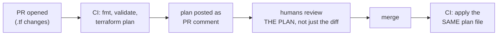

Part 5 moved state to a shared backend; Part 7 gave you modules. One workflow question remains, and it decides whether IaC actually delivers its promise: **who runs `terraform apply`, from where, and what did the team see before it happened?** The mature answer is boring and beautiful: nobody applies from a laptop. The PR is the unit of change, the plan is the review artifact, and CI holds the keys.

## What you'll learn

- Set up the standard flow: PR opens → CI posts the plan → review → merge → CI applies.
- Read a plan the way reviewers read an `EXPLAIN` — three checks in ninety seconds.
- Give CI least-privilege credentials that no laptop ever holds.
- Promote a change through environments with the same artifact, not fresh edits.

**Prerequisites:** Parts 4–5 (reading plans, remote state). Any CI system — the ideas are identical in all of them.

## 1. The flow: plan on PR, apply on merge



The insight that makes this work: **the code diff is the intention; the plan is the consequence.** A one-line change to a module variable can replace a database (Part 4's `# forces replacement`). Reviewing only the `.tf` diff means approving intentions while blind to consequences. So CI runs `terraform plan -out=tfplan` on every PR and posts the human-readable version as a comment — the consequence sits in the conversation, next to the code that caused it.

Two mechanics worth copying exactly:

- **Save the plan file** (`-out=tfplan`) and apply *that file* after merge — `terraform apply tfplan`. This guarantees what was applied is what was reviewed; a plain `apply` after merge re-plans against a world that may have changed.
- **A stale plan should fail.** If another PR merged first, the saved plan no longer matches reality — applying it errors out (state's serial has moved), which is the system protecting you. Re-plan, re-review the delta, merge again. Annoying exactly as often as it saves you.

## 2. Reading a plan like an EXPLAIN

The SQL series taught reading `EXPLAIN` before trusting a query; a plan review is the same skill with the same time budget. Three checks, ninety seconds:

1. **The verbs.** Scan the symbols first (Part 4's table): any `-` or `-/+`? A *replace* on anything stateful is a page-the-author moment, not an approve-and-move-on.
2. **The count vs the intention.** PR says "add one S3 bucket"; plan says `3 to add, 0 to change, 0 to destroy` — two extras need explaining (maybe fine: policy + versioning objects; maybe a module default surprise).
3. **The unknowns.** `(known after apply)` on values that other systems consume (IDs, endpoints) — will anything downstream break between apply and the value existing?

The cultural rule that makes reviews real: **the author writes a sentence of intent** ("resizes the API's instance type; no replacement expected — verified in plan") and the reviewer's approval means "the plan matches that sentence." Intent → consequence → match. That's the entire review.

## 3. CI holds the keys — not laptops

Applying from CI isn't just tidiness; it's where least privilege (S04-P02) meets IaC:

- **The CI job assumes a role** (cloud-side OIDC federation — no long-lived secrets stored in the CI system) scoped to what the config manages. Dev pipeline's role can't touch prod's state or prod's resources — Part 5's per-environment state split becomes a *permission* split.
- **Laptops keep read-only.** Engineers can `plan` locally against dev to iterate, but the credentials that can `apply` to prod exist only inside the pipeline. A stolen laptop, a leaked key, an over-eager Friday fix — none of them can touch production directly.
- **The audit trail is free.** Every change is a PR: who proposed, who approved, what the plan showed, when it applied. When an auditor (or the Part 3 drift investigation) asks "what changed on the 14th?", the answer is a link, not an archaeology project.

## 4. Promotion: the same change walks up the environments

With Part 6's layout (same modules, per-env directories), a change is *one edit to a shared module* and its promotion is mechanical: merge applies dev → verify (smoke test, dashboards) → a follow-up PR bumps staging to the same module version → same plan review, smaller surprise → then prod, where the plan should read as *no news*: same resource changes you've now watched twice. Environments differ only in tfvars (Part 6's invariant), so "the same change" is literally the same code walking upward — pin module versions per env (Part 7) and the walk is explicit in the diff.

The anti-pattern this kills: hand-editing prod "just this once" because the change already worked in dev. That's drift with a good excuse — and Part 3 taught you where drift leads.

## Practice (20 minutes — works with any CI, or just git + a colleague)

Simulate the whole ceremony locally — no CI required to learn the muscle:

```bash
# 1. In your Part 6 lab repo, create a branch and change something real:
#    bump file_count in envs/dev/terraform.tfvars from 1 to 3
git checkout -b resize-dev

# 2. Produce the review artifact exactly as CI would:
(cd envs/dev && terraform plan -out=tfplan)
(cd envs/dev && terraform show -no-color tfplan > plan.txt)

# 3. Review plan.txt as the READER (or trade with a colleague):
#    run the three checks — verbs? count vs intent? unknowns?
#    Write the one-sentence intent; check the plan matches it.

# 4. "Merge" and apply the reviewed artifact — not a fresh plan:
(cd envs/dev && terraform apply tfplan)

# 5. Feel the stale-plan guard: change the tfvars again, plan -out,
#    then edit the SAME value once more and try applying the old tfplan
(cd envs/dev && terraform apply tfplan)     # errors: saved plan is stale
```

Expected results: step 4 applies exactly what step 3 reviewed. Step 5 fails with a stale-plan error — the guard that guarantees review-equals-reality, seen locally before you ever wire it into CI.

## Check yourself

1. Why review the plan instead of (only) the code diff?
2. What does applying a *saved* plan file protect against, and how does the stale-plan error relate?
3. Where do prod-apply credentials live, and why does that placement matter more than any process rule?

<details><summary>See answers</summary>

1. The diff shows intention; the plan shows consequence. Small diffs can carry large consequences (forced replacements, module-default surprises) that only the plan reveals.
2. It guarantees the applied change is byte-identical to the reviewed one. If the world moved (another merge), the saved plan no longer applies cleanly and errors — forcing a re-plan and re-review instead of silently applying against changed reality.
3. Only inside CI, as a short-lived assumed role scoped per environment. Process rules ("please don't apply from laptops") rely on compliance; credentials that don't exist on laptops make the wrong action *impossible*, which is the same structural-over-careful argument as roles-over-keys in S04-P02.

</details>

## Key takeaways

- The PR is the unit of change; the plan — posted into the PR — is the review artifact. Diffs are intentions, plans are consequences.
- Review like an EXPLAIN: verbs first (any replace?), count vs stated intent, then the known-after-apply unknowns.
- Apply the saved plan file from CI; a stale-plan error is the system enforcing review-equals-reality.
- Keys live in CI as scoped short-lived roles; laptops iterate, pipelines apply. Promotion is the same change walking dev → staging → prod, never a hand-edit.

*Next — Part 9: CI/CD for Infrastructure.*
