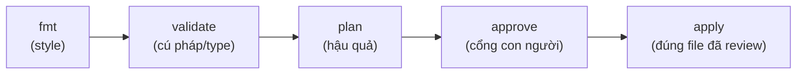

Bài 8 đã lập nghi thức: plan lúc PR, apply lúc merge, CI giữ chìa khoá. Bài này dựng cỗ máy chạy nghi thức đó — các chặng pipeline cụ thể, mẹo OIDC nghĩa là *không key cloud nào được lưu ở bất cứ đâu*, và câu hỏi bố trí repository mà team nào cũng đụng: code hạ tầng sống cùng app hay tách riêng?

## Bạn sẽ học được gì

- Lắp pipeline năm chặng — fmt, validate, plan, approve, apply — và nói được mỗi chặng bắt lỗi gì.
- Hiểu liên kết OIDC ở mức khái niệm: CI chứng minh danh tính với cloud, không secret lưu trữ.
- Quyết định đặt code ở repo app hay repo infra bằng nhịp thay đổi, không phải khẩu vị bộ lạc.
- Thêm hai chốt gác rẻ tiền bắt đa số lỗi PR hạ tầng trước khi con người nhìn: lint và policy check.

**Cần biết trước:** Bài 8 (workflow PR). Quen YAML của một CI bất kỳ — ví dụ là pseudo-config ánh xạ được sang mọi hệ.

## 1. Năm chặng, mỗi chặng bắt gì



```yaml
# pseudo-CI — hình dạng giống hệt nhau ở mọi hệ
on_pull_request:
  - terraform fmt -check          # lệch style fail ngay, không tốn thời gian người
  - terraform validate            # cú pháp, type, thiếu argument — lượt compiler
  - terraform plan -out=tfplan    # artifact review (bài 8)
  - post plan thành comment PR
on_merge:
  - require: PR đã approve        # cổng con người nằm trong settings của repo
  - terraform apply tfplan        # ĐÚNG file đã được review
```

Thứ tự là thứ tự chi phí: chặng sau đắt hơn chặng trước, nên lỗi rẻ chết sớm. `fmt -check` tốn một giây và chấm dứt tranh cãi style mãi mãi (formatter chính là style guide — cùng lập luận gofmt/black của series CS). `validate` bắt những gì một compiler bắt. `plan` cần credentials cloud và state thật — chặng đầu tiên chạm vào thứ gì đó, nhưng vẫn read-only. Chỉ `apply` mới ghi, và chỉ với artifact đã review.

Hai chi tiết thực dụng team hay làm sai: cho job plan **credentials read-only** (nó cần refresh state, không cần sửa hạ tầng — least privilege *giữa các chặng pipeline*, không chỉ giữa các môi trường); và set `-lock-timeout` cho apply để một cú deploy xếp hàng chờ lịch sự cái lock state của bài 5 thay vì fail cả run.

## 2. OIDC: pipeline không lưu key

Kiểu cũ: tạo IAM user trên cloud, sinh access key sống lâu, dán vào secrets của CI. Thế là credentials production của bạn sống trong một hệ bên thứ ba, mãi mãi, chờ ngày lộ — chính xác anti-pattern mà S04-P02 cảnh báo, được thể chế hoá.

Kiểu 2026 là **liên kết OIDC** (OpenID Connect): nền tảng CI ký một token danh tính ngắn hạn cho từng job ("đây là repo X, branch main, job apply-prod"); cloud của bạn được cấu hình *tin* issuer đó và đổi token lấy một phiên role ngắn hạn, giới hạn bằng các điều kiện bạn đặt:

- Chỉ repo `myorg/infra` — không phải repo bất kỳ trong org.
- Chỉ branch `main` — PR từ fork không assume được role apply.
- Chỉ role `infra-apply-dev` cho pipeline dev; `infra-apply-prod` đòi protected environment.

Chuỗi phần thưởng: **không secret lưu trữ → không gì phải rotate → không gì để lộ → và chính trust policy cũng là code Terraform quản** (quyền của pipeline đi qua review PR — đệ quy một cách dễ chịu). Mọi CI lớn và mọi cloud đều hỗ trợ cặp này; tên gọi khác nhau, hình dạng thì không. Nếu pipeline của bạn vẫn cầm một key `AKIA...` dán tay, đây là giờ làm bảo mật đáng giá nhất đang có sẵn cho bạn.

## 3. Repo app hay repo infra? Tách theo nhịp thay đổi

Câu hỏi muôn thuở. Trục hữu ích không phải khẩu vị mà là **ai đổi nó, bao lâu một lần, bán kính sát thương ra sao**:

| Sống CÙNG app | Sống ở repo infra RIÊNG |
|---|---|
| Resource của chính service: queue của nó, bucket của nó, task definition của nó | Nền móng dùng chung: VPC, cluster, DNS, database nhiều service dùng |
| Đổi theo tính năng app, bởi team app, review cùng PR với code cần nó | Đổi hiếm, bởi platform team, bán kính sát thương toàn tổ chức |
| State nhỏ, plan nhanh | State lớn hơn, pipeline gác kỹ, approve chặt hơn |

Đây là lập luận đường-nối-module (bài 7) ở quy mô repository: *thứ thay đổi cùng nhau thì sống cùng nhau.* Một service thêm queue không nên chờ hàng review của platform team; platform team đổi VPC không nên xảy ra được bên trong một PR tính năng chẳng ai đọc kỹ. Cắt theo nhịp cho mỗi team một pipeline khớp với rủi ro của họ — và config app tiêu thụ outputs của platform qua data-source lookup (hợp đồng bài 6), không thò tay vào state của nhau.

## 4. Hai chốt gác rẻ tiền trước mắt người

Con người review hậu quả (bài 8); máy nên bắt trước phần cơ khí:

- **Lint** (họ tflint): bắt những lỗi `validate` không bắt được — argument đã deprecated, instance type không tồn tại, footgun đặc thù provider. Vài giây mỗi lượt.
- **Policy check** (họ OPA/Sentinel/Checkov): mã hoá các luật bạn vẫn lặp lại trong comment review — "không bucket public", "mọi resource phải có tag", "không ingress `0.0.0.0/0` cổng 22" (bài học S04-P03 thành policy chạy được). Bắt đầu với năm luật bạn từng thật sự comment trên PR; nuôi lớn từ sự cố, đúng như luật fixture-từ-incident của S02-P03.

Cách đóng khung giữ mọi thứ tỉnh táo: policy check là **những comment review chạy trong một giây và không bao giờ mệt**. Chúng không thay cổng con người — chúng bảo đảm con người dồn sự chú ý vào hậu quả, thay vì đi soi tag.

## Thực hành (25 phút — vị GitHub Actions, chuyển hệ khác dễ dàng)

Nối nghi thức bài 8 vào CI thật trên repo lab:

```yaml
# .github/workflows/plan.yml — chạy trên mọi PR
name: plan
on: pull_request
permissions: { id-token: write, contents: read }   # token OIDC, không key lưu trữ
jobs:
  plan:
    runs-on: ubuntu-latest
    steps:
      - uses: actions/checkout@v4
      - run: terraform fmt -check -recursive
      - run: terraform -chdir=envs/dev init -input=false
      - run: terraform -chdir=envs/dev validate
      - run: terraform -chdir=envs/dev plan -no-color -out=tfplan
      # (post nội dung plan thành comment PR bằng action bạn thích)
```

1. Thêm workflow, mở PR đổi `file_count`, xem các chặng chạy theo thứ tự.
2. Cố tình phá từng chặng: thụt lề sai một file (fmt fail), tham chiếu `var.missing` (validate fail), và xác nhận mỗi cú fail chặn pipeline *trước khi* tới plan.
3. Nếu có account cloud: dựng trust OIDC (docs CI của bạn có sẵn JSON role/trust) và xác nhận job assume được role với **số không** secret lưu trong CI settings.
4. Chốt gác thêm: cài một bước tflint và xem nó bắt gì mà validate bỏ qua.

Kết quả mong đợi: bước 2 cho thấy thứ-tự-chi-phí hoạt động — lỗi rẻ chết trong vài giây mà chưa bao giờ phải tính plan. Bằng chứng của bước 3 là chính trang CI settings: không credentials cloud nào lưu ở đâu cả, mà plan vẫn chạy.

## Tự kiểm tra

1. Vì sao thứ tự chặng quan trọng — fmt-trước-validate-trước-plan giữ được tính chất gì?
2. Giải thích cho đồng đội vì sao OIDC thắng access key lưu trữ, trong hai câu.
3. Team sản phẩm muốn thêm một queue SQS cho service của họ. Thay đổi vào repo nào, vì sao?

<details><summary>Xem đáp án</summary>

1. Thứ tự chi phí: chặng sau đắt hơn (và nhiều quyền hơn) chặng trước, nên lỗi cơ khí chết nhanh, miễn phí, không cần quyền. Plan — chặng đầu cần credentials — chỉ chạy trên code đã đúng dạng và hợp lệ.
2. Key lưu trữ là secret sống lâu nằm trong hệ bên thứ ba — có thể lộ và phải rotate. OIDC phát token ngắn hạn theo từng job mà cloud xác minh và giới hạn theo repo/branch/environment, nên không tồn tại secret để trộm, và luật tin cậy là code review được.
3. Repo app: queue thuộc về service đó, đổi theo tính năng của nó, bán kính sát thương là chính service. Nó tiêu thụ outputs của platform dùng chung (VPC, cluster) qua data lookup — không sửa chúng.

</details>

## Điều cần nhớ

- Năm chặng, xếp theo chi phí: fmt → validate → plan → approve → apply — lỗi rẻ chết sớm, chỉ file plan đã review mới được apply.
- Liên kết OIDC thay key cloud lưu trữ bằng token ngắn hạn giới hạn theo điều kiện — không gì để rotate, không gì để lộ, trust policy là code.
- Tách repo theo nhịp thay đổi: resource của service đi cùng app, nền móng dùng chung theo platform — tiêu thụ qua hợp đồng output, không chung state.
- Lint và policy check là những comment review không biết mệt; chúng giải phóng review con người cho phần hậu quả.

*Bài tiếp theo — Phần 10: Import đồ cũ & chống drift.*
