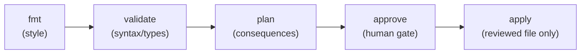

Part 8 established the ceremony: plan on PR, apply on merge, CI holds the keys. This part builds the machine that runs it — the concrete pipeline stages, the OIDC trick that means *no cloud key is stored anywhere*, and the repository-layout question every team hits: does infra code live with the app or apart from it?

## What you'll learn

- Assemble the five-stage pipeline — fmt, validate, plan, approve, apply — and say what each stage catches.
- Configure OIDC federation conceptually: CI proves its identity to the cloud, no stored secrets.
- Decide app-repo vs infra-repo placement using change cadence, not tribal preference.
- Add the two cheap guards that catch most infra-PR mistakes before humans look: lint and policy checks.

**Prerequisites:** Part 8 (the PR workflow). Familiarity with any CI system's YAML — examples are pseudo-config that maps onto all of them.

## 1. The five stages, and what each one catches



```yaml
# pseudo-CI — the shape is identical in every system
on_pull_request:
  - terraform fmt -check          # style drift fails fast, no human time wasted
  - terraform validate            # syntax, types, missing args — the compiler pass
  - terraform plan -out=tfplan    # the review artifact (Part 8)
  - post plan as PR comment
on_merge:
  - require: approved PR          # the human gate lives in the repo settings
  - terraform apply tfplan        # the SAME file that was reviewed
```

The ordering is cost-ordered: each stage is more expensive than the one before, so cheap failures die early. `fmt -check` costs a second and stops style debates forever (the formatter is the style guide — same argument as gofmt/black from the CS series). `validate` catches what a compiler would. `plan` needs cloud credentials and real state — it's the first stage that touches anything, and it's still read-only. Only `apply` writes, and only with the reviewed artifact.

Two practical details teams get wrong: give the plan job **read-only credentials** (it needs to refresh state, not mutate infra — least privilege *between pipeline stages*, not just between environments); and set `-lock-timeout` on apply so a queued deploy waits politely for Part 5's state lock instead of failing the run.

## 2. OIDC: the pipeline with no stored keys

The old way: create a cloud IAM user, generate a long-lived access key, paste it into CI secrets. Now your production credentials live in a third-party system, forever, waiting to leak — exactly the anti-pattern S04-P02 warned about, institutionalized.

The 2026 way is **OIDC federation** (OpenID Connect): the CI platform signs a short-lived identity token for each job ("this is repo X, branch main, job apply-prod"); your cloud is configured to *trust* that issuer and exchange the token for a short-lived role session, scoped by conditions you set:

- Only repo `myorg/infra` — not any repo in the org.
- Only branch `main` — a PR from a fork can't assume the apply role.
- Only role `infra-apply-dev` for the dev pipeline; `infra-apply-prod` requires the protected environment.

The payoff chain: **no stored secret → nothing to rotate → nothing to leak → and the trust policy is itself Terraform-managed code** (the pipeline's own permissions go through PR review, pleasingly recursive). Every major CI system and cloud supports this pair; the names differ, the shape doesn't. If your pipeline still holds a pasted `AKIA...` key, this is the highest-value hour of security work available to you.

## 3. App repo or infra repo? Split by change cadence

The eternal question. The useful axis is not taste but **who changes it, how often, with what blast radius**:

| Lives WITH the app | Lives in a SEPARATE infra repo |
|---|---|
| The service's own resources: its queue, its bucket, its task definition | Shared foundations: VPC, cluster, DNS, databases many services use |
| Changes with app features, by the app team, reviewed in the same PR as the code that needs it | Changes rarely, by the platform team, with organization-wide blast radius |
| Small state, fast plans | Bigger state, guarded pipelines, stricter approvals |

This is the module-seam argument (Part 7) at repository scale: *things that change together live together.* A service adding a queue shouldn't wait on the platform team's review queue; the platform team changing the VPC shouldn't be able to happen inside a feature PR nobody reads carefully. Cutting by cadence gives both teams pipelines matched to their risk — and the app config consumes the platform's outputs by data-source lookup (Part 6's contract), not by reaching into its state.

## 4. Two cheap guards before human eyes

Humans review consequences (Part 8); machines should pre-catch the mechanical stuff:

- **Lint** (tflint-class): catches the mistakes `validate` can't — deprecated arguments, invalid instance types, provider-specific footguns. Seconds per run.
- **Policy checks** (OPA/Sentinel/Checkov-class): codify the rules you'd otherwise repeat in review comments — "no public buckets", "all resources tagged", "no `0.0.0.0/0` ingress on port 22" (S04-P03's lesson as executable policy). Start with five rules you've actually commented on PRs; grow from incidents, exactly like the test-fixture rule in S02-P03.

The framing that keeps this sane: policy checks are **review comments that run in a second and never get tired**. They don't replace the human gate — they make sure the human spends attention on consequences, not on checking tags.

## Practice (25 minutes — GitHub Actions flavor, adaptable)

Wire the Part 8 ceremony into real CI on your lab repo:

```yaml
# .github/workflows/plan.yml — runs on every PR
name: plan
on: pull_request
permissions: { id-token: write, contents: read }   # OIDC token, no stored keys
jobs:
  plan:
    runs-on: ubuntu-latest
    steps:
      - uses: actions/checkout@v4
      - run: terraform fmt -check -recursive
      - run: terraform -chdir=envs/dev init -input=false
      - run: terraform -chdir=envs/dev validate
      - run: terraform -chdir=envs/dev plan -no-color -out=tfplan
      # (post the plan text as a PR comment with your preferred action)
```

1. Add the workflow, open a PR changing `file_count`, and watch the stages run in order.
2. Break each stage on purpose: mis-indent a file (fmt fails), reference `var.missing` (validate fails), and confirm each failure stops the pipeline *before* plan.
3. If you have a cloud account: set up the OIDC trust (your CI's docs have the exact role/trust JSON) and confirm the job assumes a role with **zero** secrets stored in CI settings.
4. Bonus guard: add a tflint step and see what it flags that validate didn't.

Expected results: step 2 shows the cost-ordering working — cheap failures die in seconds without ever computing a plan. Step 3's proof is the CI settings page itself: no cloud credentials stored anywhere, yet plans run.

## Check yourself

1. Why does stage order matter — what property does fmt-before-validate-before-plan preserve?
2. Explain to a teammate why OIDC beats a stored access key, in two sentences.
3. A product team wants to add an SQS queue for their service. Which repo does the change go in, and why?

<details><summary>See answers</summary>

1. Cost-ordering: each stage is more expensive (and more privileged) than the last, so mechanical failures die fast, free, and unprivileged. Plan — the first stage needing credentials — only runs on code that's already well-formed and valid.
2. A stored key is a long-lived secret sitting in a third-party system — it can leak and must be rotated. OIDC issues a short-lived, per-job token the cloud verifies and scopes by repo/branch/environment, so there is no stored secret to steal, and the trust rules are reviewable code.
3. The app repo: the queue belongs to that service, changes with its features, and its blast radius is the service itself. It consumes shared-platform outputs (VPC, cluster) via data lookups — it doesn't modify them.

</details>

## Key takeaways

- Five stages, cost-ordered: fmt → validate → plan → approve → apply — cheap failures die early, only the reviewed plan file ever applies.
- OIDC federation replaces stored cloud keys with short-lived, condition-scoped tokens — nothing to rotate, nothing to leak, trust policy as code.
- Split repos by change cadence: service resources with the app, shared foundations with the platform — consumed via output contracts, not shared state.
- Lint and policy checks are tireless review comments; they free human review for consequences.

*Next — Part 10: Importing Legacy & Fighting Drift.*
