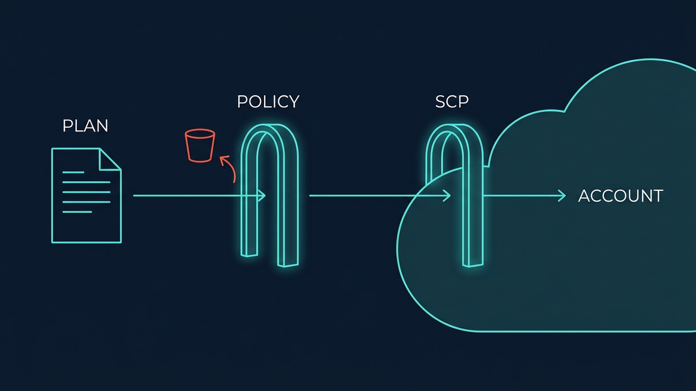

A plan review catches what a human notices. It does not catch the public S3 bucket on line 400, the missing tag your finance team needs, or the security group open to the world. This part builds the automated layers that catch what reviewers miss — before anything exists.

## What you'll learn

- Order the IaC testing ladder by cost, and know which failures each rung catches.
- Add linting that finds provider-specific mistakes `validate` can't see.
- Write policy-as-code gates that block dangerous plans (public buckets, `0.0.0.0/0`) automatically.
- Decide when native `terraform test` is worth the cost of real applies — and when it isn't.

**Prerequisites:** Part 9 (the CI pipeline these checks live in). Part 4 helps for reading plans.

Picture a mountain road with several guardrails at different heights. No single rail stops every skid — the system works because each rail catches what the one above let through, and hitting a higher rail is always cheaper than hitting a lower one. That is the whole design of this part.

## 1. The ladder: four rungs, ordered by cost

Part 9 ordered the pipeline so cheap failures die early. Testing extends that same principle into a ladder:

| Rung | Tool class | Catches | Cost | Needs cloud? |
|---|---|---|---|---|
| 1. Format & syntax | `terraform fmt -check`, `terraform validate` | Malformed HCL, unknown arguments, type errors | Seconds | No |
| 2. Lint | tflint-class | Invalid instance types, deprecated syntax, provider-specific mistakes | Seconds | No |
| 3. Policy | checkov/OPA-class | Dangerous *configurations*: public buckets, open security groups, missing encryption | Seconds–minutes | No (runs on plan) |
| 4. Test | `terraform test` | Broken module *behavior*: does applying this actually produce what the contract promises? | Minutes + real resources | Yes (usually) |

Two things to notice. First, three of the four rungs need **no cloud account** — they run on code and plans alone, so there is no excuse to skip them. Second, each rung catches a class of failure the previous one cannot *by construction*: `validate` cannot know that `t2.nano.5` isn't a real instance type (that's provider knowledge — lint), and a linter cannot know that *your* org forbids public buckets (that's policy — yours).

## 2. Rungs 1–2: syntax and lint, the free wins

`terraform validate` proves the code is *grammatical* Terraform. A linter proves it's *sensible* Terraform. The gap between the two is where a whole family of expensive mistakes lives:

```hcl
resource "aws_instance" "web" {
  instance_type = "t3.mega"        # validate: fine. lint: no such type.
  ami           = var.ami_id
}
```

`validate` passes — `instance_type` is a legal string argument. The mistake only surfaces at **apply time**, in the slowest, most embarrassing place to fail. A tflint-class tool knows the provider's actual catalog and fails in two seconds at the top of the pipeline instead.

Linters also enforce team hygiene mechanically: naming conventions, required tags on taggable resources, "no hardcoded region." Every rule a linter enforces is a review comment nobody has to type — and, unlike a human, it never gets tired and never lets one slide on a Friday.

Both rungs are one line each in Part 9's pipeline, before `plan`. There is no configuration debate to have: turn them on, fix what they find once, and they're silent forever after.

## 3. Rung 3: policy as code — your rules, enforced on the plan

Lint knows the *provider's* rules. Policy encodes **your organization's** rules — and enforces them on the plan, before anything exists.

The mechanism is the key insight of this part: `terraform plan` can emit its plan as JSON. That JSON lists every resource about to be created and every attribute it will have. A policy engine is just a program that reads that JSON and answers one question: **"is this change allowed?"**

```bash
terraform plan -out=tfplan
terraform show -json tfplan > plan.json
# policy engine reads plan.json → pass, or fail with named violations
```

Policies come from two sources, and mature teams use both:

- **Scanner rulesets** (checkov/tfsec-class): hundreds of prebuilt rules for *known-bad* patterns — S3 buckets without encryption, security groups open to `0.0.0.0/0`, IAM policies with `*` on `*`. You get the industry's accumulated scar tissue for free. Expect noise at first: tune with explicit, in-code exceptions (`# skip: rule-id — reason`), so every exception is reviewable and has an author.
- **Org policies you write** (OPA/Sentinel-class): rules no vendor could know. "Every resource carries a `cost-center` tag." "Production databases have `prevent_destroy`." "Only the platform team may create IAM roles." These are Part 8's review checklist, promoted from prose to code.

This is S04-P12's guardrail idea moved one layer earlier. An SCP stops a forbidden action *at the API, as it happens*. A policy check stops it *in the PR, before it happens* — same rule, cheaper rail. Defense in depth means having both: policy-as-code for the fast feedback, the account-level guardrail for whatever sneaks around the pipeline.



## 4. Rung 4: terraform test — for modules, mostly

Since Terraform 1.6 there's a native test framework. A test file spins up real (or planned) infrastructure, asserts on the results, and tears it down:

```hcl
# tests/bucket.tftest.hcl
run "creates_private_bucket" {
  variables { name = "test-bucket-tf" }

  assert {
    condition     = aws_s3_bucket_public_access_block.this.block_public_acls == true
    error_message = "bucket must block public ACLs"
  }
}
```

Each `run` block is an apply (or a plan, with `command = plan` — cheaper, catches less). Real applies mean real money and real minutes, so aim this rung where it pays: **shared modules.** A module used by ten teams is a contract (Part 7); its test suite is what lets you upgrade it without ten teams discovering your regression for you. For a leaf config used once, the plan review plus rungs 1–3 is usually enough — a test suite that costs more than the failures it prevents is decoration, not engineering.

The honest cost note: module tests need a sandbox account and a cleanup habit (failed runs can orphan resources). Start with `command = plan` assertions — they're free, run in CI like everything else, and already catch contract breakage like "someone changed the default and now the bucket is public."

## 5. Assembling the rails

In Part 9's pipeline, the ladder slots in as stages, cheapest first: **fmt/validate → lint → plan → policy on the plan JSON → (for modules) test.** A failure at any rung stops the pipeline — by the time a human reads the plan in the PR, the machines have already said yes four times. The reviewer's attention is spent on the one question machines can't answer: *is this change a good idea?*

That's the guardrail system complete: the road can still be driven badly, but every predictable skid hits a cheap rail long before the cliff.

## Practice (20 minutes — local, build a policy gate from scratch)

No cloud, no tools to install — just Terraform and `jq`. You'll build rung 3's mechanism yourself, so it's never a black box:

```bash
mkdir tf-policy-lab && cd tf-policy-lab

cat > main.tf <<'EOF'
resource "local_file" "config" {
  filename = "app.conf"
  content  = "debug = true"     # pretend this is a forbidden setting
}
EOF

terraform init
terraform plan -out=tfplan
terraform show -json tfplan > plan.json

# The policy engine — 6 lines of jq:
cat > check.sh <<'EOF'
violations=$(jq -r '.resource_changes[]
  | select(.change.after.content != null)
  | select(.change.after.content | contains("debug = true"))
  | .address' plan.json)
if [ -n "$violations" ]; then
  echo "POLICY FAIL: debug mode forbidden in: $violations"; exit 1
fi
echo "policy pass"
EOF
bash check.sh; echo "exit=$?"                  # POLICY FAIL … exit=1

sed -i 's/debug = true/debug = false/' main.tf # fix the config
terraform plan -out=tfplan && terraform show -json tfplan > plan.json
bash check.sh; echo "exit=$?"                  # policy pass … exit=0
```

Expected results: the first check exits 1 and *names the violating resource address* — that exit code is exactly what a CI stage consumes to block a merge. After the fix, exit 0. Real policy engines add a rule language and hundreds of prebuilt rules, but the mechanism you just built — plan → JSON → question → exit code — is the entire trick.

## Check yourself

1. `terraform validate` passes but the apply fails with "invalid instance type." Which rung was missing, and why can't `validate` catch this?
2. What's the difference between a scanner ruleset and an org policy — and why do you want both?
3. Your team owns one shared VPC module (used by 8 teams) and 40 leaf configs. Where do you aim `terraform test`, and why not everywhere?

<details><summary>See answers</summary>

1. Rung 2, lint. `validate` only checks HCL grammar and argument types against the schema — a string is a string. Knowing which instance types actually exist is provider knowledge, which is exactly what tflint-class tools encode.
2. Scanners ship prebuilt rules for industry-wide known-bad patterns (public buckets, open security groups) — free scar tissue. Org policies encode rules only your team knows (required tags, who may touch IAM). Scanners can't know your rules; your policies won't cover the industry's full catalog of foot-guns.
3. At the module — it's a contract with 8 consumers, and its test suite is what makes upgrades safe. The leaf configs are covered by rungs 1–3 plus plan review; per-config test suites would cost more than the failures they'd prevent.

</details>

## Key takeaways

- Test IaC on a ladder ordered by cost: fmt/validate → lint → policy → test. Three of four rungs need no cloud account.
- Lint encodes the provider's knowledge (real instance types, deprecations); it fails in seconds where apply would fail in minutes.
- Policy as code runs your org's rules against the plan JSON before anything exists — the same guardrail as an SCP, one layer earlier and cheaper.
- Aim `terraform test` at shared modules where the contract has many consumers; start with `command = plan` assertions before paying for real applies.

*Next — Part 12: IaC Patterns, CDK/Pulumi & the Finale.*
