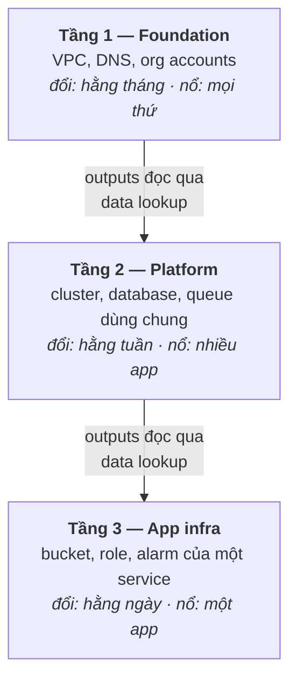

Mười một bài trước, hạ tầng là thứ bạn click. Giờ nó là code với một cuốn sổ cái, một nghi thức review, một pipeline, và những hàng rào chắn. Bài chốt này trả lời ba câu hỏi còn lại: *tổ chức* tất cả thế nào ở quy mô lớn, nghĩ gì về các đối thủ của Terraform, và làm sao biết team mình thực sự đứng ở đâu.

## Bạn sẽ học được gì

- Tổ chức repo hạ tầng theo tầng để bán kính vụ nổ — chứ không phải thói quen — quyết định ranh giới.
- So sánh Terraform, CDK, Pulumi một cách thật thà — và chọn theo team, không theo hype.
- Tự chấm team trên chiếc thang trưởng thành IaC năm bậc và gọi tên bước kế tiếp.
- Mang theo năm ý tưởng của series này — thứ sống lâu hơn mọi công cụ trong nó.

**Cần biết trước:** Bài chốt này tựa lên cả series — đặc biệt bài 5 (ranh giới state), bài 7 (module), bài 9 (CI/CD).

## 1. Tổ chức ở quy mô lớn: tầng, không phải đống

Một root config đơn lẻ sẽ phình cho tới khi mỗi plan mất mười phút và mỗi apply liều cả hệ thống. Pattern sống sót được là **phân tầng theo nhịp thay đổi và bán kính vụ nổ**:



Mỗi tầng là một config riêng với **state riêng** (bài 5: key-theo-bán-kính-vụ-nổ, áp theo chiều dọc). Tầng dưới phơi outputs; tầng trên đọc bằng data lookup (mánh liên-repo của bài 9). Phần thưởng cộng dồn: thay đổi hằng ngày ở tầng app plan trong vài giây và *không thể* đụng VPC — cú apply foundation rủi ro chỉ xảy ra bốn lần một năm, với mọi con mắt đổ vào.

Quy tắc ngón tay cái sinh ra toàn bộ cấu trúc: **thứ thay đổi cùng nhau và vỡ cùng nhau thì sống cùng nhau; mọi thứ còn lại có một ranh giới state ở giữa.** Team cũng xếp theo đúng đường kẻ đó — platform team sở hữu tầng 1–2, các app team sở hữu lát tầng 3 của mình, và module bài 7 mang pattern dùng chung xuyên qua tất cả.

## 2. CDK & Pulumi: so sánh thật thà

HCL của Terraform cố ý *không phải* ngôn ngữ lập trình. CDK và Pulumi đặt cược chiều ngược lại: viết hạ tầng bằng TypeScript hay Python, với vòng lặp, hàm, và test thật.

| | Terraform | CDK | Pulumi |
|---|---|---|---|
| Bạn viết | HCL | TypeScript/Python/… | TypeScript/Python/… |
| Engine bên dưới | Terraform core + state | **CloudFormation** | Pulumi engine + state |
| Cloud | Mọi cloud lớn + hàng trăm provider | AWS (chủ yếu) | Mọi cloud lớn |
| Plan-trước-apply | `plan` | `cdk diff` | `pulumi preview` |
| Hợp nhất | Platform team, multi-cloud, gốc ops | Shop AWS-only nơi app dev tự lo infra | Model Terraform, ngôn ngữ thật |

Để ý thứ bảng *không* cho thấy: khác biệt về model. Cả ba hội tụ về cùng một lõi — **khai báo trạng thái mong muốn, diff với thực tế, review cái diff, apply**. Mọi thứ series này dạy về state, plan, review, drift đều chuyển được sang cả ba; chỉ cú pháp và engine đổi. (CDK là kẻ ngoại lệ thật sự ở bên dưới: nó compile ra CloudFormation, nên state, drift, hành vi lỗi là của CloudFormation — cuốn sổ khác, cùng khái niệm kế toán.)

Cú đánh đổi thật thà: ngôn ngữ đa dụng cho bạn abstraction thật và unit test — và cho mọi kỹ sư khéo tay quyền viết ra hạ tầng chỉ mình họ đọc được. Ràng buộc của HCL là tính năng đúng ở chỗ *người đọc* quan trọng hơn người viết (bài 8: code hạ tầng được đọc trong review nhiều hơn được viết rất nhiều). Vậy nên chọn theo team: app dev sống trong TypeScript và chỉ deploy AWS sẽ năng suất với CDK ngay ngày đầu; platform team phục vụ nhiều stack đa cloud giữ Terraform làm mặc định; Pulumi hợp team muốn hình dạng Terraform với ngôn ngữ thật. **Đây là quyết định về nguồn tuyển và độ đọc được, không phải cuộc đua năng lực.**

## 3. Chiếc thang trưởng thành: team bạn đứng ở đâu?

Tự chấm — bậc của bạn là dòng *thấp nhất* vẫn còn đúng với bạn:

| Bậc | Tên | Bạn có | Series này |
|---|---|---|---|
| 0 | Click-ops | Đổi trên console, không code, trí nhớ bộ lạc | — |
| 1 | Có code | Resource trong HCL, state local, apply từ laptop | Bài 1–4 |
| 2 | Workflow team | Remote state + lock, module, PR với plan review | Bài 5–8 |
| 3 | Tự động | CI/CD với OIDC, cổng policy, drift detection hằng đêm | Bài 9–11 |
| 4 | Văn hoá | Console read-only, làn nhanh cho thay đổi nhỏ, quyết định ghi trong repo | Bài 10–11 |

Hai ghi chú thật thà. Đa số team thật đứng ở bậc 1–2 với một chân trên bậc 3 — điều đó bình thường, và chiếc thang là một hướng đi, không phải bảng xếp hạng xấu hổ. Và các cú nhảy không đều nhau: 0→1 là một cuối tuần; 2→3 là công việc đường ống; **3→4 là chính trị** — nó lấy đi quyền console mọi người đã quen, và chỉ sống sót nếu đường code đủ nhanh (bài học bài 10: pipeline chậm tái tạo click-ops với nhiều bước hơn).

Bước kế tiếp giá trị nhất cho đa số team đang đọc: dòng nào bạn trượt đầu tiên, đó chính là bài tập về nhà.

## 4. Năm ý tưởng mang ra khỏi series

Công cụ sẽ deprecated; ý tưởng thì chuyển giao được. Nếu chỉ giữ năm thứ:

1. **Trạng thái mong muốn khai báo + reconciliation.** Bạn mô tả đích đến; một engine diff và hội tụ. Đây là Terraform — và Kubernetes (S11-P06), và mọi hệ thống chống entropy ở quy mô lớn.
2. **Cuốn sổ cái.** State là nguồn sự thật thứ hai cho phép công cụ biết nó sở hữu gì và cần xoá gì. Gặp bất kỳ hành vi IaC "bí ẩn" nào, phép so sánh ba bên (code / state / thực tế, bài 3) đều giải thích được.
3. **Plan là artifact review.** Ý định (diff) và hậu quả (plan) là hai văn bản khác nhau; review hậu quả là thứ khiến thay đổi hạ tầng an toàn (bài 8). `EXPLAIN` trước khi chạy — ở mọi nơi.
4. **Bán kính vụ nổ quyết định cấu trúc.** Key state, tầng, ranh giới module, độ nghiêm của policy — mọi quyết định cấu trúc trong series này đều là quyết định bán-kính-vụ-nổ mặc áo khác.
5. **Văn hoá thắng công cụ.** Drift detection, console read-only, break-glass có page: phần khó chưa bao giờ là cú pháp HCL. Pipeline chiến thắng là pipeline mọi người *thích hơn* click.

Đi đâu tiếp: **S04 (AWS từ cơ bản đến nâng cao)** cho chiều sâu về chính các resource bạn vẫn khai báo — P11 bên đó là series này trong một miếng, P12 là câu chuyện guardrail cao hơn một tầng. **S11 (Docker & K8s)** là cùng model desired-state áp vào workload — hai series cố ý vần với nhau. Và hạ tầng của chính bạn: chiếc thang ở mục 3 là giáo trình.

## Thực hành (25 phút — capstone: repo hai tầng, hoàn toàn local)

Cả series trong một bài tập: hai tầng, state tách riêng, outputs tiêu thụ xuôi dòng, và bằng chứng bán kính vụ nổ là thật.

```bash
mkdir -p tf-capstone/foundation tf-capstone/app && cd tf-capstone

# Tầng 1 — foundation: sở hữu "tên network"
cat > foundation/main.tf <<'EOF'
resource "local_file" "network" {
  filename = "${path.module}/network.txt"
  content  = "net-prod-a"
}
output "network_name" { value = local_file.network.content }
EOF

# Tầng 2 — app: đọc output của foundation, không bao giờ đụng resource của nó
cat > app/main.tf <<'EOF'
data "terraform_remote_state" "foundation" {
  backend = "local"
  config  = { path = "../foundation/terraform.tfstate" }
}
resource "local_file" "app_config" {
  filename = "${path.module}/app.conf"
  content  = "attach_to = ${data.terraform_remote_state.foundation.outputs.network_name}"
}
EOF

cd foundation && terraform init && terraform apply -auto-approve && cd ..
cd app        && terraform init && terraform apply -auto-approve && cd ..
cat app/app.conf                          # attach_to = net-prod-a — contract liên tầng hoạt động

# Chứng minh bán kính vụ nổ: destroy tầng app…
cd app && terraform destroy -auto-approve && cd ..
ls foundation/network.txt                 # …foundation nguyên vẹn. Đó là toàn bộ vấn đề.
```

Kết quả mong đợi: config tầng app chứa output của foundation mà không config nào tham chiếu *resource* của bên kia — chỉ qua contract output (bài 6). Destroy tầng app không thể chạm foundation: state riêng, bán kính vụ nổ riêng, đúng thuộc tính mục 1 đã hứa. Chạy lại `terraform plan` ở từng tầng — cả hai nói "no changes": hai cuốn sổ, cùng trung thực.

## Tự kiểm tra

1. Nguyên tắc duy nhất nào quyết định tầng này kết thúc và tầng kia bắt đầu ở đâu — và cơ chế nào cưỡng chế ranh giới đó?
2. Một người bạn nói "CDK hơn Terraform vì ngôn ngữ thật thắng HCL." Hãy đưa steelman thật thà *và* phản đề thật thà.
3. Team bạn có remote state, module, PR review, nhưng apply vẫn chạy từ laptop và không ai kiểm drift. Bạn ở bậc nào, và bài tập kế tiếp là gì?

<details><summary>Xem đáp án</summary>

1. Bán kính vụ nổ và nhịp thay đổi: thứ đổi cùng nhau và vỡ cùng nhau thì sống cùng nhau; còn lại có ranh giới state ở giữa. Cưỡng chế bằng config riêng với state file riêng, nối duy nhất qua outputs và data lookup — một tầng về mặt vật lý không thể sửa resource tầng khác.
2. Steelman: vòng lặp, hàm, unit test thật; app dev đã thạo ngôn ngữ tự lo hạ tầng không cần học HCL. Phản đề: code hạ tầng được đọc trong review nhiều hơn được viết, và ràng buộc HCL giữ nó đọc được bởi bất kỳ ai; CDK còn đổi engine sang CloudFormation (state và hành vi lỗi khác) và nghiêng hẳn AWS. Model của cả ba giống hệt — nên chọn theo team và độ đọc được, không theo năng lực.
3. Bậc 2 (workflow team đủ, tự động hoá thiếu). Bài tập kế tiếp là đường ống bài 9–10: apply dời vào CI với OIDC, rồi job drift `plan -detailed-exitcode` hằng đêm — đó là cú nhảy 2→3.

</details>

## Điều cần nhớ

- Tổ chức repo theo tầng theo nhịp đổi và bán kính vụ nổ; state riêng mỗi tầng, nối bằng contract output — thay đổi hằng ngày không bao giờ đụng được foundation.
- Terraform, CDK, Pulumi chung một model (khai báo → diff → review → apply); chọn theo team và độ đọc được, không theo danh sách tính năng. Mọi thứ trong series chuyển giao được.
- Tự chấm trên chiếc thang — code → workflow team → tự động → văn hoá — và coi dòng trượt đầu tiên là bài tập. Cú nhảy 3→4 là chính trị, không phải kỹ thuật.
- Giữ năm ý tưởng: desired state, sổ cái, plan-là-review, cấu trúc theo bán kính vụ nổ, văn hoá thắng công cụ. Công cụ sẽ đổi; những thứ này thì không.

*Khép lại Terraform & IaC thực chiến — trọn 12 phần. Muốn hiểu sâu các resource AWS trong ví dụ, xem AWS từ cơ bản đến nâng cao; muốn thấy cùng model desired-state áp vào workload, xem Docker & Kubernetes.*
