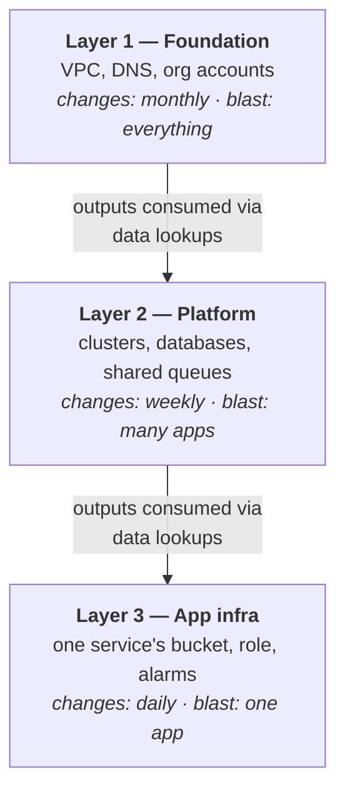

Eleven parts ago, infrastructure was something you clicked. Now it's code with a ledger, a review ritual, a pipeline, and guardrails. This finale answers the three questions that remain: how to *structure* it all at scale, what to make of Terraform's competitors, and how to know where your team actually stands.

## What you'll learn

- Structure infrastructure repos in layers so blast radius, not habit, drives the boundaries.
- Compare Terraform, CDK, and Pulumi honestly — and pick by team, not by hype.
- Grade your team on the five-level IaC maturity ladder and name the next step.
- Carry the five ideas from this series that will outlive every tool in it.

**Prerequisites:** This closing part leans on the whole series — especially Parts 5 (state boundaries), 7 (modules), and 9 (CI/CD).

## 1. Structure at scale: layers, not piles

A single root config grows until every plan takes ten minutes and every apply risks everything. The pattern that survives is **layering by change rate and blast radius**:



Each layer is its own config with **its own state** (Part 5's key-per-blast-radius, applied vertically). Lower layers expose outputs; higher layers read them with data lookups (Part 9's cross-repo trick). The payoff compounds: a daily app-layer change plans in seconds and *cannot* touch the VPC — the risky foundation apply happens four times a year, with everyone watching.

The rule of thumb that generates the whole structure: **things that change together and break together live together; everything else gets a state boundary between them.** Teams map onto the same lines — the platform team owns layers 1–2, app teams own their slice of layer 3, and Part 7's modules carry shared patterns across all of it.

## 2. CDK & Pulumi: the honest comparison

Terraform's HCL is deliberately *not* a programming language. CDK and Pulumi bet the other way: write infrastructure in TypeScript or Python, with real loops, functions, and tests.

| | Terraform | CDK | Pulumi |
|---|---|---|---|
| You write | HCL | TypeScript/Python/… | TypeScript/Python/… |
| Engine underneath | Terraform core + state | **CloudFormation** | Pulumi engine + state |
| Clouds | All major + hundreds of providers | AWS (mostly) | All major |
| Plan-before-apply | `plan` | `cdk diff` | `pulumi preview` |
| Best fit | Platform teams, multi-cloud, ops-rooted | AWS-only shops where app devs own infra | Terraform's model, real languages |

Notice what the table *doesn't* show: a difference in model. All three converged on the same core — **declare desired state, diff against reality, review the diff, apply**. Everything this series taught about state, plans, review, and drift transfers to all three; only the syntax and the engine change. (CDK is the real outlier underneath: it compiles to CloudFormation, so state, drift, and failure behavior are CloudFormation's — different ledger, same bookkeeping concept.)

The honest trade: a general-purpose language gives you real abstractions and unit tests — and gives every clever engineer the power to write infrastructure only they can read. HCL's constraints are a feature precisely when the *reader* matters more than the writer (Part 8: infrastructure code is read in review far more than it's written). So choose by team: app developers who live in TypeScript and deploy only to AWS will be productive in CDK on day one; a platform team serving many stacks across clouds keeps Terraform as the default; Pulumi suits teams who want Terraform's shape with a real language. **This is a hiring-pool and readability decision, not a capability race.**

## 3. The maturity ladder: where does your team stand?

Grade yourself — your level is the *lowest* row that's still true of you:

| Level | Name | You have | This series |
|---|---|---|---|
| 0 | Click-ops | Console changes, no code, tribal memory | — |
| 1 | Code exists | Resources in HCL, state local, applies from laptops | Parts 1–4 |
| 2 | Team workflow | Remote state + locking, modules, PRs with plan review | Parts 5–8 |
| 3 | Automated | CI/CD with OIDC, policy gates, nightly drift detection | Parts 9–11 |
| 4 | Culture | Read-only consoles, fast lane for small changes, decisions recorded in the repo | Parts 10–11 |

Two honest notes. Most real teams sit at level 1–2 with one foot on 3 — that's normal, and the ladder is a direction, not a shame index. And the jumps are not equal: 0→1 is a weekend; 2→3 is plumbing; **3→4 is politics** — it takes away console access people are used to, and only survives if the code path is fast (Part 10's lesson: a slow pipeline recreates click-ops with extra steps).

The single most valuable next step for most teams reading this: whichever row you failed first, that's the assignment.

## 4. Five ideas to carry out of this series

Tools deprecate; ideas transfer. If you keep only five things:

1. **Declarative desired state + reconciliation.** You describe the end state; an engine diffs and converges. This is Terraform — and Kubernetes (S11-P06), and every system fighting entropy at scale.
2. **The ledger.** State is a second source of truth that lets a tool know what it owns and what to delete. Wherever you meet a "mysterious" IaC behavior, the three-way comparison (code / state / reality, Part 3) explains it.
3. **The plan is the review artifact.** Intent (diff) and consequence (plan) are different documents; reviewing consequences is what makes infrastructure changes safe (Part 8). `EXPLAIN` before you run — everywhere.
4. **Blast radius drives structure.** State keys, layers, module boundaries, policy strictness — every structural decision in this series was a blast-radius decision wearing different clothes.
5. **Culture beats tooling.** Drift detection, read-only consoles, break-glass with a pager: the hard parts were never HCL syntax. The pipeline that wins is the one people *prefer* over clicking.

Where to next: **S04 (AWS Zero to Advanced)** gives depth on the resources you've been declaring — P11 there is this series in one bite, P12 the guardrails story one level up. **S11 (Docker & K8s)** is the same desired-state model applied to workloads — the two series rhyme on purpose. And your own infrastructure: the ladder in section 3 is the syllabus.

## Practice (25 minutes — capstone: a two-layer repo, fully local)

The whole series in one exercise: two layers, separate state, outputs consumed downstream, and proof the blast radius is real.

```bash
mkdir -p tf-capstone/foundation tf-capstone/app && cd tf-capstone

# Layer 1 — foundation: owns the "network name"
cat > foundation/main.tf <<'EOF'
resource "local_file" "network" {
  filename = "${path.module}/network.txt"
  content  = "net-prod-a"
}
output "network_name" { value = local_file.network.content }
EOF

# Layer 2 — app: reads foundation's output, never touches its resources
cat > app/main.tf <<'EOF'
data "terraform_remote_state" "foundation" {
  backend = "local"
  config  = { path = "../foundation/terraform.tfstate" }
}
resource "local_file" "app_config" {
  filename = "${path.module}/app.conf"
  content  = "attach_to = ${data.terraform_remote_state.foundation.outputs.network_name}"
}
EOF

cd foundation && terraform init && terraform apply -auto-approve && cd ..
cd app        && terraform init && terraform apply -auto-approve && cd ..
cat app/app.conf                          # attach_to = net-prod-a — cross-layer contract works

# Prove the blast radius: destroy the app layer…
cd app && terraform destroy -auto-approve && cd ..
ls foundation/network.txt                 # …foundation untouched. That's the whole point.
```

Expected results: the app layer's config contains the foundation's output without either config referencing the other's *resources* — only the output contract (Part 6). Destroying the app layer cannot touch the foundation: separate state, separate blast radius, exactly the property section 1 promised. Re-run `terraform plan` in each layer — both say "no changes": two ledgers, both true.

## Check yourself

1. What single principle decides where one layer ends and the next begins — and what mechanism enforces the boundary?
2. A friend says "CDK is better than Terraform because real languages beat HCL." Give the honest steelman *and* the honest counter.
3. Your team has remote state, modules, and PR reviews, but applies still run from laptops and nobody checks drift. What level are you, and what's the next assignment?

<details><summary>See answers</summary>

1. Blast radius and change rate: things that change and break together live together; everything else gets a state boundary. Enforced by separate configs with separate state files, connected only through outputs and data lookups — a layer physically cannot modify another layer's resources.
2. Steelman: real loops, functions, and unit tests; app developers already fluent in the language own their infra without learning HCL. Counter: infrastructure code is read in review far more than written, and HCL's constraints keep it readable by anyone; CDK also swaps the engine to CloudFormation (different state and failure behavior) and is AWS-centric. The model is identical in all three — so choose by team and readability, not capability.
3. Level 2 (team workflow complete, automation missing). Next assignment is Part 9–10's plumbing: applies move to CI with OIDC, then a nightly `plan -detailed-exitcode` drift job — that's the 2→3 jump.

</details>

## Key takeaways

- Structure repos in layers by change rate and blast radius; separate state per layer, connected by output contracts — the daily change can never touch the foundation.
- Terraform, CDK, and Pulumi share one model (declare → diff → review → apply); choose by team and readability, not by feature lists. Everything in this series transfers.
- Grade your team on the ladder — code → team workflow → automated → culture — and treat the first failing row as the assignment. The 3→4 jump is political, not technical.
- Keep the five ideas: desired state, the ledger, plan-as-review, blast-radius structure, culture over tooling. The tools will change; these won't.

*This concludes Terraform & IaC in Practice — all 12 parts. For the AWS resources behind the examples, see AWS from Zero to Advanced; for the same desired-state model applied to workloads, see Docker & Kubernetes.*
